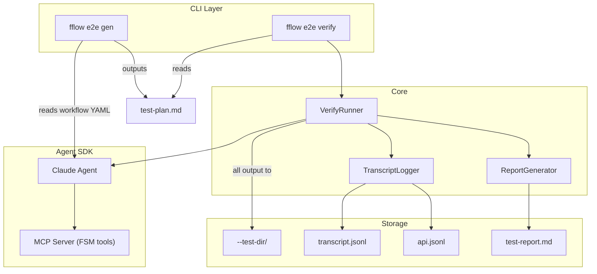

## 1. Overview

FreeFlow E2E is a general-purpose, agent-driven end-to-end testing framework that ships with fflow. It enables developers to write natural-language test plans as structured markdown, then have an AI agent execute them against real infrastructure. The agent observes effects, judges pass/fail, and produces detailed logs for debugging. Two CLI sub-commands — `fflow e2e gen` and `fflow e2e verify` — cover the full lifecycle from test plan generation to execution and reporting.

## 2. Detailed Requirements

### Functional Requirements

| ID | Requirement |
|----|-------------|
| FR1 | `fflow e2e gen` generates structured markdown test plans from a workflow YAML or user prompt |
| FR2 | `fflow e2e verify` executes a test plan using a Claude agent against real infrastructure |
| FR3 | Test plans use structured markdown: `## Setup`, `## Steps`, `## Expected Outcomes`, `## Cleanup` |
| FR4 | The agent determines pass/fail using natural language judgment (no machine assertions) |
| FR5 | `--test-dir <path>` specifies the output directory for all artifacts |
| FR6 | Output artifacts: timestamped transcript, Claude API JSONL, `test-report.md` |
| FR7 | Backed by a `verifier.workflow.yaml` workflow that drives the verification process |
| FR8 | General-purpose — not tightly coupled to fflow; can test any CLI/workflow tool |

### Non-Functional Requirements

| ID | Requirement |
|----|-------------|
| NF1 | Logs must be detailed enough for a follow-up agent to reproduce and debug failures |
| NF2 | Must work with real external services (no mocking) |
| NF3 | Must integrate with existing fflow CLI patterns (global flags, JSON output, error codes) |

## 3. Architecture Overview



## 4. Components & Interfaces

### 4.1 `fflow e2e gen` Command

**Responsibility**: Generate a structured markdown test plan from a workflow YAML or a natural language prompt.

```
fflow e2e gen <fsm-path-or-prompt> [--output <file>] [-j]
```

- If `<fsm-path-or-prompt>` is a `.yaml` file, parse the FSM and generate test cases covering all reachable paths
- If it's a free-text prompt, use the Claude agent to generate a test plan based on the description
- Output: a `.md` file in the test plan format
- Uses `fflow run` internally with a `gen.workflow.yaml` workflow (or a simple single-shot prompt)

### 4.2 `fflow e2e verify` Command

**Responsibility**: Execute a test plan using a Claude agent and produce a test report.

```
fflow e2e verify <test-plan.md> --test-dir <path> [--model <model>] [-j]
```

| Flag | Required | Description |
|------|----------|-------------|
| `<test-plan.md>` | Yes | Path to the structured markdown test plan |
| `--test-dir` | Yes | Output directory for all artifacts |
| `--model` | No | Claude model to use (default: claude-sonnet-4-20250514) |

**Internally**:
1. Parses the test plan markdown into sections
2. Starts a `verifier.workflow.yaml` workflow run
3. Launches a Claude agent via the Agent SDK with:
   - System prompt containing the test plan
   - MCP tools for FSM control + shell execution
   - Transcript logging middleware
4. The agent executes each step, collects evidence, judges pass/fail
5. On completion, generates `test-report.md`

### 4.3 TranscriptLogger

**Responsibility**: Capture all agent interactions with timestamps for reproducibility.

- Wraps the Agent SDK message stream
- Writes two files:
  - `transcript.jsonl` — structured log of all actions, observations, and decisions with ISO timestamps
  - `api.jsonl` — raw Claude API request/response pairs

### 4.4 ReportGenerator

**Responsibility**: Produce a human-readable test report from the agent's execution.

- Reads the transcript and test plan
- Generates `test-report.md` with:
  - Overall verdict (PASS / FAIL)
  - Per-step results with evidence
  - Failure details and reproduction steps
  - Timing information

### 4.5 `verifier.workflow.yaml` Workflow

Drives the verification agent through a structured process:

```
setup → execute-steps → evaluate → report → done
```

| State | Purpose |
|-------|---------|
| `setup` | Read the test plan, perform setup steps, verify prerequisites |
| `execute-steps` | Execute each test step sequentially, collecting evidence |
| `evaluate` | Compare observed outcomes against expected outcomes |
| `report` | Generate the test report and write to `--test-dir` |
| `done` | Terminal state |

### 4.6 `gen.workflow.yaml` Workflow (for `e2e gen`)

Drives test plan generation:

```
analyze → generate → done
```

| State | Purpose |
|-------|---------|
| `analyze` | Read the workflow YAML or prompt, identify testable paths and edge cases |
| `generate` | Produce the structured markdown test plan |
| `done` | Terminal state |

## 5. Data Models

### Test Plan Format

```markdown
# Test: <test-name>

## Setup
- Prerequisites and environment setup
- Fixtures to create
- Services to verify

## Steps
1. **<step-name>**: <action description>
   - Expected: <what should happen>
2. **<step-name>**: <action description>
   - Expected: <what should happen>
...

## Expected Outcomes
- <overall outcome 1>
- <overall outcome 2>

## Cleanup
- <teardown action 1>
- <teardown action 2>
```

### Transcript Entry (`transcript.jsonl`)

```json
{
  "ts": "2026-03-17T12:00:00.000Z",
  "type": "action" | "observation" | "judgment" | "error",
  "step": 1,
  "content": "Ran `fflow start workflow.yaml --run-id test-123`",
  "evidence": "exit_code=0, stdout=..."
}
```

### Test Report Structure (`test-report.md`)

```markdown
# Test Report: <test-name>
**Date**: <ISO date>
**Verdict**: PASS | FAIL
**Duration**: <total time>

## Results

| Step | Name | Verdict | Duration |
|------|------|---------|----------|
| 1 | ... | PASS | 2.3s |
| 2 | ... | FAIL | 5.1s |

## Failures
### Step 2: <step-name>
**Expected**: ...
**Observed**: ...
**Evidence**: ...
**Reproduction**: ...

## Cleanup Status
- [x] <cleanup action>
```

## 6. Error Handling

| Failure Mode | Recovery Strategy |
|--------------|-------------------|
| Test plan parse error | Exit with `ARGS_INVALID` error code, show which section is malformed |
| Agent API failure (rate limit, network) | Retry up to 3 times with exponential backoff; log failure in transcript |
| Setup step fails | Log as FAIL, skip remaining steps, proceed to cleanup |
| Cleanup step fails | Log warning, continue with remaining cleanup, report in summary |
| Agent judgment unclear | Default to FAIL with "inconclusive" verdict, include full evidence |
| `--test-dir` not writable | Exit with `ARGS_INVALID` before starting the agent |

## 7. Acceptance Criteria

**AC1**: Given a workflow YAML, when `fflow e2e gen <workflow.yaml>` is run, then a structured markdown test plan is produced covering all reachable state paths.

**AC2**: Given a valid test plan, when `fflow e2e verify <plan.md> --test-dir ./out` is run, then the agent executes each step and `./out/` contains `transcript.jsonl`, `api.jsonl`, and `test-report.md`.

**AC3**: Given a test plan where step 2 should fail, when `fflow e2e verify` is run, then `test-report.md` shows step 2 as FAIL with evidence and the overall verdict is FAIL.

**AC4**: Given an interrupted verification run, when the `--test-dir` is examined, then partial transcripts and a partial report are available for debugging.

**AC5**: Given `fflow e2e verify --test-dir ./out -j`, when the run completes, then JSON output includes `{ "success": true/false, "data": { "verdict": "PASS|FAIL", "steps_passed": N, "steps_failed": M } }`.

## 8. Testing Strategy

| Layer | What to Test | How |
|-------|-------------|-----|
| Unit | Test plan parser, report generator, transcript logger | Vitest with fixture files |
| Integration | CLI arg parsing, `--test-dir` creation, error codes | `execFileSync` against compiled CLI |
| E2E (dogfood) | Run `fflow e2e verify` against a simple 2-state FSM test plan | Self-referential: fflow tests itself |

## 9. Appendices

### Technology Choices

| Choice | Rationale |
|--------|-----------|
| Claude Agent SDK | Already used by `fflow run`; consistent architecture |
| Structured markdown test plans | Human-readable, agent-interpretable, easy to version control |
| JSONL for transcripts | Append-friendly, line-by-line parseable, standard format |
| FSM-backed verification | Dogfoods fflow's own workflow engine; structured agent execution |

### Alternatives Considered

| Alternative | Why Rejected |
|-------------|-------------|
| YAML test plans | Less readable for natural language steps; markdown is more natural for agent consumption |
| Machine-parseable assertions | Over-constrains the agent; natural language judgment is more flexible and matches the "agent-native" philosophy |
| Separate test runner package | Adds complexity; bundling with fflow enables dogfooding and keeps the tool self-contained |
| JUnit/TAP output | Could be added later as an output format option; markdown report is the primary deliverable |
