# Markdown Workflow Fix

Validate a `.workflow.md` file against the canonical format specification and auto-fix any issues found.

## Usage

`/fflow markdown fix <file>` — where `<file>` is the path to a `.workflow.md` file.

## Canonical Markdown Workflow Format

A valid `.workflow.md` file has the following structure:

### YAML Frontmatter

```yaml
---
version: 1.2          # required — workflow schema version
initial: start         # required — name of the initial state
allowed_tools:         # optional — list of allowed tool names
  - Read
  - Write
# extends_guide is NOT in frontmatter — it appears as a <freeflow extends-guide="..."> tag in the ## Guide section
---
```

### Document Structure

1. **`# <Title> Workflow`** — h1 heading, the workflow title
2. **`## State Machine`** — contains a mermaid `stateDiagram-v2` code block (decorative, auto-generated from transitions)
3. **`## Guide`** (optional) — workflow-level instructions that apply to all states; supports full markdown
4. **`## State: <name>`** — one section per state, containing (in this order):
   - **`### Transitions`** (required) — bulleted list of transitions or `(none)` for terminal states
   - **`### Instructions`** (required for non-workflow states) — the state prompt, supports full markdown. Headings inside prompts should start at `###` then `####` then `**bold**`.
   - **`### Todos`** (optional) — bulleted list of todo items

### Transition Format

Each transition is a bulleted list item:

```
- label -> target
- label → target
```

Both `->` (ASCII) and `→` (U+2192) are accepted as separators. Terminal states use `(none)` or an empty section.

### `<freeflow>` Tags

Tags provide metadata for state inheritance and composition. They are stripped from prompts shown to users.

```html
<!-- State inheritance: self-closing, placed at the top of a state section -->
<freeflow from="workflow-name#state-name">

<!-- Composition: self-closing, delegates entire state to a child workflow -->
<freeflow workflow="./child-workflow">

<!-- Appended todos: block tag containing a markdown list -->
<freeflow append-todos>
- Item one
- Item two
</freeflow>
```

- `from="workflow#state"` — inherit instructions from another workflow's state
- `workflow="./path"` — delegate the entire state to a child workflow (no `### Instructions` needed)
- `append-todos` — additional todo items appended during inheritance

## Validation Checklist

When validating a `.workflow.md` file, check the following in order:

1. **Frontmatter has `version` and `initial`** — both fields must be present in the YAML frontmatter block
2. **Heading hierarchy is correct** — `# Title` (h1) > `## State Machine` / `## Guide` / `## State: X` (h2) > `### Instructions` / `### Todos` / `### Transitions` (h3)
3. **Every `## State:` has `### Instructions`** — unless the state contains a `<freeflow workflow="...">` tag (workflow delegation)
4. **Every `## State:` has `### Transitions`** — all states must declare their transitions
5. **Transition format is valid** — each line matches `- label -> target` or `- label → target`
6. **All transition targets reference existing states** — every target name must correspond to a `## State: <target>` section
7. **`done` state exists** — there must be a `## State: done` section
8. **`initial` state exists** — the state named in frontmatter `initial` must have a corresponding `## State:` section
9. **`<freeflow>` tags have valid attributes** — only `from`, `workflow`, and `append-todos` are supported; attribute values must be non-empty

## Fix Instructions

After validation, apply these fixes for any issues found:

### Regenerate `## State Machine` Mermaid Block

Rebuild the mermaid diagram from the actual `### Transitions` data in each state:

```mermaid
stateDiagram-v2
  [*] --> <initial>
  <source> --> <target>: <label>
  ...
  <terminal> --> [*]
```



- The initial state gets a `[*] --> <initial>` edge
- Each transition `- label -> target` in `## State: source` becomes `source --> target: label`
- Terminal states (with `(none)` transitions) get a `<state> --> [*]` edge

### Add Missing `### Transitions`

If a `## State:` section lacks a `### Transitions` subsection, add one with `(none)`.

### Normalize Heading Levels

- The workflow title must be h1 (`#`)
- Top-level sections (`State Machine`, `Guide`, `State: X`) must be h2 (`##`)
- Subsections (`Instructions`, `Todos`, `Transitions`) must be h3 (`###`)

### Add `### Instructions` Placeholder

If a non-workflow state (no `<freeflow workflow="...">` tag) is missing `### Instructions`, add a placeholder:

```markdown
### Instructions

TODO: Add instructions for this state.
```

## Process

1. Read the target `.workflow.md` file
2. Run through the validation checklist, collecting all issues
3. Report issues found to the user
4. Apply fixes as described above
5. Write the corrected file
6. Re-validate to confirm all issues are resolved
