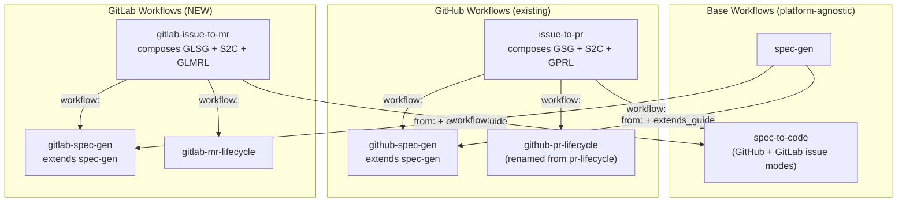

## design.md

### 1. Overview

Add GitLab support to the fflow workflow ecosystem by creating GitLab-specific workflow extensions (`gitlab-spec-gen`, `gitlab-mr-lifecycle`, `gitlab-issue-to-mr`) that mirror the existing GitHub workflows. Uses `glab` CLI for all GitLab API interactions. Also renames `pr-lifecycle` → `github-pr-lifecycle` for consistency, and modifies `spec-to-code` to support GitLab issue mode alongside the existing GitHub issue mode.

### 2. Goal & Constraints

**Goal:**
1. Create `gitlab-spec-gen` extending `spec-gen` with GitLab issue/notes interaction via `glab` CLI
2. Create `gitlab-mr-lifecycle` for monitoring GitLab MRs via `glab` CLI
3. Create `gitlab-issue-to-mr` composing the above with `spec-to-code`
4. Modify `spec-to-code` to support GitLab issue mode (notes, award emoji, labels)
5. Rename `pr-lifecycle` → `github-pr-lifecycle`
6. Update `issue-to-pr` references to renamed `github-pr-lifecycle`
7. Create GitLab polling scripts (`poll_issue_gl.py`, `poll_mr_gl.py`)

**Constraints:**
- MUST NOT break existing `issue-to-pr` workflow behavior
- MUST use `glab` CLI (not raw HTTP/curl) for all GitLab API interactions
- MUST use `GITLAB_TOKEN` env var for authentication (no config file reading)
- MUST auto-detect GitLab project from git remote URL
- MUST reuse fflow's `from:`, `extends_guide`, and `workflow:` composition mechanisms
- MUST NOT duplicate spec-gen core logic — only extend with platform adaptations
- MUST preserve the three execution modes (full-auto, fast-forward, stop-here)
- GitLab instance: `gitlab.corp.metabit-trading.com` (self-hosted)

### 3. Architecture Overview



### 4. Components & Interfaces

#### 4.1 `gitlab-spec-gen` (NEW)

**Path**: `workflows/gitlab-spec-gen/workflow.yaml`

Mirrors `github-spec-gen` structure but with `glab` CLI:
- `extends_guide: ../spec-gen/workflow.yaml` with GitLab-specific artifact override
- Each state uses `from: "../spec-gen/workflow.yaml#<state>"` with `### GitLab Adaptation`
- `create-issue` state: uses `glab issue create` to create issue, `glab issue note` for comments
- Artifact storage: GitLab issue notes + local cache (same dual-storage pattern)
- Polling: `poll_issue_gl.py` — polls GitLab issue notes via `glab api`
- Reactions: Award emoji API via `glab api` (`POST /projects/:id/issues/:iid/notes/:note_id/award_emoji`)
- Status checklist: Updates issue description via `glab issue update`

**`glab` CLI mapping from `github-spec-gen`:**

| Operation | GitHub (`gh`) | GitLab (`glab`) |
|-----------|---------------|-----------------|
| Auth check | `gh auth status` | `glab auth status` |
| Create issue | `gh issue create --repo R --title T --body B` | `glab issue create --title T --description B` |
| Comment | `gh issue comment N --repo R --body B` | `glab issue note N --message B` |
| Edit body | `gh issue edit N --repo R --body B` | `glab issue update N --description B` |
| Get user | `gh api user --jq .login` | `glab api user --jq .username` |
| Get issue | `gh api repos/O/R/issues/N` | `glab api projects/:fullpath/issues/N` |
| Add label | `gh issue edit N --add-label L` | `glab issue update N --label L` |
| React | `gh api .../reactions -f content=eyes` | `glab api .../award_emoji -f name=eyes` |

**States**: `create-issue` → `requirements` ↔ `research` → `design` → `plan` → `e2e-gen` → `done`

**Note on research transitions**: Research can only transition back to requirements (not directly to design), matching the updated spec-gen flow.

#### 4.2 `gitlab-mr-lifecycle` (NEW)

**Path**: `workflows/gitlab-mr-lifecycle/workflow.yaml`

GitLab equivalent of `github-pr-lifecycle`. States:

| State | Purpose | `glab` CLI / API |
|-------|---------|-----------------|
| `create-mr` | Create MR or find existing | `glab mr create --source-branch X --target-branch Y --title T` |
| `poll` | Monitor MR events | `poll_mr_gl.py` — checks pipeline, discussions, notes |
| `fix` | Fix CI pipeline failures | `glab ci view` to read pipeline logs |
| `rebase` | Rebase onto target | `glab api -X PUT .../merge_requests/:iid/rebase` (GitLab native rebase API) |
| `address` | Handle review discussions | `glab api .../discussions`, reply via notes, resolve via `PUT .../discussions/:id?resolved=true` |
| `push` | Commit and push fixes | Update MR description via `glab mr update` |
| `done` | MR merged or closed | Terminal state |

**Key simplifications over `github-pr-lifecycle`:**
- Thread resolution: Simple REST `PUT` instead of GraphQL mutation
- CI status: Embedded in MR object (`head_pipeline.status`, `detailed_merge_status`) — fewer API calls
- Rebase: GitLab provides native rebase API — no local git rebase needed
- Discussions: Flat REST endpoint, no GraphQL

#### 4.3 `gitlab-issue-to-mr` (NEW)

**Path**: `workflows/gitlab-issue-to-mr/workflow.yaml`

Standalone composition workflow (does NOT extend `issue-to-pr`):

```yaml
version: 1.2
extends_guide: ../gitlab-spec-gen/workflow.yaml
guide: |
  {{base}}

  ### GitLab Issue-to-MR — Composition Guide
  # (similar to issue-to-pr guide but with GitLab terminology)

states:
  start:
    prompt: |
      # Detect input mode
      # Parse gitlab project path or existing issue reference
      # Auto-detect project from git remote
  spec:
    workflow: ../gitlab-spec-gen/workflow.yaml
    transitions:
      completed: decide
  decide:
    prompt: |
      # Choose execution mode (full-auto / fast-forward / stop)
      # Post as issue note, poll for reply
  confirm-implement:
    prompt: |
      # Fast-forward gate — poll issue for go/stop
  implement:
    workflow: ../spec-to-code/workflow.yaml
    transitions:
      completed: confirm-mr
  confirm-mr:
    prompt: |
      # Post implementation summary, confirm MR submission
  submit-mr:
    workflow: ../gitlab-mr-lifecycle/workflow.yaml
    transitions:
      completed: done
  done:
    prompt: |
      # Final summary note on issue
    transitions: {}
```

**Input modes:**
- **New idea**: User provides GitLab project and idea description → creates issue
- **Existing issue**: User provides `project#N` or GitLab issue URL → attaches to existing issue

**Agent memory**: `project_path`, `issue_iid`, `issue_creator`, `mode`, `slug`, `branch_name`

#### 4.4 `spec-to-code` modifications

**Path**: `workflows/spec-to-code/workflow.yaml` (existing, modified)

The `setup` state's issue mode currently assumes GitHub. Needs to detect platform and branch:

- **GitHub issue mode**: existing behavior (`gh api`, `gh issue comment`, GitHub labels)
- **GitLab issue mode**: same pattern but with `glab` equivalents
- **Detection**: Check if the issue reference contains `gitlab` in the URL, or check git remote

Specific changes needed:
- `setup` state: detect platform from issue URL/reference, set platform variable
- `implement` state: progress comments use platform-appropriate CLI
- `done` state: summary comment posted via correct platform CLI
- `download_spec.py` / `prepare_implementation.py`: Add GitLab variants or make platform-aware

#### 4.5 `github-pr-lifecycle` (RENAME)

**Path**: `workflows/github-pr-lifecycle/workflow.yaml` (renamed from `pr-lifecycle`)

Pure rename — no content changes. Update all references:
- `issue-to-pr/workflow.yaml`: `workflow: ../github-pr-lifecycle/workflow.yaml`
- Any other workflows referencing `pr-lifecycle`

#### 4.6 Polling Scripts (NEW)

| Script | Purpose | Location |
|--------|---------|----------|
| `poll_issue_gl.py` | Poll GitLab issue notes | `workflows/gitlab-spec-gen/poll_issue_gl.py` |
| `poll_mr_gl.py` | Poll GitLab MR events | `workflows/gitlab-mr-lifecycle/poll_mr_gl.py` |

Both scripts follow the same pattern as GitHub counterparts but use `glab api`:
- Background execution, periodic polling
- Filter by author username
- React with award emoji (👀 via `glab api .../award_emoji`)
- Output `NEW_COMMENT: <body>` to stdout
- Persist state in `~/.freeflow/runs/{run_id}/`

**`poll_issue_gl.py`**: Polls `glab api projects/:id/issues/:iid/notes` for new notes from issue creator.

**`poll_mr_gl.py`**: Monitors MR for:
- Merge/close status changes
- Pipeline status (`head_pipeline.status`)
- New discussions and `@bot` mentions
- Target branch updates (rebase needed)
Writes `mr_status.json` consumed by other states.

### 5. Data Models

#### Agent Memory

| Field | Type | Description |
|-------|------|-------------|
| `project_path` | string | GitLab project path (e.g., `ran.xian/test-proj`) |
| `gitlab_url` | string | GitLab instance URL (e.g., `https://gitlab.corp.metabit-trading.com`) |
| `issue_iid` | int | Issue iid (project-scoped) |
| `issue_creator` | string | Username of issue creator |
| `mode` | string | `full-auto` \| `fast-forward` |
| `slug` | string | Spec directory slug |
| `branch_name` | string | Feature branch name (from spec-to-code) |

#### Artifact Storage (unchanged pattern)

```
$HOME/.freeflow/runs/{run_id}/artifacts/
  requirements.md
  research/<topic>.md
  design.md
  plan.md
  e2e.md
$HOME/.freeflow/runs/{run_id}/artifact_comment_ids.json
```

Both GitHub comment IDs and GitLab note IDs are numeric — the tracking file works identically.

#### GitLab-specific state files

```
$HOME/.freeflow/runs/{run_id}/
  mr_status.json         # MR state (mirrors pr_status.json structure)
  comment_count          # Note count for polling
```

### 6. Integration Testing

**Test 1: All new workflow files load without schema errors**
- **Given**: All new/modified workflow YAML files exist
- **When**: `fflow start <workflow> --run-id test` is run for each
- **Then**: FSM loads successfully, initial state is correct, all transitions are valid

**Test 2: `gitlab-spec-gen` extends `spec-gen` correctly**
- **Given**: `gitlab-spec-gen/workflow.yaml` with `from:` references
- **When**: FSM is loaded and states are expanded
- **Then**: Each state contains base spec-gen instructions + `### GitLab Adaptation` section; research state only has `back to requirements` transition (not `proceed to design`)

**Test 3: `gitlab-issue-to-mr` composition expands correctly**
- **Given**: `gitlab-issue-to-mr/workflow.yaml` with `workflow:` references
- **When**: FSM is loaded
- **Then**: Sub-workflow states are namespaced (e.g., `spec/create-issue`, `spec/requirements`); done-state transitions are correctly rewritten

**Test 4: Renamed `github-pr-lifecycle` loads correctly**
- **Given**: `github-pr-lifecycle/workflow.yaml` (renamed from `pr-lifecycle`)
- **When**: FSM is loaded
- **Then**: Identical behavior to original `pr-lifecycle`

**Test 5: `issue-to-pr` still works after rename**
- **Given**: `issue-to-pr/workflow.yaml` referencing `../github-pr-lifecycle/workflow.yaml`
- **When**: FSM is loaded
- **Then**: Sub-workflow states expand correctly, all transitions valid

### 7. E2E Testing

**Scenario: GitLab spec-gen creates issue and runs requirements**
1. User starts `gitlab-spec-gen` workflow with a test idea
2. System runs `glab auth status` to verify authentication
3. System creates a GitLab issue via `glab issue create`
4. System posts welcome note via `glab issue note`
5. **Verify:** Issue exists on `gitlab.corp.metabit-trading.com/ran.xian/test-proj`
6. User replies "1" (requirements) on the issue
7. System posts a requirements question as a note
8. **Verify:** Note appears on the issue with `[bot reply]` prefix

**Scenario: GitLab MR lifecycle creates and monitors MR**
1. User starts `gitlab-mr-lifecycle` workflow with an existing branch
2. System creates MR via `glab mr create`
3. System starts polling MR status
4. **Verify:** MR is created with correct source/target branches
5. **Verify:** Pipeline status is detected from MR object

**Scenario: Refactored issue-to-pr backward compatibility**
1. User starts `issue-to-pr` workflow (referencing renamed `github-pr-lifecycle`)
2. System creates GitHub issue and runs through spec-gen
3. **Verify:** All transitions work identically to pre-refactor behavior
4. **Verify:** `github-pr-lifecycle` sub-workflow expands correctly

### 8. Error Handling

| Failure Mode | Recovery |
|-------------|----------|
| `glab auth status` fails | Report error, tell user to set `GITLAB_TOKEN` env var and run `glab auth login` |
| `glab issue create` 404 | Report project not found, suggest checking project path and permissions |
| `glab api` 429 rate limit | Read `Retry-After`, wait, retry |
| Network error | Retry 3 times with 5s backoff, then report to user |
| Pipeline failure | `fix` state reads job logs via `glab ci view`, applies fixes, pushes |
| MR conflict | `rebase` state uses GitLab rebase API (`PUT .../rebase`), falls back to local rebase |
| Issue description update conflict | Re-read current description, re-apply changes, retry |
| `glab` CLI not installed | Report error, provide installation instructions |

### File Tree (new/modified files)

```
workflows/
  gitlab-spec-gen/              # NEW — extends spec-gen for GitLab
    workflow.yaml
    poll_issue_gl.py
  gitlab-mr-lifecycle/          # NEW — GitLab MR lifecycle
    workflow.yaml
    poll_mr_gl.py
  gitlab-issue-to-mr/           # NEW — composes gitlab-spec-gen + spec-to-code + gitlab-mr-lifecycle
    workflow.yaml
  github-pr-lifecycle/          # RENAMED from pr-lifecycle
    workflow.yaml
    poll_pr.py                  # moved with rename
  issue-to-pr/                  # MODIFIED — update workflow: reference
    workflow.yaml
  spec-to-code/                 # MODIFIED — add GitLab issue mode
    workflow.yaml
```
