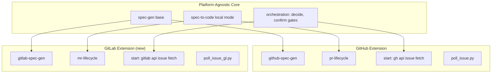

## research/issue-to-pr-architecture.md

### Summary

The existing `issue-to-pr` workflow composes three sub-workflows (`github-spec-gen`, `spec-to-code`, `pr-lifecycle`) into an end-to-end pipeline. GitHub-specific logic is concentrated in a small number of states and two polling scripts, while the core orchestration and spec-gen logic is platform-agnostic.

### Key Findings

1. **spec-gen is 100% platform-agnostic** — all states (`create-structure`, `requirements`, `research`, `design`, `plan`, `e2e-gen`, `done`) operate on local files only
2. **github-spec-gen extends spec-gen** using `extends_guide` + `from:` with `{{base}}` — each state inherits core logic and appends a `### GitHub Adaptation` section
3. **spec-to-code is ~85% platform-agnostic** — only "issue mode" branches use `gh api` for label validation, artifact download, and progress comments
4. **pr-lifecycle is 100% GitHub-specific** — every state uses `gh` CLI, GitHub API, or GraphQL mutations
5. **issue-to-pr orchestration** is mostly platform-agnostic (decide, confirm gates) but `start` state fetches issue context via `gh api`

### Platform Dependency Map

| Component | Platform-Agnostic | GitHub-Specific |
|-----------|:-:|:-:|
| spec-gen (base) | 100% | 0% |
| github-spec-gen | 0% | 100% (extends spec-gen) |
| spec-to-code (local mode) | 100% | 0% |
| spec-to-code (issue mode) | ~20% | ~80% |
| pr-lifecycle | 0% | 100% |
| issue-to-pr orchestration | ~60% | ~40% |

### GitHub-Specific Touch Points

The GitHub integration is concentrated in:
- **Artifact storage**: Issue comments + `artifact_comment_ids.json` for in-place PATCH updates
- **Status tracking**: Issue body markdown checklists updated via `gh issue edit`
- **Polling**: `poll_issue.py` (issue comments) and `poll_pr.py` (PR events)
- **Comment conventions**: `[bot reply]` prefix, 👀 reactions, creator-only filtering
- **PR management**: `gh pr create/edit/checks`, GraphQL thread resolution

### Refactoring Strategy: What Can Be Shared

### Recommendations

1. **Extract a base `issue-to-code` workflow** containing platform-agnostic orchestration (decide, confirm gates, mode propagation)
2. **Keep `github-spec-gen` pattern** — `gitlab-spec-gen` should similarly extend `spec-gen` using `from:` + `{{base}}`
3. **Create `mr-lifecycle`** as the GitLab equivalent of `pr-lifecycle`
4. **`issue-to-gl-mr`** composes: `gitlab-spec-gen` + `spec-to-code` + `mr-lifecycle` — mirroring `issue-to-pr`'s structure but with GitLab sub-workflows
5. The `start` state needs platform-specific issue fetching — use `from:` to extend a shared base if logic is similar enough
