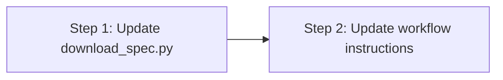

# Implementation Plan: Concise Slug Names in spec-to-code Issue Mode

## Dependency Graph

## Checklist
- [x] Step 1: Update download_spec.py — remove slugify, require --slug
- [ ] Step 2: Update workflow YAML — concise slug instruction

---

## Step 1: Update download_spec.py — remove slugify, require --slug

**Depends on**: none

**Objective**: Remove the `slugify()` fallback and make `--slug` a required argument, so the script always receives an agent-chosen slug.

**Test Requirements**: None — this is a trivial argparse change. The function removal is safe because the only caller (workflow.yaml) already passes `--slug`.

**Implementation Guidance**:
1. Delete the `slugify()` function (lines 43-54)
2. Change `--slug` from optional to required: `parser.add_argument("--slug", required=True, help="Slug for the spec directory")`
3. Replace `slug = args.slug or slugify(title)` with `slug = args.slug`
4. Update the module docstring to remove "If --slug is not provided, it is derived from the issue title"
5. Remove the unused `re` import if `slugify` was the only consumer (check: `re` is also used in `parse_artifact_header`, so keep it)

---

## Step 2: Update workflow YAML — concise slug instruction

**Depends on**: Step 1

**Objective**: Change the setup state instruction so the agent derives a concise, meaningful slug instead of mechanically slugifying the full title.

**Test Requirements**: None — this is a natural-language instruction change.

**Implementation Guidance**:
1. In `workflow.yaml`, replace line 41:
   - **From**: `Derive \`slug\` from the issue title (lowercase, strip \`feat:\`/\`fix:\` prefixes, replace non-alphanumeric with hyphens).`
   - **To**: `Derive a concise \`slug\` from the issue title — a short, meaningful identifier (lowercase, hyphen-separated).`
