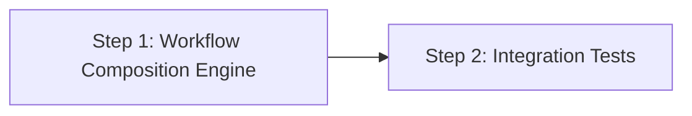

# Implementation Plan: Workflow Composition via `workflow:` Field

## Dependency Graph

## Checklist

- [x] Step 1: Workflow Composition Engine
- [ ] Step 2: Integration Tests

---

## Step 1: Workflow Composition Engine

**Depends on**: none

**Objective**: Implement the complete workflow composition feature — schema updates
(version 1.2, `workflow:` field validation), the expansion engine that inlines child
workflows as namespaced sub-states, and per-state guide scoping. After this step,
composed workflows fully expand into flat FSMs with correct guide isolation.

**Test Requirements**:

Schema & validation:
- Test: `version: 1.2` accepted, `version: 1.3` rejected
- Test: state with `workflow:` and `from:` → `SCHEMA_INVALID` (mutually exclusive)
- Test: state with `workflow:` and `prompt:` → `SCHEMA_INVALID`
- Test: state with `workflow:` but no `transitions` → `SCHEMA_INVALID`
- Test: `workflow:` used with `version: 1` → `SCHEMA_INVALID`
- Test: `STATE_NAME_RE` updated to allow `/` in state names — verify names like
  `foo/bar/baz` pass, `foo//bar` or `/foo` fail

Expansion engine:
- Test: basic expansion — parent state with `workflow:` expands to namespaced child states
- Test: transition rewriting — child internal transitions are prefixed
- Test: done-state exit mapping — child's done transitions replaced by parent's transitions
- Test: initial state redirect — if parent's `initial` is a workflow state, `fsm.initial`
  becomes `state/child-initial`
- Test: multiple workflow states in one parent — both expand independently
- Test: nested composition — workflow A → B → C produces `a/b/c` naming
- Test: circular reference → `SCHEMA_INVALID`
- Test: namespace collision → `SCHEMA_INVALID`
- Test: self-referencing transition (parent transition targets the workflow state itself)

Guide scoping:
- Test: child workflow with guide — expanded states have `state.guide` set to child's guide
- Test: child workflow without guide — expanded states have no `state.guide` (parent guide applies)
- Test: state card rendering — when `state.guide` is set, it's used instead of `fsm.guide`
- Test: reminder rendering — same guide scoping applies to `formatReminder()`

**Implementation Guidance**:

Schema changes in `fsm.ts`:
1. Update `STATE_NAME_RE` to allow `/`-separated segments (see design §4.3)
2. Update version check to accept `1.2` (see design §4.4)
3. Add optional `guide?: string` field to `FsmState` interface (see design §5.3)
4. Add pre-validation: if a state has `workflow:` field, validate mutual exclusion
   rules and forbidden fields

Expansion engine in `fsm.ts`:
5. Add `resolveWorkflowStates()` function (see design §4.1 for full algorithm)
6. Call it in `loadFsmInternal()` before `resolveRefs()` (see design §4.2)
7. Use `resolveWorkflow()` to resolve workflow references
8. Reuse the `visited` set pattern for circular reference detection
9. Handle initial state redirect: if `doc.initial === stateName`, update to
   `stateName/childFsm.initial`
10. If child FSM has a `guide`, set it on each expanded state's `guide` field

Output changes in `output.ts`:
11. Update `formatStateCard()` to accept and use per-state guide override
12. Update `formatReminder()` similarly if it references the guide

Fixtures:
13. Create fixture YAML files in `src/__tests__/fixtures/` for all test cases

---

## Step 2: Integration Tests

**Depends on**: Step 1

**Objective**: End-to-end integration tests that verify the full pipeline from YAML loading
through state card rendering for composed workflows.

**Test Requirements** (not covered by Step 1):
- Test: full pipeline — load a composed workflow, verify `fflow start` output shows correct
  initial state card with namespaced state name
- Test: `fflow goto` through a composed workflow — navigate across child boundary, verify
  state cards at each step
- Test: composed workflow with `from:` in child states — verify `from:` resolution works
  correctly within expanded child states
- Test: composed workflow with `extends_guide` on child — verify guide inheritance chain
  works with composition
- Test: Mermaid visualization (`fsmToMermaid`) produces correct graph for composed workflows

**Implementation Guidance**:
1. Create integration test file `src/__tests__/workflow-compose-integration.test.ts`
2. Use fixture-based `loadFsm()` tests that verify the full loaded structure
3. Test the output formatting functions with composed FSM data
4. Verify Mermaid output includes namespaced state names and correct transitions
