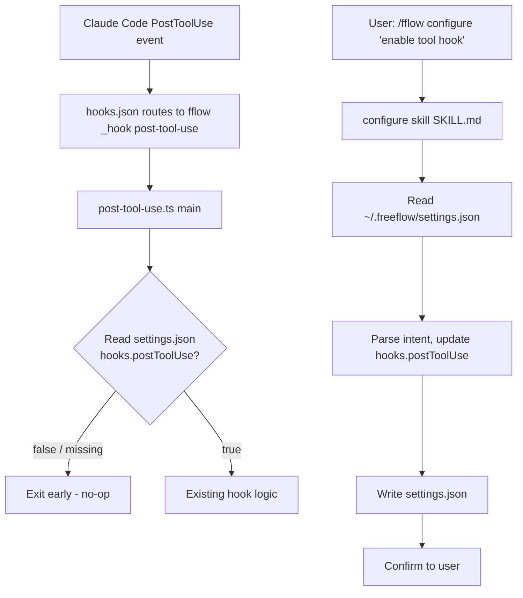

# Design: Disable Tool Hook by Default

## Overview

The freeflow PostToolUse hook currently fires on every tool call unconditionally. This change makes it opt-in: the hook script checks `~/.freeflow/settings.json` before doing any work, and a new `/fflow configure` skill lets users enable/disable it via natural language.

## Goal & Constraints

### Goals

1. The PostToolUse hook must be a no-op by default (when `settings.json` is absent or `hooks.postToolUse` is falsy).
2. A new `/fflow configure` skill parses natural-language intent and writes to `~/.freeflow/settings.json`.
3. The settings file uses the schema `{ "hooks": { "postToolUse": boolean } }`.
4. `hooks/hooks.json` remains in the package (hook is always registered with Claude Code), but the hook script exits early when disabled.

### Constraints

- MUST NOT break existing behavior for users who explicitly enable the hook.
- MUST NOT introduce a new CLI command — configure is a skill only.
- MUST NOT change the hook's reminder logic — only add an early-exit gate.
- MUST preserve the `FREEFLOW_ROOT` / `FREEFSM_ROOT` environment variable override for the settings path.

## Architecture Overview



## Components & Interfaces

### 1. Settings Reader (`src/settings.ts`)

New module responsible for reading and writing `~/.freeflow/settings.json`.

```typescript
interface FreeflowSettings {
  hooks?: {
    postToolUse?: boolean;
  };
}

function loadSettings(root: string): FreeflowSettings;
function saveSettings(root: string, settings: FreeflowSettings): void;
function isHookEnabled(root: string, hookName: "postToolUse"): boolean;
```

- `loadSettings` reads and parses `settings.json` from the root directory. Returns `{}` if file is missing or malformed.
- `saveSettings` writes the settings object to `settings.json`, creating the file if needed.
- `isHookEnabled` is a convenience wrapper: returns `settings.hooks?.[hookName] === true`.

### 2. PostToolUse Hook Gate (`src/hooks/post-tool-use.ts`)

Add an early-exit check at the top of `handlePostToolUse`:

```
if (!isHookEnabled(root, "postToolUse")) return null;
```

This goes before any session/counter logic, so when disabled the hook does zero work.

The `main()` function already resolves `root` — pass it through.

### 3. Configure Skill (`skills/configure/SKILL.md`)

A new skill file that instructs the agent to:
1. Read the user's natural-language argument (e.g., "enable tool hook", "disable the post tool use hook").
2. Read current `~/.freeflow/settings.json` (or note it doesn't exist).
3. Determine the intent (enable or disable `hooks.postToolUse`).
4. Write the updated settings using the Edit/Write tool.
5. Confirm what was changed.

The skill does NOT call any fflow CLI commands — it directly reads/writes `settings.json`.

## Data Models

### settings.json

Location: `<root>/settings.json` where root defaults to `~/.freeflow/`.

```json
{
  "hooks": {
    "postToolUse": true
  }
}
```

- Top-level object, extensible for future settings.
- `hooks` namespace groups all hook-related toggles.
- Each hook key is a boolean. Absent or `false` means disabled.
- The file may not exist — treated as all-defaults (everything disabled).

## Integration Testing

### Test 1: Hook disabled when settings missing

- **Given**: No `settings.json` exists in the root directory, and a valid session binding exists.
- **When**: `handlePostToolUse` is called with a valid `HookInput`.
- **Then**: Returns `null` (no reminder generated). No counter increment.

### Test 2: Hook disabled when `hooks.postToolUse` is false

- **Given**: `settings.json` exists with `{ "hooks": { "postToolUse": false } }`.
- **When**: `handlePostToolUse` is called.
- **Then**: Returns `null`.

### Test 3: Hook enabled and functioning

- **Given**: `settings.json` exists with `{ "hooks": { "postToolUse": true } }`, valid session binding, counter at 4.
- **When**: `handlePostToolUse` is called (counter becomes 5, divisible by 5).
- **Then**: Returns a reminder string (existing behavior preserved).

### Test 4: Settings load with malformed JSON

- **Given**: `settings.json` exists but contains invalid JSON.
- **When**: `loadSettings` is called.
- **Then**: Returns `{}` (defaults — hook disabled). No exception thrown.

### Test 5: Settings save creates file

- **Given**: `settings.json` does not exist.
- **When**: `saveSettings(root, { hooks: { postToolUse: true } })` is called.
- **Then**: File is created with the correct JSON content.

### Test 6: Settings save preserves existing keys

- **Given**: `settings.json` has `{ "hooks": { "postToolUse": false }, "other": "value" }`.
- **When**: `saveSettings` is called with `{ hooks: { postToolUse: true }, other: "value" }`.
- **Then**: File contains both keys with `postToolUse` updated to `true`.

## Error Handling

| Failure | Behavior |
|---------|----------|
| `settings.json` missing | Treated as empty `{}` — all hooks disabled (default) |
| `settings.json` malformed JSON | Treated as empty `{}` — log nothing, fail silently |
| `settings.json` not writable | Skill reports error to user ("could not write settings") |
| `root` directory doesn't exist | `saveSettings` creates it with `mkdirSync({ recursive: true })` |
| Unknown hook name in settings | Ignored — only known keys are checked |
