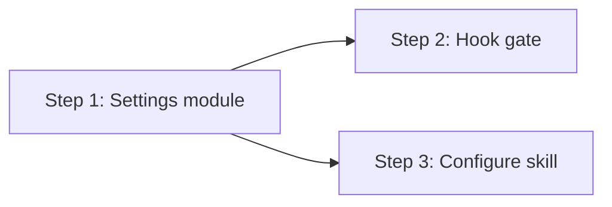

# Implementation Plan: Disable Tool Hook by Default

## Dependency Graph

## Checklist
- [x] Step 1: Settings module
- [x] Step 2: Hook gate + integration tests
- [x] Step 3: Configure skill

---

## Step 1: Settings Module

**Depends on**: none

**Objective**: Create the `src/settings.ts` module that reads/writes `~/.freeflow/settings.json`. This is the foundation both the hook gate and the configure skill depend on.

**Test Requirements**:
- Test 4 (design.md): `loadSettings` returns `{}` for missing file
- Test 4 (design.md): `loadSettings` returns `{}` for malformed JSON
- Test 5 (design.md): `saveSettings` creates file when missing
- Test 6 (design.md): `saveSettings` preserves existing keys
- Unit test: `isHookEnabled` returns `false` when settings empty
- Unit test: `isHookEnabled` returns `true` when `hooks.postToolUse` is `true`
- Unit test: `isHookEnabled` returns `false` when `hooks.postToolUse` is `false`

**Implementation Guidance**: Create `src/settings.ts` with `FreeflowSettings` interface, `loadSettings`, `saveSettings`, and `isHookEnabled` functions. See design.md "Settings Reader" section. Use `readFileSync`/`writeFileSync` consistent with the existing `store.ts` patterns. `loadSettings` should catch parse errors and return `{}`.

---

## Step 2: Hook Gate + Integration Tests

**Depends on**: Step 1

**Objective**: Add an early-exit check to `handlePostToolUse` so the hook is a no-op unless `hooks.postToolUse` is `true` in settings.

**Test Requirements**:
- Test 1 (design.md): Hook returns `null` when settings missing
- Test 2 (design.md): Hook returns `null` when `hooks.postToolUse` is `false`
- Test 3 (design.md): Hook returns reminder when `hooks.postToolUse` is `true` (existing behavior preserved)
- Verify existing hook tests still pass with `hooks.postToolUse: true` in test fixtures

**Implementation Guidance**: In `src/hooks/post-tool-use.ts`, add `isHookEnabled(root, "postToolUse")` check as the very first line of `handlePostToolUse`, before session binding and counter logic. The `main()` function already resolves `root` — pass it to `handlePostToolUse` (it already receives `root`). See design.md "PostToolUse Hook Gate" section.

---

## Step 3: Configure Skill

**Depends on**: Step 1

**Objective**: Create the `/fflow configure` skill that lets users enable/disable hooks via natural language.

**Test Requirements**: No automated tests — this is a skill markdown file (SKILL.md) that instructs the agent. Verify manually that the skill file is well-formed and referenced in the package plugin manifest.

**Implementation Guidance**: Create `skills/configure/SKILL.md` with frontmatter (`name: configure`, `description: ...`). The skill instructions should tell the agent to: (1) parse the user's intent from the argument, (2) read `~/.freeflow/settings.json`, (3) update `hooks.postToolUse` accordingly using the Write/Edit tool, (4) confirm the change. See design.md "Configure Skill" section. Register the skill in the plugin's skill manifest if needed.
