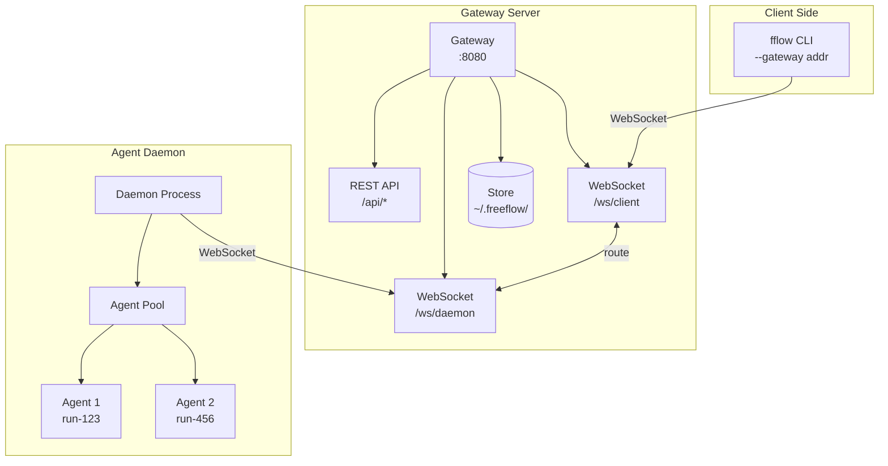
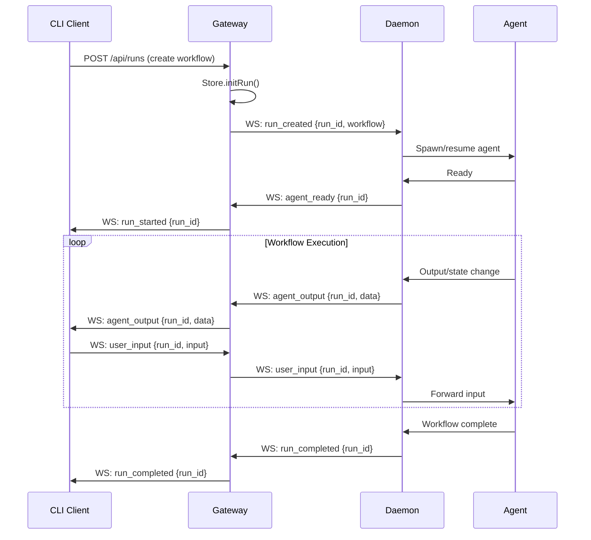
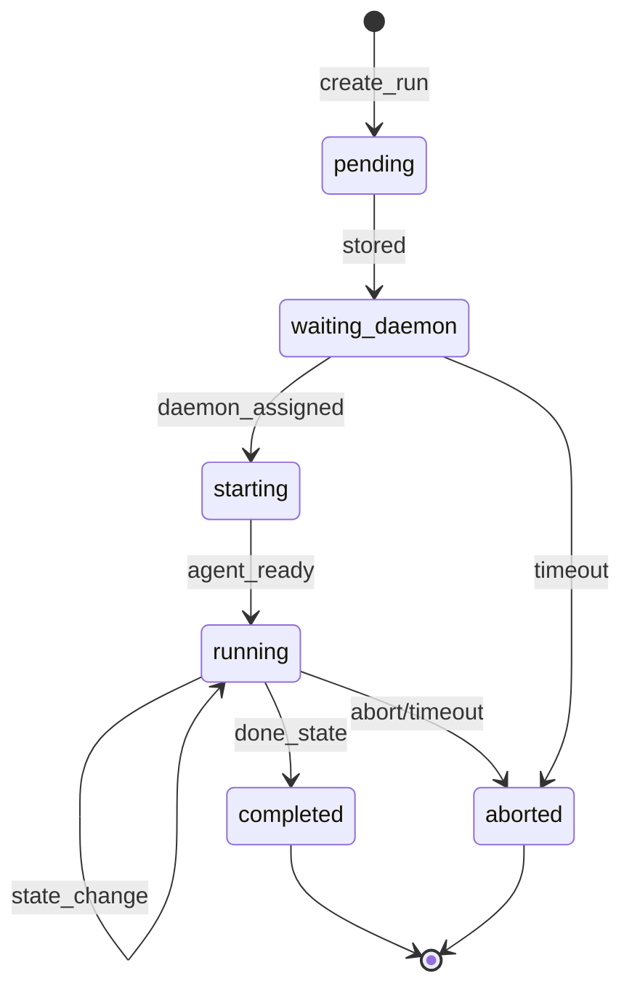

# fflow Gateway Design

## Overview

fflow Gateway is a remote execution layer for fflow workflows, enabling users to run `fflow run --gateway <addr>` from any machine and have the workflow execute on a centralized server. The architecture follows a three-tier model: CLI Client → Gateway (routing + state) → Agent Daemon (execution), providing WebSocket-based real-time interaction that mirrors the local `fflow run` experience.

## Goal & Constraints

### Goals
1. **Remote Execution**: Users can execute `fflow run --gateway <addr> <workflow>` to run workflows on a remote server
2. **Real-time Interaction**: WebSocket-based bidirectional communication for human-in-the-loop workflows
3. **Agent Daemon Model**: Decoupled architecture where Gateway handles routing/state and Daemon manages agent sessions
4. **Multi-workflow Support**: Handle 10-20 concurrent workflows with shared storage
5. **API Key Authentication**: Simple token-based auth for small team use

### Constraints
- MUST NOT modify existing `fflow` CLI behavior when `--gateway` is not specified
- MUST NOT require changes to workflow YAML format
- MUST NOT store credentials in plaintext in configuration files
- MUST NOT block on network failures — graceful degradation required
- MUST NOT exceed single-machine deployment complexity for initial release

## Architecture Overview



### Data Flow



## Components & Interfaces

### 1. Gateway Server

**Responsibility**: HTTP/WebSocket server, request routing, state management, authentication

**API Surface**:

```typescript
// REST API
POST   /api/runs              // Create new run
GET    /api/runs              // List runs
GET    /api/runs/:id          // Get run status
DELETE /api/runs/:id          // Abort run
GET    /api/health            // Health check

// WebSocket: /ws/client (for CLI clients)
interface ClientMessage {
  type: 'create_run' | 'user_input' | 'abort_run' | 'subscribe';
  run_id?: string;
  payload?: unknown;
}

interface ServerMessage {
  type: 'run_created' | 'run_started' | 'agent_output' |
        'state_changed' | 'run_completed' | 'error';
  run_id: string;
  payload?: unknown;
}

// WebSocket: /ws/daemon (for Agent Daemon)
interface DaemonMessage {
  type: 'register' | 'agent_ready' | 'agent_output' |
        'state_changed' | 'run_completed' | 'error';
  run_id?: string;
  payload?: unknown;
}

interface GatewayToDaemonMessage {
  type: 'start_run' | 'user_input' | 'abort_run';
  run_id: string;
  payload?: unknown;
}
```

**Configuration**:
```typescript
interface GatewayConfig {
  port: number;                    // default: 8080
  host: string;                    // default: '0.0.0.0'
  api_keys: string[];              // allowed API keys
  store_root: string;              // default: ~/.freeflow
  max_concurrent_runs: number;     // default: 20
  idle_timeout_ms: number;         // default: 3600000 (1h)
}
```

### 2. Agent Daemon

**Responsibility**: Manage agent sessions, execute workflows, communicate with Gateway

**API Surface**:

```typescript
interface DaemonConfig {
  gateway_url: string;             // e.g., 'ws://localhost:8080/ws/daemon'
  api_key: string;
  max_agents: number;              // default: 10
  agent_idle_timeout_ms: number;   // default: 300000 (5min)
}

// Internal agent management
interface AgentHandle {
  run_id: string;
  session_id: string;
  status: 'starting' | 'running' | 'idle' | 'stopped';
  last_activity: Date;
}
```

### 3. CLI Client Extension

**Responsibility**: Connect to Gateway, proxy user interactions

**New CLI Options**:
```bash
fflow run <workflow> --gateway <url> [--api-key <key>]
```

**Behavior**:
1. If `--gateway` specified, connect to Gateway WebSocket instead of local execution
2. Create run via Gateway API
3. Stream output from Gateway to terminal
4. Forward stdin to Gateway as user_input
5. Handle disconnection with reconnect logic

### 4. Store Extension

**Responsibility**: Persist run metadata with Gateway context

**New Fields**:
```typescript
interface RunMeta {
  // ... existing fields ...
  gateway_id?: string;        // Gateway instance ID
  client_id?: string;         // Connected client ID
  daemon_id?: string;         // Managing daemon ID
}
```

## Data Models

### Run State Machine



### Message Types

```typescript
// Client → Gateway
type ClientToGateway =
  | { type: 'create_run'; workflow: string; run_id?: string; prompt?: string }
  | { type: 'user_input'; run_id: string; input: string }
  | { type: 'abort_run'; run_id: string }
  | { type: 'subscribe'; run_id: string };

// Gateway → Client
type GatewayToClient =
  | { type: 'run_created'; run_id: string }
  | { type: 'run_started'; run_id: string; state: string }
  | { type: 'agent_output'; run_id: string; content: string; stream?: boolean }
  | { type: 'state_changed'; run_id: string; from: string; to: string }
  | { type: 'run_completed'; run_id: string; status: 'completed' | 'aborted' }
  | { type: 'error'; run_id?: string; message: string };

// Daemon → Gateway
type DaemonToGateway =
  | { type: 'register'; daemon_id: string; capacity: number }
  | { type: 'agent_ready'; run_id: string }
  | { type: 'agent_output'; run_id: string; content: string; stream?: boolean }
  | { type: 'state_changed'; run_id: string; from: string; to: string }
  | { type: 'run_completed'; run_id: string; status: 'completed' | 'aborted' }
  | { type: 'error'; run_id: string; message: string };

// Gateway → Daemon
type GatewayToDaemon =
  | { type: 'start_run'; run_id: string; workflow: string; prompt?: string }
  | { type: 'user_input'; run_id: string; input: string }
  | { type: 'abort_run'; run_id: string };
```

### Storage Schema

```
~/.freeflow/
├── gateway.json              # Gateway config
├── runs/
│   └── {run_id}/
│       ├── fsm.meta.json     # Extended with gateway fields
│       ├── events.jsonl
│       └── snapshot.json
└── sessions/
    └── {session_id}.json
```

## Integration Testing

### Test 1: Gateway-Daemon Connection

**Given**: Gateway running on port 8080, Daemon configured with Gateway URL
**When**: Daemon starts and sends `register` message
**Then**:
- Gateway accepts WebSocket connection
- Gateway stores daemon info in memory
- Gateway responds with `registered` acknowledgment

### Test 2: Run Creation Flow

**Given**: Connected Daemon with capacity > 0, authenticated client
**When**: Client sends `create_run` with workflow path
**Then**:
- Gateway creates run in Store
- Gateway sends `start_run` to Daemon
- Daemon spawns agent and sends `agent_ready`
- Gateway sends `run_started` to client

### Test 3: User Input Routing

**Given**: Running workflow waiting for user input
**When**: Client sends `user_input` message
**Then**:
- Gateway forwards to correct Daemon
- Daemon forwards to correct Agent
- Agent processes input and continues

### Test 4: Disconnection Handling

**Given**: Running workflow with connected client
**When**: Client disconnects unexpectedly
**Then**:
- Workflow continues running (not aborted)
- Client can reconnect and resubscribe
- Buffered output is replayed on reconnect

## E2E Testing

### Scenario: Basic Remote Workflow Execution

1. Start Gateway server with `fflow gateway --port 8080`
2. Start Daemon with `fflow daemon --gateway ws://localhost:8080`
3. **Verify**: Gateway shows daemon connected
4. User runs `fflow run spec-gen --gateway http://localhost:8080`
5. System shows "Connected to gateway, creating run..."
6. System shows initial state card (same as local)
7. User interacts with workflow (answers questions)
8. **Verify**: State transitions work correctly
9. User completes workflow
10. **Verify**: Run marked as completed in Gateway

### Scenario: Reconnection After Disconnect

1. Start Gateway and Daemon
2. User starts a workflow via Gateway
3. User disconnects (Ctrl+C or network issue)
4. User reconnects with same run_id
5. **Verify**: Output is replayed
6. **Verify**: User can continue interaction

## Error Handling

### Network Failures

| Failure | Detection | Recovery |
|---------|-----------|----------|
| Client disconnect | WebSocket close | Run continues, client can reconnect |
| Daemon disconnect | WebSocket close + heartbeat | Mark runs as orphaned, reassign to another daemon |
| Gateway restart | Process exit | Daemon auto-reconnects, clients reconnect |

### Agent Failures

| Failure | Detection | Recovery |
|---------|-----------|----------|
| Agent crash | Process exit code | Mark run as failed, notify client |
| Agent timeout | No output for N minutes | Send warning, then abort if unresponsive |
| Agent OOM | Process killed | Mark run as failed with reason |

### Authentication Errors

| Error | Response |
|-------|----------|
| Missing API key | 401 Unauthorized |
| Invalid API key | 403 Forbidden |
| Expired key | 401 Unauthorized (with refresh hint) |

### Graceful Degradation

- If no Daemon available: Queue runs, notify clients of wait
- If Store write fails: Retry with backoff, eventually fail run
- If client slow: Buffer output, drop if buffer full
