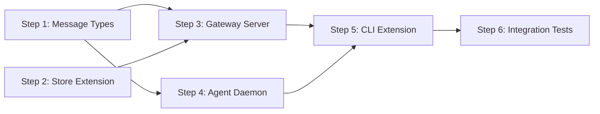

# Implementation Plan: fflow Gateway

## Dependency Graph

## Checklist

- [x] Step 1: Define Message Types and Protocols
- [x] Step 2: Extend Store with Gateway Fields
- [x] Step 3: Implement Gateway Server
- [x] Step 4: Implement Agent Daemon
- [x] Step 5: Extend CLI with --gateway Support
- [x] Step 6: Integration Tests

---

## Step 1: Define Message Types and Protocols

**Depends on**: none

**Objective**: Define all TypeScript types for WebSocket messages between Client, Gateway, and Daemon. This provides the contract for all subsequent implementations.

**Related Files**:
- `packages/freeflow/src/gateway/types.ts` (create)
- `packages/freeflow/src/store.ts` (reference for existing types)

**Test Requirements**:
- Unit test: Validate message type guards (isClientMessage, isDaemonMessage)
- Unit test: Serialize/deserialize round-trip for each message type

**Implementation Guidance**:
- Create `src/gateway/types.ts` with all message types from design.md "Data Models" section
- Export type guards for runtime validation
- Export serialization helpers

---

## Step 2: Extend Store with Gateway Fields

**Depends on**: none

**Objective**: Add gateway-specific fields to RunMeta for tracking gateway context (gateway_id, client_id, daemon_id).

**Related Files**:
- `packages/freeflow/src/store.ts` (modify)
- `packages/freeflow/src/gateway/types.ts` (reference)

**Test Requirements**:
- Unit test: Create run with gateway fields, read back correctly
- Unit test: Update gateway fields on existing run

**Implementation Guidance**:
- Extend `RunMeta` interface with optional gateway fields
- No changes to existing Store methods — fields are optional
- Add helper methods: `updateGatewayInfo(runId, info)`

---

## Step 3: Implement Gateway Server

**Depends on**: Step 1, Step 2

**Objective**: Implement the HTTP/WebSocket server that routes messages between clients and daemons, manages run state.

**Related Files**:
- `packages/freeflow/src/gateway/server.ts` (create)
- `packages/freeflow/src/gateway/client-handler.ts` (create)
- `packages/freeflow/src/gateway/daemon-handler.ts` (create)
- `packages/freeflow/src/gateway/router.ts` (create)
- `packages/freeflow/src/gateway/types.ts` (reference)
- `packages/freeflow/src/store.ts` (reference)

**Test Requirements**:
- Unit test: API key validation middleware
- Unit test: REST endpoint handlers (create run, list runs, get run)
- Unit test: WebSocket message routing logic
- Integration test case from design.md: "Gateway-Daemon Connection"

**Implementation Guidance**:
- Use `ws` package for WebSocket, built-in `http` for REST
- Implement REST endpoints per design.md "Components & Interfaces"
- Implement WebSocket handlers for `/ws/client` and `/ws/daemon`
- Router maintains client→daemon and run→daemon mappings
- See design.md "Architecture Overview" for message flow

---

## Step 4: Implement Agent Daemon

**Depends on**: Step 1

**Objective**: Implement the daemon process that connects to Gateway and manages agent sessions.

**Related Files**:
- `packages/freeflow/src/daemon/index.ts` (create)
- `packages/freeflow/src/daemon/agent-pool.ts` (create)
- `packages/freeflow/src/daemon/gateway-client.ts` (create)
- `packages/freeflow/src/gateway/types.ts` (reference)
- `packages/freeflow/src/commands/run.ts` (reference for agent spawning)

**Test Requirements**:
- Unit test: Daemon registers with Gateway on connect
- Unit test: Agent pool creates/resumes agents correctly
- Unit test: Output forwarding from agent to Gateway
- Integration test case from design.md: "Run Creation Flow"

**Implementation Guidance**:
- Daemon connects to Gateway WebSocket on startup
- Sends `register` message with capacity
- On `start_run`: spawn agent using logic from `commands/run.ts`
- Forward agent output as `agent_output` messages
- Forward user input to agent stdin
- Track agent lifecycle per design.md state machine

---

## Step 5: Extend CLI with --gateway Support

**Depends on**: Step 3, Step 4

**Objective**: Add `--gateway` option to `fflow run` command to connect to remote Gateway instead of local execution.

**Related Files**:
- `packages/freeflow/src/commands/run.ts` (modify)
- `packages/freeflow/src/cli.ts` (modify)
- `packages/freeflow/src/gateway/cli-client.ts` (create)
- `packages/freeflow/src/gateway/types.ts` (reference)

**Test Requirements**:
- Unit test: CLI parses --gateway and --api-key options
- Unit test: Gateway client connects and authenticates
- Unit test: User input forwarding works correctly
- Integration test case from design.md: "User Input Routing"

**Implementation Guidance**:
- Add `--gateway <url>` and `--api-key <key>` options to `run` command
- If `--gateway` specified, use `GatewayCliClient` instead of local execution
- `GatewayCliClient` connects to `/ws/client`, handles message routing
- Mirror terminal output formatting from local `run` command
- Handle reconnection on disconnect

---

## Step 6: Integration Tests

**Depends on**: Step 5

**Objective**: Run remaining integration tests from design.md that weren't covered by individual steps.

**Related Files**:
- `packages/freeflow/src/__tests__/gateway-integration.test.ts` (create)
- All gateway modules (reference)

**Test Requirements**:
- Integration test case from design.md: "Disconnection Handling"
  - This test requires full stack (Client + Gateway + Daemon) which wasn't available in earlier steps

**Implementation Guidance**:
- Set up test harness that spawns Gateway and Daemon
- Test client disconnect/reconnect scenario
- Test output buffering and replay on reconnect
- Use vitest with longer timeout for integration tests
