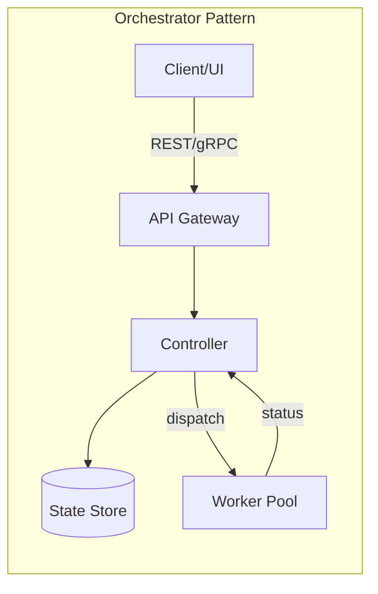

# Workflow Orchestration Gateway 模式

## Summary

主流 workflow 编排系统（Temporal、Prefect、Airflow）都采用 server-worker 分离架构，通过 API Gateway 管理 workflow 实例。fflow gateway 可以借鉴这些成熟模式，但需要适配 AI agent workflow 的特殊需求（人机交互、状态注入、长时间运行）。

## Key Findings

### 1. Temporal

- **架构**: Server 集群 + Worker 进程 + CLI/SDK
- **API**: gRPC + HTTP Gateway
- **特点**:
  - Workflow 定义为代码（不是声明式）
  - Worker 拉取任务执行
  - Server 管理状态和事件历史
  - 支持信号（signal）和查询（query）实时交互

### 2. Prefect

- **架构**: Prefect Server + Agent + Flow 代码
- **API**: REST API + WebSocket（实时更新）
- **特点**:
  - Flow 定义为 Python 代码
  - Agent 轮询或长连接获取任务
  - UI Dashboard 实时监控
  - 支持运行时参数传递

### 3. Airflow

- **架构**: Webserver + Scheduler + Worker
- **API**: REST API（Airflow 2.0+）
- **特点**:
  - DAG 定义为 Python 代码
  - Scheduler 主动调度
  - 任务粒度较粗（分钟级）
  - 适合批处理，不适合交互式

### 4. 共同模式

- **状态与执行分离**: Server 持有状态，Worker 执行逻辑
- **Pull vs Push**: Temporal/Prefect 用 Pull（worker 拉取），Airflow 用 Push（scheduler 推送）
- **事件驱动**: 所有系统都有事件日志记录状态变更

## Trade-offs

| 模式 | 优点 | 缺点 | 适合场景 |
|------|------|------|----------|
| Pull (Worker 拉取) | 简单可靠、worker 可动态扩缩 | 轮询开销、延迟 | 长时间运行的 workflow |
| Push (Server 推送) | 低延迟、实时 | 需要持久连接、复杂重连 | 交互式 workflow |
| 混合 (WebSocket + 轮询) | 平衡延迟和可靠性 | 实现复杂 | 生产环境推荐 |

## 适配 AI Agent Workflow 的考量

1. **长上下文保持**
   - AI agent session 需要保持上下文
   - 不能像传统 worker 那样无状态重启
   - 建议: Worker 即 agent session，不做 pool

2. **人机交互**
   - 传统 workflow 是自动化的
   - AI workflow 需要 human-in-the-loop
   - 建议: Gateway 支持 signal/query 向 agent 注入消息

3. **状态注入**
   - fflow 通过 PostToolUse hook 注入状态
   - Gateway 需要替代或协调 hook 机制
   - 建议: Gateway 暴露 WebSocket 用于实时状态同步

4. **长时间运行**
   - AI agent 可能运行数小时
   - 需要处理断连、恢复
   - 建议: 基于 event sourcing 的恢复机制

## Recommendations

1. **采用 Pull 模式 + WebSocket 事件通知**
   - Agent 通过 CLI/SDK 与 gateway 交互
   - Gateway 通过 WebSocket 推送事件到外部客户端

2. **保留 fflow CLI 作为 agent 侧接口**
   - Gateway 是管理面，CLI 是执行面
   - 避免重复实现 FSM 逻辑

3. **事件溯源架构**
   - 复用现有 events.jsonl
   - Gateway 订阅文件变更或定期轮询

## References

- Temporal: https://temporal.io/
- Prefect: https://www.prefect.io/
- Airflow: https://airflow.apache.org/
