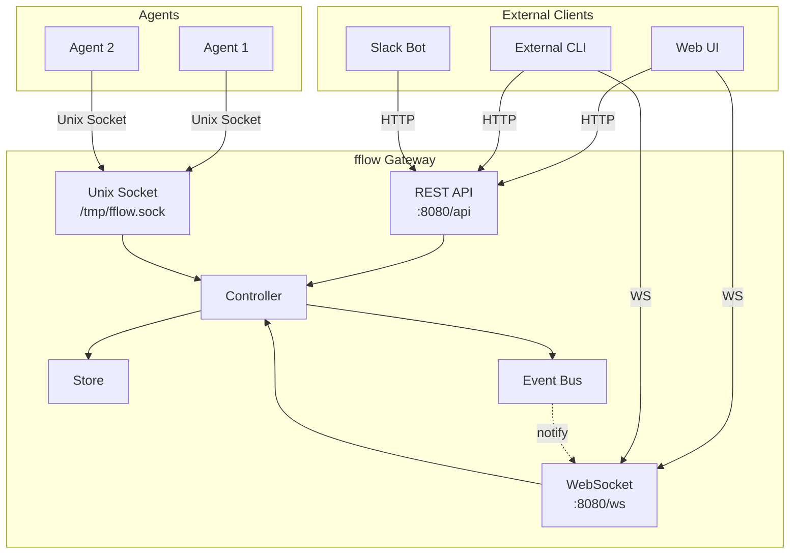

# API 设计方案对比

## Summary

fflow gateway 需要同时服务两类客户端：外部管理客户端（创建/监控 workflow）和内部 agent（执行 workflow）。REST API 适合管理操作，WebSocket 适合实时状态同步，Unix Socket 可作为本地 agent 的快速路径。

## Key Findings

### 方案对比

| 方案 | 延迟 | 复杂度 | 适用场景 |
|------|------|--------|----------|
| REST API | 高（每次建连） | 低 | CRUD 操作、管理面 |
| WebSocket | 低（持久连接） | 中 | 实时通知、状态同步 |
| Unix Socket | 最低 | 低 | 本地 IPC、同机 agent |
| gRPC | 低 | 高 | 微服务、强类型 |

### 推荐架构



### REST API 设计

```
# Workflow Runs
POST   /api/runs                 # 创建新 run
GET    /api/runs                 # 列出所有 runs
GET    /api/runs/:id             # 获取 run 详情
DELETE /api/runs/:id             # 终止 run
POST   /api/runs/:id/goto        # 状态转换
GET    /api/runs/:id/history     # 获取历史
GET    /api/runs/:id/events      # SSE 事件流

# Workflows (templates)
GET    /api/workflows            # 列出可用 workflows
GET    /api/workflows/:name      # 获取 workflow 定义
POST   /api/workflows/:name/validate  # 验证 workflow

# System
GET    /api/health               # 健康检查
GET    /api/metrics              # Prometheus 指标
```

### WebSocket 协议

```typescript
// Client -> Server
{ type: "subscribe", run_id: "abc123" }
{ type: "unsubscribe", run_id: "abc123" }
{ type: "goto", run_id: "abc123", target: "review", on: "code ready" }

// Server -> Client
{ type: "state_changed", run_id: "abc123", from: "coding", to: "review" }
{ type: "run_created", run_id: "abc123" }
{ type: "run_finished", run_id: "abc123", status: "completed" }
{ type: "error", message: "..." }
```

### 认证方案

1. **API Key** (简单)
   - Header: `Authorization: Bearer <api-key>`
   - 适合内部使用、Slack bot

2. **JWT** (标准)
   - 支持过期、刷新
   - 适合 Web UI

3. **mTLS** (安全)
   - 证书认证
   - 适合 agent-gateway 通信

**推荐**: 先用 API Key 快速迭代，后续加 JWT。

## Trade-offs

| 选择 | 优点 | 缺点 |
|------|------|------|
| REST + WebSocket | 标准、灵活 | 需要维护两套协议 |
| 纯 WebSocket | 统一协议、低延迟 | 不符合 REST 习惯、调试难 |
| gRPC + gRPC-Web | 强类型、高效 | 浏览器支持复杂、学习曲线 |

## Recommendations

1. **REST API 作为主接口**
   - 管理操作（CRUD）
   - 外部集成友好

2. **WebSocket 作为事件通道**
   - 实时状态推送
   - 可选，REST 轮询作为 fallback

3. **Unix Socket 作为本地快速路径**
   - Agent 调用 gateway
   - 绕过网络栈，低延迟

4. **API Key 认证**
   - 简单有效
   - 可后续扩展 JWT

5. **JSON 作为数据格式**
   - 复用现有 fflow JSON 输出
   - 易调试、广泛支持
