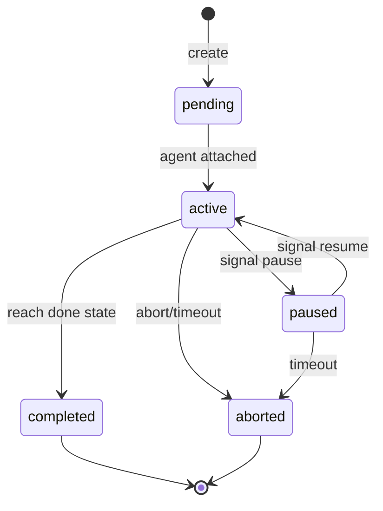
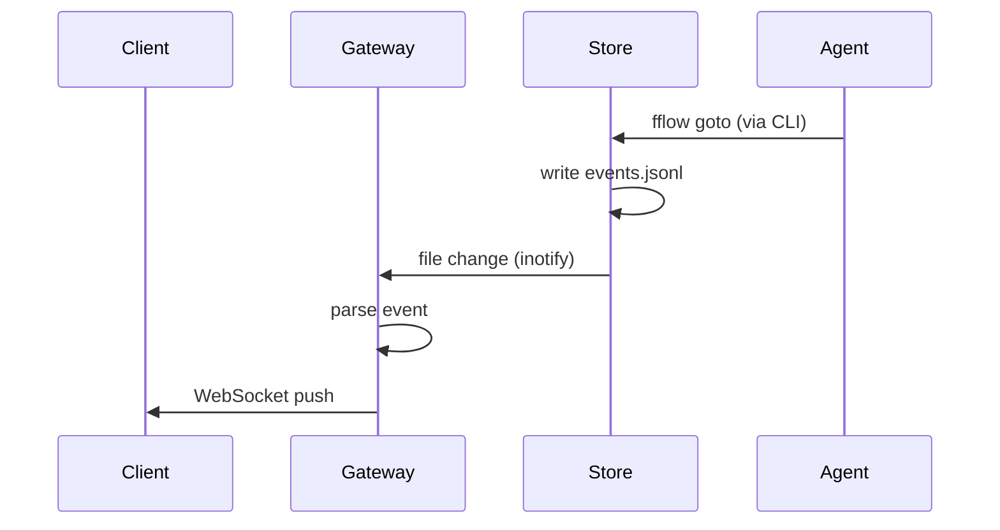

# 多实例管理策略

## Summary

fflow gateway 需要管理多个并发 workflow 实例，每个实例可能绑定到不同的 AI agent session。关键挑战是实例生命周期管理、状态同步、资源隔离。建议采用轻量级进程模型 + 事件驱动架构。

## Key Findings

### 1. 实例生命周期



**状态定义**:
- `pending`: 已创建，等待 agent 执行
- `active`: agent 正在执行
- `paused`: 暂停，保留上下文
- `completed`: 正常完成
- `aborted`: 异常终止

### 2. Agent 绑定模型

| 模型 | 描述 | 优点 | 缺点 |
|------|------|------|------|
| 1:1 绑定 | 每个 run 绑定一个 agent session | 简单、隔离好 | 资源开销大 |
| Agent Pool | 空闲 agent 领取任务 | 资源利用率高 | 上下文丢失 |
| 混合模式 | 短任务用 pool，长任务用绑定 | 灵活 | 复杂 |

**推荐**: 1:1 绑定，因为 AI agent 需要保持上下文。

### 3. 状态同步机制



**同步方式**:
1. **文件监控 (inotify/fswatch)**: 监控 events.jsonl 变更
2. **轮询**: 定期检查 snapshot.json
3. **CLI 回调**: 修改 fflow CLI，在状态变更后调用 gateway

**推荐**: 先用轮询（简单），后续优化为 inotify。

### 4. 资源隔离

| 资源 | 隔离策略 |
|------|----------|
| 存储目录 | 每个 run 独立目录（已有） |
| 锁 | 目录锁（已有） |
| 内存 | Agent 进程隔离 |
| CPU | 无限制（可选 cgroup） |
| 网络 | 无限制（可选 namespace） |

**推荐**: 复用现有目录隔离，agent 进程隔离，暂不需要 cgroup/namespace。

### 5. 并发控制

```typescript
interface GatewayConfig {
  max_concurrent_runs: number;      // 最大并发 run 数
  max_pending_runs: number;         // 最大排队数
  run_timeout_seconds: number;      // 单个 run 超时
  idle_timeout_seconds: number;     // 空闲超时（无状态变更）
}
```

**策略**:
- 超过 `max_concurrent_runs` 时，新 run 进入 pending 队列
- 超过 `max_pending_runs` 时，拒绝新建
- 超时的 run 自动标记为 aborted

### 6. 故障恢复

| 故障场景 | 恢复策略 |
|----------|----------|
| Agent 崩溃 | 保留 run 状态，允许新 agent 恢复 |
| Gateway 崩溃 | 基于 Store 重建内存状态 |
| Store 损坏 | 从 events.jsonl 重建 snapshot |

**已有能力**:
- events.jsonl 是 append-only，可重放
- snapshot.json 可重建

**需要新增**:
- Agent 心跳检测
- Run 状态过期检测

## Trade-offs

| 选择 | 优点 | 缺点 |
|------|------|------|
| 内存状态 + 文件持久化 | 性能好、简单 | 单机限制 |
| 纯文件系统 | 无状态 gateway | 性能差 |
| 数据库 | 分布式、查询能力 | 复杂度高 |

## Recommendations

1. **单机先行，保留分布式扩展能力**
   - 内存状态 + 文件持久化
   - Store 抽象可后续替换为数据库

2. **1:1 agent 绑定**
   - 每个 run 绑定一个 agent session
   - Agent 崩溃后可重新绑定

3. **轮询 + WebSocket 推送**
   - Gateway 轮询 Store 变更
   - 通过 WebSocket 推送给客户端

4. **简单超时机制**
   - Run 超时自动 abort
   - 可配置超时时间

5. **优雅关闭**
   - Gateway 关闭时通知活跃 agent
   - 给 agent 时间保存状态
