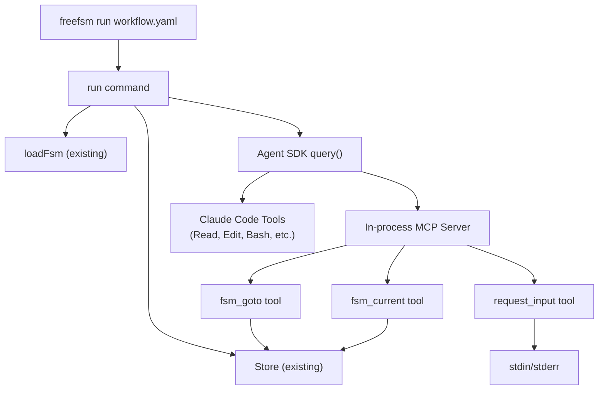

## 1. Overview

We are adding a `freefsm run` command that launches a Claude Agent SDK session to autonomously execute an FSM workflow. The agent receives state instructions via MCP tool calls (`fsm_goto`, `fsm_current`) that wrap existing freefsm functions, and can request human input via a `request_input` MCP tool that reads from stdin. This turns freefsm from a "plugin for agents" into an "agent orchestrator" — it can now drive workflows end-to-end without an external host agent like Claude Code.

## 2. Detailed Requirements

### CLI Interface
- `freefsm run <path> [--run-id <id>]` — resolve path using existing logic, auto-generate run ID if omitted
- Follows the existing command pattern: `RunArgs` interface, `try/catch` + `handleError()`, JSON output via `-j`

### Agent Session
- Uses `@anthropic-ai/claude-agent-sdk` V1 `query()` with streaming input (async generator)
- System prompt = FSM `guide` field + tool usage instructions
- Initial user message = output of `freefsm start` (state card)
- Agent loop runs until FSM reaches a terminal state (no transitions) or the agent stops

### MCP Tools (in-process via `createSdkMcpServer`)
- `fsm_goto(target, on)` — transitions FSM, returns new state card
- `fsm_current()` — returns current state card
- `request_input(prompt)` — prints prompt to stderr, reads response from stdin

### Tool Access
- Workflow YAML may declare `allowed_tools: string[]` at top level
- Defaults to full Claude Code toolset if omitted
- MCP tools are always allowed (auto-prepended)

### State Management
- Reuses existing freefsm infrastructure via direct function imports (Store, loadFsm, etc.)
- Event sourcing, snapshots, file locks — all existing behavior preserved

## 3. Architecture Overview



**Data flow:**
1. `freefsm run` loads the FSM YAML, initializes the run via Store, creates the MCP server with FSM tools
2. Launches `query()` with system prompt (guide) and initial message (state card from `start`)
3. Agent executes state instructions using Claude Code tools + custom MCP tools
4. Agent calls `fsm_goto` to transition → tool handler validates and commits via Store → returns new state card
5. Agent calls `request_input` when it needs human input → handler prompts on stderr, reads from stdin
6. Loop continues until terminal state or agent stops

## 4. Components & Interfaces

### 4.1 `src/commands/run.ts` — Main command

```typescript
export interface RunArgs {
  fsmPath: string;      // Resolved absolute path to workflow YAML
  runId?: string;        // Optional, auto-generated if omitted
  root: string;          // Storage root (default ~/.freefsm/)
  json: boolean;         // JSON output mode
}

export async function run(args: RunArgs): Promise<void>;
```

This is the only new file. It:
1. Loads FSM via `loadFsm()`
2. Generates run ID if needed
3. Initializes run via `Store.initRun()` + `Store.commit()` (same as `start` command)
4. Creates MCP server with FSM tools
5. Builds system prompt from FSM guide
6. Launches `query()` and iterates over messages
7. Prints agent output to stdout

### 4.2 MCP Server (created inside `run.ts`)

```typescript
const fsmServer = createSdkMcpServer({
  name: "freefsm",
  version: "1.0.0",
  tools: [
    tool("fsm_goto", "Transition FSM to a new state", {
      target: z.string().describe("Target state name"),
      on: z.string().describe("Transition label"),
    }, handler),

    tool("fsm_current", "Get current FSM state card", {}, handler),

    tool("request_input", "Ask the human for input via stdin", {
      prompt: z.string().describe("The question to ask the human"),
    }, handler),
  ],
});
```

### 4.3 Tool Handlers

**`fsm_goto` handler:**
- Reads current snapshot from Store
- Validates transition (same logic as existing `goto` command)
- Commits event + snapshot update via `Store.commit()` within `Store.withLock()`
- Returns `formatStateCard()` of the new state
- If FSM reaches terminal state (no transitions), includes a note that the workflow is complete

**`fsm_current` handler:**
- Reads snapshot + meta from Store
- Loads FSM, builds state card
- Returns `formatStateCard()`

**`request_input` handler:**
- Writes prompt to `process.stderr` (so it's visible to the human but not mixed with agent stdout)
- Creates a readline interface on `process.stdin`
- Returns a Promise that resolves when the user types a line
- Returns `{ content: [{ type: "text", text: userInput }] }`

### 4.4 FSM YAML Schema Extension

Add optional `allowed_tools` field:

```yaml
version: 1
guide: "..."
initial: start
allowed_tools:          # NEW — optional
  - Read
  - Edit
  - Bash
states:
  start:
    prompt: "..."
    transitions:
      done: done
  done:
    prompt: "Complete"
    transitions: {}
```

### 4.5 System Prompt Construction

```typescript
const systemPrompt = `You are an FSM-driven agent executing the "${fsmName}" workflow.

## FSM Guide
${fsm.guide ?? "No guide provided."}

## How to Use FSM Tools
- Call \`fsm_current\` to see your current state and instructions.
- Call \`fsm_goto\` with \`target\` (state name) and \`on\` (transition label) to move to the next state.
- Call \`request_input\` when you need information from the human.
- Execute the state's instructions before transitioning.
- The workflow ends when you reach a state with no transitions.

## Rules
- Follow state instructions exactly.
- Do NOT skip states or transitions.
- Only use valid transition labels shown in the state card.`;
```

## 5. Data Models

### Existing (unchanged)
- `Fsm`, `FsmState` — from `fsm.ts`
- `Store`, `Snapshot`, `StoreEvent`, `RunMeta` — from `store.ts`
- `StateCard` — from `output.ts`

### New
```typescript
// Extended Fsm interface (in fsm.ts)
export interface Fsm {
  version: number;
  guide?: string;
  initial: string;
  states: Record<string, FsmState>;
  allowed_tools?: string[];    // NEW
}
```

### Agent SDK Types (from @anthropic-ai/claude-agent-sdk)
```typescript
import { query, tool, createSdkMcpServer } from "@anthropic-ai/claude-agent-sdk";
import type { SDKMessage } from "@anthropic-ai/claude-agent-sdk";
```

## 6. Error Handling

| Failure Mode | Handling |
|---|---|
| FSM YAML invalid | `loadFsm()` throws `FsmError` → `handleError()` prints and exits |
| Run ID already exists | `CliError("RUN_EXISTS")` → user picks different ID |
| Invalid transition attempted by agent | `fsm_goto` handler returns error text to agent (not a crash) — agent retries with correct label |
| Agent SDK connection fails | Catch at top level, print error, exit 2 |
| stdin closed during `request_input` | Return EOF indicator to agent, agent decides how to proceed |
| Agent exceeds context / stops | `query()` generator ends → command prints final state and exits |
| Lock contention | Store's `withLock()` retries with 5s timeout (existing behavior) |

Key principle: **FSM tool errors are returned as text to the agent** (not thrown), so the agent can self-correct. Only infrastructure errors (SDK crash, file I/O) are thrown.

## 7. Acceptance Criteria

**AC1: Basic workflow execution**
Given a simple 3-state FSM YAML,
When `freefsm run workflow.yaml` is executed,
Then the agent transitions through all states and exits at the terminal state.

**AC2: FSM state persistence**
Given `freefsm run` is executing,
When the agent calls `fsm_goto`,
Then events are written to `events.jsonl` and `snapshot.json` is updated.

**AC3: Human input**
Given a workflow where the agent calls `request_input`,
When the tool is invoked,
Then a prompt appears on stderr and the agent receives the stdin response.

**AC4: Allowed tools**
Given a YAML with `allowed_tools: [Read, Bash]`,
When `freefsm run` launches the agent,
Then only Read, Bash, and the MCP tools are available.

**AC5: Invalid transition handling**
Given the agent attempts an invalid `fsm_goto`,
When the transition is not in the current state's transitions,
Then the tool returns an error message (not a crash) and the agent retries.

**AC6: Run ID generation**
Given no `--run-id` flag,
When `freefsm run workflow.yaml` is executed,
Then a run ID is auto-generated in `<name>-<timestamp>` format.

## 8. Testing Strategy

### Unit Tests
- `fsm_goto` handler: valid transitions, invalid transitions, terminal state detection
- `fsm_current` handler: correct state card formatting
- `request_input` handler: mock stdin, test prompt output to stderr
- System prompt construction from various FSM configs
- `allowed_tools` merging with MCP tool names

### Integration Tests
- End-to-end: run a simple FSM with a mocked Agent SDK (mock `query()` to return predetermined tool calls)
- Verify event log and snapshot after full workflow
- Verify `request_input` with piped stdin

### Manual Testing
- Run with a real FSM YAML and live Agent SDK
- Verify agent follows state instructions and transitions correctly

## 9. Appendices

### Technology Choices

| Choice | Rationale | Alternatives Rejected |
|---|---|---|
| V1 `query()` API | Stable, production-ready | V2 `createSession` — unstable, API may change |
| In-process MCP via `createSdkMcpServer` | No separate process, low latency | Standalone MCP server — unnecessary complexity |
| stdin for `request_input` | CLI-native, simple, no dependencies | MCP elicitation — requires host support, deferred to v2 |
| Direct function imports | No subprocess overhead, type-safe | Child process — slower, loses type safety |
| Per-workflow `allowed_tools` | Simple, covers most cases | Per-state tools — over-engineering for v1 |

### Research Summary
- **Claude Agent SDK**: `query()` async generator + `createSdkMcpServer()`. Custom tools require streaming input mode. Hooks available for lifecycle interception.
- **MCP Protocol**: Tools defined with Zod schemas. Elicitation available but deferred. In-process via Agent SDK is simplest.
- **HITL Patterns**: Blocking MCP tool is the cleanest — agent waits for tool result. stdin is simplest for CLI.
