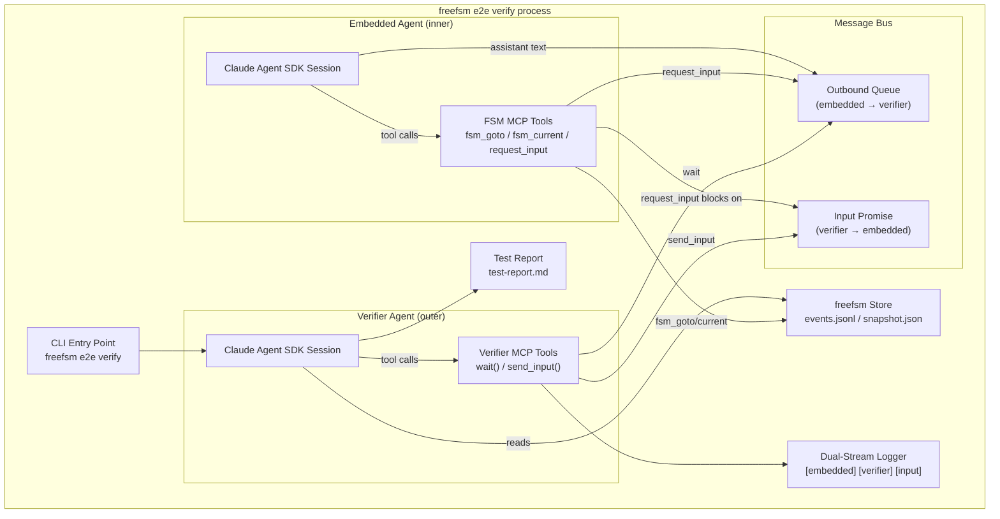
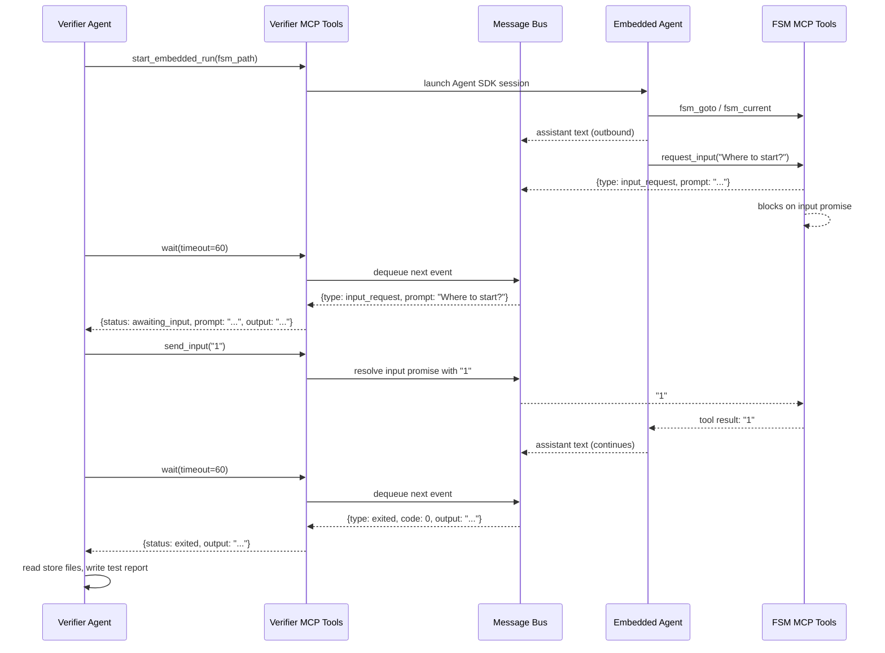

# Design: Embedded E2E Verification for freefsm

## 1. Overview

Replace the current generic `freefsm e2e verify` with a specialized implementation that runs `freefsm run` as an **embedded agent** inside the verifier process. The verifier agent communicates with the embedded agent through a message bus, enabling it to observe output, detect `request_input` prompts, and provide input — just as a human user would. This solves the fundamental limitation of the current approach: inability to test interactive `freefsm run` workflows that require multi-turn user input.

Inspired by the Freeman evaluator architecture (`~/Code/freeman/freeman/evaluator/`), which uses an in-process embedded agent with message bus and MCP tools for the outer evaluator to send/receive messages.

## 2. Detailed Requirements

### 2.1 Embedded Agent Execution

- `freefsm run` must support an **embedded mode** where the `request_input` MCP tool writes to a message bus instead of blocking on stdin.
- The embedded agent runs in-process (same Node.js process as the verifier), not as a subprocess.
- Assistant text output (what a human would see) is captured in the message bus outbound queue.
- `request_input` prompts are captured as a distinct event type so the verifier knows input is expected.

### 2.2 Verifier MCP Tools

The verifier agent receives MCP tools to interact with the embedded agent:

- **`wait(timeout)`** — blocks until the embedded agent produces an assistant message or calls `request_input`. Returns the output/prompt. Timeout prevents infinite hangs.
- **`send_input(text)`** — sends a line of text to the embedded agent, resolving a pending `request_input`. Errors if no input is currently expected.

### 2.3 Autonomous Input Decisions

- The verifier agent decides what input to provide based on the **test plan's steps and goal** — not by reading the FSM workflow being tested.
- The test plan format is unchanged: `## Setup`, `## Steps`, `## Expected Outcomes`, `## Cleanup`.
- The workflow path to test is inferred from the Setup section of the test plan.

### 2.4 Log Access & Reporting

- The verifier can read the embedded run's store files (`events.jsonl`, `snapshot.json`) after the run completes.
- The verifier writes a test report based on observations and store data.

### 2.5 Live Logging

`freefsm e2e verify` logs three streams to stderr, visually distinguishable:

| Stream | Prefix | Color | Indentation |
|--------|--------|-------|-------------|
| Embedded agent output | `[embedded]` | Cyan | Indented |
| Verifier agent output | `[verifier]` | Green | Top level |
| Verifier input to embedded | `[input]` | Magenta | Top level |

Tool calls are excluded from logs — only assistant text, `request_input` prompts, and user-provided input are shown.

### 2.6 Replaces Existing Implementation

The new embedded approach fully replaces the current `freefsm e2e verify`. The CLI interface remains the same: `freefsm e2e verify <plan.md> --test-dir <path>`.

## 3. Architecture Overview



### Data Flow



## 4. Components & Interfaces

### 4.1 MessageBus

Central communication channel between the embedded agent and the verifier.

```typescript
class MessageBus {
  // Outbound: embedded agent → verifier
  enqueueOutput(text: string): void;
  enqueueInputRequest(prompt: string): Promise<string>; // blocks until resolved

  // Verifier side
  waitForEvent(timeout: number): Promise<BusEvent>;  // blocks until event available
  resolveInput(text: string): void;                    // resolves pending input request

  // Lifecycle
  markExited(code: number): void;
}
```

**Events** are consumed in FIFO order. `waitForEvent` blocks (with timeout) until the next event is available or the embedded agent exits.

### 4.2 EmbeddedRun

Wraps the embedded `freefsm run` Agent SDK session. Adapts the existing `run()` function to use the message bus instead of stdin/stdout.

```typescript
class EmbeddedRun {
  constructor(fsmPath: string, options: EmbeddedRunOptions);

  start(): Promise<void>;   // launches Agent SDK session in background
  getBus(): MessageBus;
  getRunId(): string;
  getStoreRoot(): string;   // path to store for post-hoc inspection
}
```

Key changes from the current `run()`:
- `request_input` tool resolves via `bus.enqueueInputRequest()` instead of `readline` on stdin
- Agent `result` messages go to `bus.enqueueOutput()` instead of `process.stdout`
- The session runs as an async task, not blocking the main thread

### 4.3 Verifier MCP Tools

Exposed to the verifier agent via an MCP server:

#### `start_embedded_run(fsm_path: string, prompt?: string)`
Starts the embedded `freefsm run` session. Returns `{ run_id, store_root }`.

#### `wait(timeout: number)`
Blocks until the next event from the embedded agent.

Returns one of:
```typescript
{ status: "output", text: string }           // assistant produced text
{ status: "awaiting_input", prompt: string, output: string }  // request_input called
{ status: "exited", code: number, output: string }            // agent session ended
{ status: "timeout" }                        // timeout reached
```

The `output` field contains any accumulated assistant text since the last `wait()` call.

#### `send_input(text: string)`
Sends input to the embedded agent. Fails if no `request_input` is pending.

### 4.4 DualStreamLogger

Logs to stderr with visual distinction between streams.

```typescript
class DualStreamLogger {
  logEmbedded(text: string): void;   // [embedded] cyan, indented
  logVerifier(text: string): void;   // [verifier] green, top level
  logInput(text: string): void;      // [input]    magenta, top level
}
```

### 4.5 Verifier Agent

The outer Claude Agent SDK session. Receives:
- System prompt with verification instructions
- Test plan context (parsed from markdown)
- MCP tools: `start_embedded_run`, `wait`, `send_input`, plus file read tools for store inspection

The verifier agent autonomously:
1. Starts the embedded run
2. Observes output via `wait()`
3. Provides input via `send_input()` when `request_input` is detected
4. Reads store files after completion
5. Writes test report

## 5. Data Models

### 5.1 BusEvent

```typescript
type BusEvent =
  | { type: "output"; text: string }
  | { type: "input_request"; prompt: string; output: string }
  | { type: "exited"; code: number; output: string }
```

### 5.2 EmbeddedRunOptions

```typescript
interface EmbeddedRunOptions {
  runId?: string;
  root?: string;       // freefsm store root
  prompt?: string;     // initial user prompt
  model?: string;      // Claude model override
  logger?: DualStreamLogger;
}
```

### 5.3 VerifyArgs (updated)

```typescript
interface VerifyArgs {
  planPath: string;
  testDir: string;
  json: boolean;
  model?: string;
}
```

Unchanged CLI interface. The workflow path is parsed from the test plan's Setup section.

### 5.4 Test Report Output

Written to `--test-dir`:
- `test-report.md` — human-readable report with per-step verdicts
- `test-report.json` — machine-readable summary (when `--json`)
- `transcript.jsonl` — verifier agent's transcript (actions, observations, judgments)

## 6. Error Handling

| Error Case | Handling |
|------------|----------|
| Embedded agent crashes | `waitForEvent` returns `{ type: "exited", code: 1 }`. Verifier reports failure. |
| `wait()` timeout | Returns `{ status: "timeout" }`. Verifier decides whether to retry or fail the step. |
| `send_input()` with no pending request | Returns MCP error: "No input request pending". |
| Invalid FSM path in Setup | `start_embedded_run` fails with descriptive error. |
| Embedded agent never calls `request_input` | `wait()` returns `output` or `exited` events — verifier proceeds normally. |
| Store files missing | Verifier reports what it can; missing files noted in report. |

## 7. Acceptance Criteria

### AC1: Basic embedded run
**Given** a test plan targeting a non-interactive FSM workflow
**When** `freefsm e2e verify <plan> --test-dir <dir>` is run
**Then** the embedded agent executes to completion, and a test report is written to `<dir>/test-report.md`

### AC2: Interactive input handling
**Given** a test plan targeting an FSM workflow that requires user input
**When** the embedded agent calls `request_input`
**Then** the verifier agent detects the prompt, decides the appropriate input from the test plan context, sends it via `send_input`, and the embedded agent continues

### AC3: Multi-turn interaction
**Given** a workflow requiring multiple rounds of user input
**When** the verifier runs the test
**Then** it handles each `request_input` → `send_input` cycle correctly, observing output between each

### AC4: Live logging
**Given** the verify command is running
**When** the embedded agent produces output or the verifier sends input
**Then** stderr shows color-coded, prefixed logs: `[embedded]` (cyan, indented), `[verifier]` (green), `[input]` (magenta)

### AC5: Store inspection
**Given** the embedded run has completed
**When** the verifier reads `events.jsonl` and `snapshot.json`
**Then** it can verify FSM state transitions and final state in the test report

### AC6: Timeout handling
**Given** the embedded agent hangs or takes too long
**When** `wait(timeout)` expires
**Then** the verifier receives a timeout status and can fail the step gracefully

## 8. Testing Strategy

### 8.1 Unit Tests

- **MessageBus**: enqueue/dequeue ordering, timeout behavior, input resolution, exit signaling
- **DualStreamLogger**: correct prefixes, colors, indentation
- **EmbeddedRun**: startup, shutdown, bus wiring

### 8.2 Integration Tests

- **End-to-end with a simple FSM**: Create a trivial 2-state FSM that requires input, write a test plan, run `freefsm e2e verify`, assert report is generated with correct verdicts
- **Non-interactive workflow**: Verify that workflows without `request_input` still work
- **Timeout scenario**: FSM that hangs, verify timeout is handled

### 8.3 Dogfood Tests

- Use the new verify to test freefsm's own workflows (e.g., PDD workflow first state)

## 9. Appendices

### 9.1 Technology Choices

| Choice | Rationale |
|--------|-----------|
| In-process embedded agent | Avoids subprocess stdio piping complexity. Direct function call + message bus is simpler and more reliable. |
| Promise-based message bus | Node.js native async/await. No external dependencies needed. |
| Event queue (not callbacks) | Verifier agent is tool-call driven — it needs to poll for events via `wait()`, not receive callbacks. Queue model fits MCP tool semantics. |

### 9.2 Research: Freeman Evaluator

The Freeman evaluator (`~/Code/freeman/freeman/evaluator/`) uses:
- `InMemoryMessageBus` with asyncio events (Python equivalent of Promise)
- Unix socket server for IPC between evaluator tools and embedded instance
- MCP tools: `wait_ready`, `send`, `receive`, `report_progress`
- Index-based message dequeue

For freefsm, we simplify:
- No Unix socket needed (both agents are in same Node.js process)
- `BusEvent` queue replaces separate inbound/outbound message lists
- `wait()` combines `wait_ready` + `receive` into one blocking tool
- No `report_progress` — verifier writes its own report

### 9.3 Alternatives Considered

| Alternative | Why Rejected |
|-------------|-------------|
| **Child process with piped stdio** | Requires parsing unstructured stderr to detect `request_input`. Fragile. Race conditions with buffering. |
| **Programmatic callback API on `run()`** | Tightly couples verifier to run internals. Embedded mode with message bus is cleaner. |
| **IPC/socket communication** | Overkill for same-process communication. Adds unnecessary complexity. |
| **Keep generic verify, add new subcommand** | User decided to replace — one approach is simpler to maintain. |
