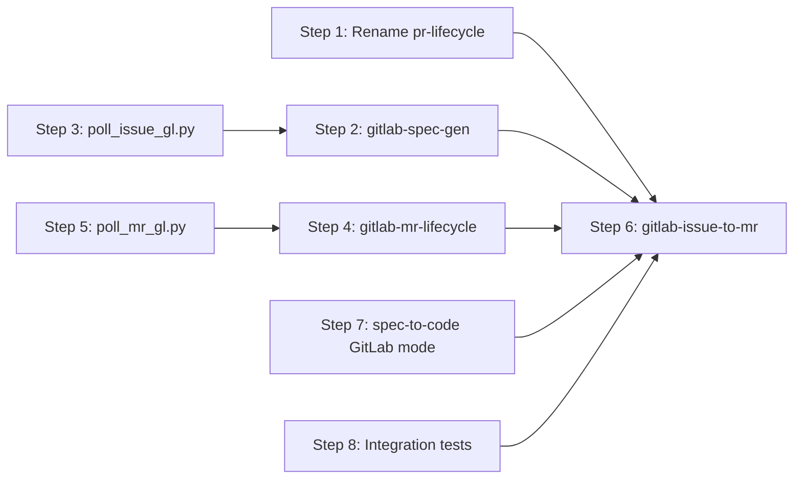

# Implementation Plan: GitLab Workflow Support

## Dependency Graph

## Checklist
- [x] Step 1: Rename `pr-lifecycle` → `github-pr-lifecycle`
- [x] Step 2: Create `gitlab-spec-gen` workflow
- [x] Step 3: Create `poll_issue_gl.py` polling script
- [x] Step 4: Create `gitlab-mr-lifecycle` workflow
- [x] Step 5: Create `poll_mr_gl.py` polling script
- [ ] Step 6: Create `gitlab-issue-to-mr` composition workflow
- [x] Step 7: Modify `spec-to-code` for GitLab issue mode
- [ ] Step 8: Integration tests

---

## Step 1: Rename `pr-lifecycle` → `github-pr-lifecycle`

**Depends on**: none

**Objective**: Establish consistent naming convention (`github-*` / `gitlab-*`) by renaming the existing PR lifecycle workflow. This is a prerequisite for the composition workflows that reference it.

**Related Files**:
- `workflows/pr-lifecycle/workflow.yaml` → rename to `workflows/github-pr-lifecycle/workflow.yaml`
- `workflows/pr-lifecycle/poll_pr.py` → move to `workflows/github-pr-lifecycle/poll_pr.py`
- `workflows/issue-to-pr/workflow.yaml` — update `workflow:` reference from `../pr-lifecycle/` to `../github-pr-lifecycle/`
- `workflows/idea-to-pr/workflow.yaml` — update `workflow:` reference if it references pr-lifecycle

**Test Requirements**:
- Integration Test 4: Renamed `github-pr-lifecycle` loads correctly (same behavior as original)
- Integration Test 5: `issue-to-pr` still works after rename (sub-workflow expands correctly)

**Implementation Guidance**:
1. Rename the directory `workflows/pr-lifecycle/` → `workflows/github-pr-lifecycle/`
2. Update `workflow:` reference in `issue-to-pr/workflow.yaml`: `../pr-lifecycle/workflow.yaml` → `../github-pr-lifecycle/workflow.yaml`
3. Check `idea-to-pr/workflow.yaml` for similar references and update
4. Verify no other workflows reference the old path

---

## Step 2: Create `gitlab-spec-gen` workflow

**Depends on**: Step 3 (needs `poll_issue_gl.py`)

**Objective**: Create the GitLab-specific spec generation workflow that mirrors `github-spec-gen` but uses `glab` CLI for all interactions. This is a core building block for the GitLab pipeline.

**Related Files**:
- `workflows/gitlab-spec-gen/workflow.yaml` — NEW
- `workflows/github-spec-gen/workflow.yaml` — reference for structure
- `workflows/spec-gen/workflow.yaml` — base workflow being extended
- `workflows/gitlab-spec-gen/poll_issue_gl.py` — polling script (Step 3)

**Test Requirements**:
- Integration Test 2: `gitlab-spec-gen` extends `spec-gen` correctly (each state has base + GitLab adaptation; research only has `back to requirements` transition)

**Implementation Guidance**:
1. Create `workflows/gitlab-spec-gen/workflow.yaml` following exact same structure as `github-spec-gen/workflow.yaml`
2. Use `extends_guide: ../spec-gen/workflow.yaml` with `{{base}}` + GitLab-specific guide override
3. Each state uses `from: "../spec-gen/workflow.yaml#<state>"` with `### GitLab Adaptation` section
4. Replace all `gh` CLI commands with `glab` equivalents per the mapping in design.md §4.1
5. `create-issue` state: `glab issue create --title T --description B`, `glab issue note N --message B`
6. Artifact creation: write locally + post via `glab api` to create notes, track note IDs
7. Status checklist updates: `glab issue update N --description B`
8. Auth check: `glab auth status`
9. Reactions: `glab api projects/:fullpath/issues/:iid/notes/:note_id/award_emoji -f name=eyes`
10. Reference `poll_issue_gl.py` for polling pattern

---

## Step 3: Create `poll_issue_gl.py` polling script

**Depends on**: none

**Objective**: GitLab equivalent of `poll_issue.py` that polls GitLab issue notes for new comments from the issue creator.

**Related Files**:
- `workflows/gitlab-spec-gen/poll_issue_gl.py` — NEW
- `workflows/github-spec-gen/poll_issue.py` — reference implementation

**Test Requirements**:
- Unit test: script parses note responses correctly, filters by author, outputs `NEW_COMMENT:` format

**Implementation Guidance**:
1. Copy `poll_issue.py` as starting point
2. Replace GitHub API calls with `glab api` equivalents:
   - List notes: `glab api projects/{project_path}/issues/{iid}/notes --paginate`
   - React: `glab api -X POST projects/{project_path}/issues/{iid}/notes/{note_id}/award_emoji -f name=eyes`
3. Filter by `author.username` (GitLab) instead of `author.login` (GitHub)
4. Note IDs are in `.id` field (same as GitHub comment IDs)
5. Accept args: `project_path`, `iid`, `creator_username`, `--run-id`
6. Persist note count in `~/.freeflow/runs/{run_id}/comment_count`
7. Use `GITLAB_TOKEN` env var for auth (passed to glab automatically)

---

## Step 4: Create `gitlab-mr-lifecycle` workflow

**Depends on**: Step 5 (needs `poll_mr_gl.py`)

**Objective**: GitLab MR monitoring workflow equivalent to `github-pr-lifecycle`. Monitors MR from creation through merge/close, fixing CI failures and addressing review feedback.

**Related Files**:
- `workflows/gitlab-mr-lifecycle/workflow.yaml` — NEW
- `workflows/github-pr-lifecycle/workflow.yaml` — reference (after rename in Step 1)
- `workflows/gitlab-mr-lifecycle/poll_mr_gl.py` — polling script (Step 5)

**Test Requirements**:
- Integration Test 1 (partial): `gitlab-mr-lifecycle` loads without schema errors, all transitions valid

**Implementation Guidance**:
1. Create `workflows/gitlab-mr-lifecycle/workflow.yaml` following `github-pr-lifecycle` structure
2. States: `create-mr`, `poll`, `fix`, `rebase`, `address`, `push`, `done`
3. `create-mr`: `glab mr create --source-branch X --target-branch Y --title T --description B`
4. `poll`: Run `poll_mr_gl.py` in background, consumes `mr_status.json`
5. `fix`: Read CI logs via `glab ci view` or `glab api projects/:id/pipelines/:pid/jobs`
6. `rebase`: Use GitLab native rebase API: `glab api -X PUT projects/:id/merge_requests/:iid/rebase`
7. `address`: Read discussions via `glab api projects/:id/merge_requests/:iid/discussions`, reply via notes, resolve via `PUT .../discussions/:id?resolved=true`
8. `push`: Update MR description via `glab mr update :iid --description B`
9. Key simplifications vs GitHub version: REST thread resolution (no GraphQL), native rebase API, CI status embedded in MR object

---

## Step 5: Create `poll_mr_gl.py` polling script

**Depends on**: none

**Objective**: GitLab equivalent of `poll_pr.py` that monitors MR status, pipeline, discussions, and `@bot` mentions.

**Related Files**:
- `workflows/gitlab-mr-lifecycle/poll_mr_gl.py` — NEW
- `workflows/github-pr-lifecycle/poll_pr.py` — reference implementation

**Test Requirements**:
- Unit test: script correctly parses MR status, pipeline state, new discussions

**Implementation Guidance**:
1. Copy `poll_pr.py` as starting point
2. Replace GitHub API with `glab api` equivalents:
   - MR status: `glab api projects/:id/merge_requests/:iid` → check `state`, `detailed_merge_status`, `head_pipeline`
   - Discussions: `glab api projects/:id/merge_requests/:iid/discussions`
   - Notes: `glab api projects/:id/merge_requests/:iid/notes`
3. Write `mr_status.json` with structure matching `pr_status.json`:
   - `state`: merged/closed/open
   - `pipeline_status`: success/failed/running/pending
   - `needs_rebase`: boolean (from `detailed_merge_status`)
   - `discussions`: unresolved threads
   - `bot_mentions`: notes mentioning `@bot`
4. React with 👀 to new notes via award emoji API
5. Accept args: `project_path`, `mr_iid`, `--run-id`

---

## Step 6: Create `gitlab-issue-to-mr` composition workflow

**Depends on**: Steps 1, 2, 4, 7

**Objective**: End-to-end GitLab workflow from issue to merged MR, composing `gitlab-spec-gen`, `spec-to-code`, and `gitlab-mr-lifecycle`.

**Related Files**:
- `workflows/gitlab-issue-to-mr/workflow.yaml` — NEW
- `workflows/issue-to-pr/workflow.yaml` — reference for composition pattern
- `workflows/gitlab-spec-gen/workflow.yaml` — sub-workflow
- `workflows/spec-to-code/workflow.yaml` — sub-workflow
- `workflows/gitlab-mr-lifecycle/workflow.yaml` — sub-workflow

**Test Requirements**:
- Integration Test 3: `gitlab-issue-to-mr` composition expands correctly (namespaced states, done-state transitions rewritten)

**Implementation Guidance**:
1. Create `workflows/gitlab-issue-to-mr/workflow.yaml` following `issue-to-pr` structure
2. Use `version: 1.2` for `workflow:` composition support
3. `extends_guide: ../gitlab-spec-gen/workflow.yaml` with GitLab-specific composition guide
4. States:
   - `start`: Detect input mode (new idea or existing GitLab issue). Auto-detect project from git remote via `git remote get-url origin | sed 's|.*gitlab[^/]*/||;s|\.git$||'`. Fetch issue via `glab api` if existing.
   - `spec`: `workflow: ../gitlab-spec-gen/workflow.yaml` → transitions: `completed: decide`
   - `decide`: Post execution mode options as issue note, poll for choice (1=full-auto, 2=fast-forward, 3=stop)
   - `confirm-implement`: Fast-forward gate, poll issue for go/stop
   - `implement`: `workflow: ../spec-to-code/workflow.yaml` → transitions: `completed: confirm-mr`
   - `confirm-mr`: Post implementation summary, confirm MR submission (skipped in full-auto)
   - `submit-mr`: `workflow: ../gitlab-mr-lifecycle/workflow.yaml` → transitions: `completed: done`
   - `done`: Post final summary note, terminal state
5. Agent memory: `project_path`, `gitlab_url`, `issue_iid`, `issue_creator`, `mode`, `slug`
6. Gate states use `glab issue note` for posting and `poll_issue_gl.py` for polling

---

## Step 7: Modify `spec-to-code` for GitLab issue mode

**Depends on**: none

**Objective**: Make `spec-to-code`'s issue mode work for both GitHub and GitLab, so it can be composed into both `issue-to-pr` and `gitlab-issue-to-mr`.

**Related Files**:
- `workflows/spec-to-code/workflow.yaml` — MODIFY
- `workflows/spec-to-code/download_spec.py` — MODIFY or create GitLab variant
- `workflows/spec-to-code/prepare_implementation.py` — MODIFY or create GitLab variant

**Test Requirements**:
- Unit test: `spec-to-code` loads without schema errors after modification
- Verify GitHub issue mode still works (no regression)

**Implementation Guidance**:
1. In `setup` state, detect platform from the issue reference or parent workflow context:
   - If issue URL contains `gitlab` or project path format → GitLab mode
   - If `owner/repo#N` format → GitHub mode
   - Add platform detection logic to the prompt
2. Add `### GitLab Issue Mode` section to states that interact with the issue:
   - `setup`: Validate spec-ready label via `glab api`, download artifacts from GitLab notes
   - `implement`: Post progress comments via `glab issue note`
   - `done`: Post summary via `glab issue note`, update labels
3. For `download_spec.py`: Create `download_spec_gl.py` variant that fetches artifacts from GitLab issue notes (or make the existing script platform-aware)
4. For `prepare_implementation.py`: Create GitLab variant that uses `glab` for branch/label operations

---

## Step 8: Integration tests

**Depends on**: Steps 1-6

**Objective**: Verify all new and modified workflow files load correctly and compose as expected via FSM schema validation.

**Related Files**:
- `src/__tests__/fsm-workflow-compose.test.ts` — add tests
- `src/__tests__/fsm-reuse.test.ts` — add tests
- All new/modified workflow YAML files

**Test Requirements**:
- Integration Test 1: All new workflow files load without schema errors
- Integration Test 2: `gitlab-spec-gen` extends `spec-gen` correctly
- Integration Test 3: `gitlab-issue-to-mr` composition expands correctly
- Integration Test 4: Renamed `github-pr-lifecycle` loads correctly
- Integration Test 5: `issue-to-pr` still works after rename
- Additional: Verify research → requirements only transition in both `github-spec-gen` and `gitlab-spec-gen`

**Implementation Guidance**:
1. Add test cases to existing test files following the patterns in `fsm-workflow-compose.test.ts` and `fsm-reuse.test.ts`
2. For each new workflow: load via `loadFsm()`, verify state count, verify specific transitions
3. For composition workflows: verify namespaced states exist (e.g., `spec/create-issue`), verify done-state exit mapping
4. For `from:` workflows: verify merged prompts contain both `{{base}}` content and adaptation section
5. Verify backward compatibility: `issue-to-pr` loads with same state set as before
