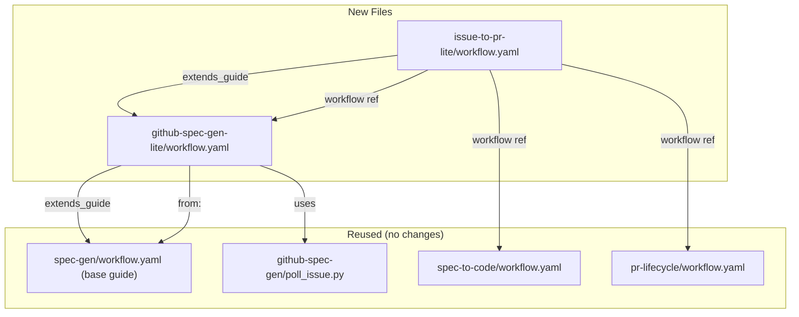

### Overview

Issue-to-PR Lite is a new workflow YAML file (`issue-to-pr-lite/workflow.yaml`) that provides a streamlined version of the existing `issue-to-pr` workflow. It composes a lite variant of `github-spec-gen` with the existing `spec-to-code` and `pr-lifecycle` sub-workflows, producing simplified design and plan artifacts while keeping all other workflow phases (requirements, research, implementation, PR) unchanged.

### Goal & Constraints

**Goals:**
- Create a new `issue-to-pr-lite` workflow directory under `packages/freeflow/workflows/`
- Create a lite variant of `github-spec-gen` (`github-spec-gen-lite/workflow.yaml`) that produces simplified design.md and plan.md artifacts
- Simplified design.md sections: Overview, Goal & Constraints, Architecture & Components (merged section combining Architecture Overview, Components & Interfaces, Data Models, and Integration Testing), E2E Testing — no Error Handling section
- Simplified plan.md: exactly 2 steps — Step 1 "Implement the feature" (with bullet sub-items referencing design components) and Step 2 "E2E test"
- Workflow invocable as `/fflow issue-to-pr-lite`
- All other phases (requirements, research, spec-to-code, pr-lifecycle) remain identical to `issue-to-pr`

**Constraints:**
- MUST NOT modify existing `issue-to-pr`, `github-spec-gen`, or `spec-gen` workflow files
- MUST reuse existing sub-workflows (`spec-to-code`, `pr-lifecycle`) without modification
- MUST maintain the same GitHub issue interaction pattern (comments, polling, status checklist)
- MUST NOT introduce new CLI commands or runtime changes — this is purely a new workflow YAML
- MUST keep `extends_guide` and `from:` inheritance patterns consistent with existing conventions

### Architecture & Components



#### Component: `github-spec-gen-lite/workflow.yaml`

A lite variant of `github-spec-gen` that overrides the `design` and `plan` states with simplified prompts while inheriting everything else.

**Structure:**
- `extends_guide: ../github-spec-gen/workflow.yaml` — inherits the full GitHub issue interaction guide (artifact output, comment polling, status checklist, error handling)
- `from: "../spec-gen/workflow.yaml#requirements"` — reuses requirements state unchanged
- `from: "../spec-gen/workflow.yaml#research"` — reuses research state unchanged
- Custom `design` state — overrides the base design prompt with simplified sections (4 sections instead of 8)
- Custom `plan` state — overrides the base plan prompt with 2-step format
- `from: "../spec-gen/workflow.yaml#e2e-gen"` — reuses e2e-gen state unchanged
- Reuses `create-issue` and `done` states from github-spec-gen with GitHub adaptations
- Reuses `poll_issue.py` from `github-spec-gen/` (relative path `../github-spec-gen/poll_issue.py`)

**Key differences from `github-spec-gen`:**

| Aspect | github-spec-gen | github-spec-gen-lite |
|--------|----------------|---------------------|
| design.md sections | 8 sections | 4 sections (Overview, Goal & Constraints, Architecture & Components, E2E Testing) |
| plan.md steps | N steps (one per component) | 2 steps (implement + e2e test) |
| plan.md Step 1 format | Each step is a self-contained module | Single step with bullet sub-items referencing design components |

**Design state prompt override:**
The lite design state replaces the 8-section requirement with:
1. **Overview** — same as base
2. **Goal & Constraints** — same as base
3. **Architecture & Components** — merged section covering architecture (with Mermaid diagram), component responsibilities, data models, and integration test cases (Given/When/Then format)
4. **E2E Testing** — same as base (critical for e2e completeness)

**Plan state prompt override:**
The lite plan state replaces the N-step format with a fixed 2-step structure:
```markdown
# Implementation Plan: <Feature Name>

## Checklist
- [ ] Step 1: Implement the feature
- [ ] Step 2: E2E test

---

## Step 1: Implement the feature

**Depends on**: none

**Objective**: Implement all components described in design.md.

**Sub-items**:
- <bullet referencing design component 1>
- <bullet referencing design component 2>
- ...

**Related Files**: <all files from design>

**Test Requirements**: <integration tests from design>

---

## Step 2: E2E test

**Depends on**: Step 1

**Objective**: Run e2e tests to validate the implementation.
```

#### Component: `issue-to-pr-lite/workflow.yaml`

A thin wrapper that composes the lite spec-gen with existing sub-workflows. Structurally identical to `issue-to-pr/workflow.yaml` except:
- References `../github-spec-gen-lite/workflow.yaml` instead of `../github-spec-gen/workflow.yaml`
- `extends_guide` points to `../github-spec-gen-lite/workflow.yaml`
- All other states (start, decide, confirm-implement, implement, confirm-pr, submit-pr, done) are identical

**Data models:** No new data structures. Uses the same artifact cache (`~/.freeflow/runs/{run_id}/artifacts/`), comment ID tracking, and status checklist format as existing workflows.

**Integration testing:**

- **Given** a valid workflow YAML at `github-spec-gen-lite/workflow.yaml`
  **When** `fflow start issue-to-pr-lite --run-id test-1`
  **Then** the FSM loads successfully and enters the `start` state

- **Given** the lite design state is active
  **When** the agent writes design.md
  **Then** design.md contains exactly 4 sections: Overview, Goal & Constraints, Architecture & Components, E2E Testing (no Error Handling)

- **Given** the lite plan state is active
  **When** the agent writes plan.md
  **Then** plan.md contains exactly 2 steps: "Implement the feature" and "E2E test"

- **Given** issue-to-pr-lite references spec-to-code
  **When** the spec sub-workflow completes and transitions to implement
  **Then** spec-to-code starts correctly with the spec artifacts

### E2E Testing

**Scenario: Lite workflow produces simplified artifacts**
1. User starts `/fflow issue-to-pr-lite` with a simple idea and a test repo
2. System creates a GitHub issue with status checklist
3. User chooses "requirements" → answers questions → chooses "fast forward"
4. System generates design.md with 4 sections (Overview, Goal & Constraints, Architecture & Components, E2E Testing)
5. **Verify:** design.md does NOT contain "Error Handling" section
6. **Verify:** design.md contains a merged "Architecture & Components" section
7. System generates plan.md with exactly 2 steps
8. **Verify:** plan.md Step 1 is "Implement the feature" with bullet sub-items
9. **Verify:** plan.md Step 2 is "E2E test"
10. System generates e2e.md and transitions to done

**Scenario: Lite workflow composes with spec-to-code correctly**
1. User starts `/fflow issue-to-pr-lite` with full-auto mode
2. System completes spec (lite design + lite plan)
3. System transitions to spec-to-code implementation
4. **Verify:** spec-to-code receives the 2-step plan and implements accordingly
5. System transitions to pr-lifecycle
6. **Verify:** PR is created successfully
