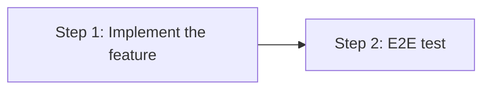

# Implementation Plan: Issue-to-PR Lite Workflow

## Dependency Graph

## Checklist
- [x] Step 1: Implement the feature
- [x] Step 2: E2E test

---

## Step 1: Implement the feature

**Depends on**: none

**Objective**: Create the `github-spec-gen-lite` and `issue-to-pr-lite` workflow YAML files that produce simplified design and plan artifacts.

**Related Files**:
- `packages/freeflow/workflows/issue-to-pr/workflow.yaml` (reference — existing issue-to-pr)
- `packages/freeflow/workflows/github-spec-gen/workflow.yaml` (reference — existing github-spec-gen)
- `packages/freeflow/workflows/spec-gen/workflow.yaml` (reference — base spec-gen with state definitions)
- `packages/freeflow/workflows/github-spec-gen/poll_issue.py` (reused — polling script)
- `packages/freeflow/workflows/github-spec-gen-lite/workflow.yaml` (new — lite spec-gen variant)
- `packages/freeflow/workflows/issue-to-pr-lite/workflow.yaml` (new — lite issue-to-pr wrapper)

**Test Requirements**:
- Validate that `fflow start issue-to-pr-lite --run-id test-1` loads the FSM successfully and enters the `start` state
- Validate that the workflow YAML passes schema validation (version, guide, states, transitions)
- Validate that `from:` references resolve correctly to base spec-gen states

**Implementation Guidance**:

Create two new workflow directories and YAML files:

1. **`github-spec-gen-lite/workflow.yaml`** — lite variant of github-spec-gen:
   - `extends_guide: ../github-spec-gen/workflow.yaml` to inherit all GitHub issue interaction rules
   - Reuse `create-issue`, `requirements`, `research`, `e2e-gen`, `done` states via `from:` from base workflows
   - Override `design` state with a custom prompt requiring only 4 sections:
     - Overview
     - Goal & Constraints
     - Architecture & Components (merged section with Mermaid diagram, component responsibilities, data models, integration tests in Given/When/Then format)
     - E2E Testing
   - Override `plan` state with a custom prompt requiring exactly 2 steps:
     - Step 1: "Implement the feature" with bullet sub-items referencing design components
     - Step 2: "E2E test"
   - Keep all GitHub adaptations (comment polling, artifact posting, status checklist updates)

2. **`issue-to-pr-lite/workflow.yaml`** — composition wrapper:
   - `extends_guide: ../github-spec-gen-lite/workflow.yaml` to inherit lite guide
   - Same structure as `issue-to-pr/workflow.yaml` but referencing `../github-spec-gen-lite/workflow.yaml` for the `spec` state
   - All other states (start, decide, confirm-implement, implement, confirm-pr, submit-pr, done) identical to `issue-to-pr`

---

## Step 2: E2E test

**Depends on**: Step 1

**Objective**: Validate the lite workflow end-to-end by running `fflow verify` with a test plan that exercises the workflow and verifies simplified artifact output.

**Related Files**:
- `packages/freeflow/workflows/issue-to-pr-lite/workflow.yaml` (system under test)
- `packages/freeflow/workflows/github-spec-gen-lite/workflow.yaml` (system under test)
- `packages/freeflow/docs/e2e-testing-design.md` (reference — e2e testing model)
- E2E test plan (to be generated by e2e-gen state)

**Test Requirements**:
- E2E scenario: Lite workflow produces simplified artifacts (design.md with 4 sections, plan.md with 2 steps)
- E2E scenario: Lite workflow composes with spec-to-code correctly

**Implementation Guidance**:
- The e2e test plan will be generated in the e2e-gen state using the `/e2e-gen` skill
- The executor agent will run the lite workflow and the verifier will check that artifacts match the simplified format
- Test plan should verify: design.md has no Error Handling section, plan.md has exactly 2 steps, GitHub issue interaction works correctly
