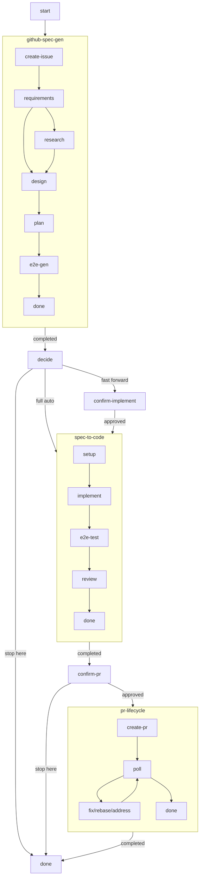

# Design — issue-to-pr workflow

## Overview

A composition workflow that takes a GitHub issue (new or existing) through the full pipeline:
spec generation → implementation → PR submission. The GitHub issue serves as the
asynchronous communication channel between the agent and the user. The workflow reuses
three existing sub-workflows (`github-spec-gen`, `spec-to-code`, `pr-lifecycle`) connected
by polling gate states where the agent waits for user confirmation via issue comments.

## Goal & Constraints

### Goal
- Accept a new idea (create issue) or an existing issue URL as input
- Generate a complete spec via `github-spec-gen` (Q&A, research, design, plan — all on the issue)
- Implement the spec via `spec-to-code` in issue mode
- Submit and monitor a PR via `pr-lifecycle`, linked to the source issue
- Support two modes: **fast-forward** (stops at gates for confirmation) and **full-auto** (no stops)
- Polling gates between phases use 20-second interval via `poll_issue.py`

### Constraints
- MUST NOT duplicate logic already in sub-workflows — compose only
- MUST NOT introduce new TypeScript code — this is a pure YAML workflow + guide
- MUST reuse `poll_issue.py` from `github-spec-gen` for all issue polling
- MUST pass issue context (`owner/repo#N`) to `spec-to-code` and `pr-lifecycle`

## Architecture Overview



The workflow is a linear pipeline with two optional gate states (`confirm-implement`,
`confirm-pr`) that activate based on the user's mode choice.

## Components & Interfaces

### 1. Start state (inline)

Handles two input modes:
- **New idea**: User provides `repo` + idea text → creates a GitHub issue (delegates to `github-spec-gen/create-issue`)
- **Existing issue**: User provides `owner/repo#N` → fetches issue, extracts context

Since `github-spec-gen` already handles issue creation as its initial state, the start
state just needs to handle the "existing issue" case. For new ideas, we pass straight
through to the `github-spec-gen` sub-workflow which creates the issue.

**Decision**: Make `start` an inline state that detects the input mode:
- If `owner/repo#N` → attach to existing issue, extract context, transition to `spec`
- If rough idea + repo → transition to `spec` (which starts at `github-spec-gen/create-issue`)

### 2. Spec state (sub-workflow: github-spec-gen)

Reuses `github-spec-gen` directly via `workflow:` reference. The sub-workflow handles:
- Issue creation (if new idea)
- Requirements Q&A via issue comments
- Research, design, plan generation
- All artifacts posted as issue comments

The parent workflow's `guide` passes down the mode context and issue reference.

### 3. Decide state (inline)

After spec completion, presents mode options via issue comment and polls for response:
1. **Full auto** — skip all gates, run to PR
2. **Fast forward** — stop before implementation and PR for confirmation
3. **Stop here** — end after spec

### 4. Confirm-implement state (inline, gate)

Posts a confirmation request on the issue, polls for user's go-ahead.
Only entered in fast-forward mode.

### 5. Implement state (sub-workflow: spec-to-code)

Runs `spec-to-code` in issue mode. The guide override ensures:
- `source_mode = "issue"` is set during setup
- The issue reference (`owner/repo#N`) is passed through
- Per-step progress is posted on the issue

### 6. Confirm-pr state (inline, gate)

Posts implementation summary on the issue, polls for user approval to create PR.
Only entered in fast-forward mode. In full-auto mode, `implement/done` transitions
directly to `submit-pr`.

### 7. Submit-pr state (sub-workflow: pr-lifecycle)

Runs `pr-lifecycle` which:
- Creates PR linked to the source issue (reads `source-issue` file written by spec-to-code)
- Monitors CI, handles reviews, rebases
- Merges when ready

### 8. Done state (inline)

Summarizes the full pipeline result and posts a final comment on the issue.

## Data Models

### Workflow YAML structure

```yaml
version: 1.2
extends_guide: ../github-spec-gen/workflow.yaml
guide: |
  {{base}}
  # ... additional issue-to-pr guide content

initial: start

states:
  start:           # inline — detect input mode
  spec:            # workflow: ../github-spec-gen/workflow.yaml
  decide:          # inline — mode selection
  confirm-implement: # inline — gate (fast-forward only)
  implement:       # workflow: ../spec-to-code/workflow.yaml
  confirm-pr:      # inline — gate (fast-forward only)
  submit-pr:       # workflow: ../pr-lifecycle/workflow.yaml
  done:            # inline — final summary
```

### Agent memory (conversation context)

Values tracked across states:
- `repo` — `owner/repo` string
- `issue_number` — the GitHub issue number
- `issue_creator` — username of the issue creator
- `mode` — `full-auto` or `fast-forward`
- `slug` — spec directory slug (derived from issue title)

These are NOT persisted to files — they live in the agent's conversation memory,
passed through via the guide.

### Artifact flow between phases

```
github-spec-gen outputs:
  ~/.freeflow/runs/{run_id}/artifacts/  (requirements.md, design.md, plan.md, etc.)
  ~/.freeflow/runs/{run_id}/artifact_comment_ids.json
  Issue with spec-ready label

spec-to-code reads:
  ./specs/<slug>/  (downloaded from issue by setup state)
  Writes source-issue file for pr-lifecycle

pr-lifecycle reads:
  ./specs/<slug>/source-issue → links PR to issue
```

## Integration Testing

Since this is a pure YAML composition with no new TypeScript code, integration testing
focuses on the YAML schema validation:

- **Given**: The issue-to-pr workflow YAML
- **When**: `fflow start` loads and validates the schema
- **Then**: All sub-workflow references resolve, all states expand correctly, all transitions are valid

- **Given**: The expanded state machine
- **When**: Enumerating all paths
- **Then**: Both fast-forward and full-auto paths reach `done`

## E2E Testing

Since this workflow composes three sub-workflows that each have their own testing, and
running the full pipeline requires real GitHub API interaction across multiple agent sessions,
e2e testing is **not included**. The cost (3+ agent sessions, real GitHub repo) outweighs
the benefit for what is pure YAML composition.

## Error Handling

- **Sub-workflow failures**: If `github-spec-gen`, `spec-to-code`, or `pr-lifecycle`
  encounters an error, it surfaces through the sub-workflow's own error handling.
  The parent workflow has no additional error states.
- **Polling timeout**: The `poll_issue.py` script runs indefinitely until a matching
  comment arrives. No timeout is implemented — the user can abort via `/fflow:finish`.
- **Issue not found**: If an existing issue URL is invalid, the start state reports
  the error and stops.
- **Mode context loss**: The guide instructs the agent to remember the mode choice.
  If context is lost (unlikely in a single session), the gate states default to
  asking for confirmation (safe fallback).
