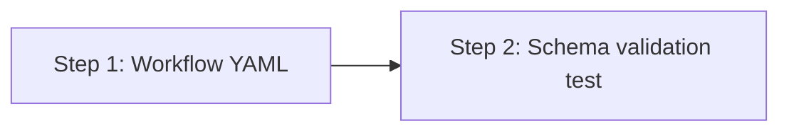

# Implementation Plan: issue-to-pr workflow

## Dependency Graph

## Checklist
- [x] Step 1: Create the issue-to-pr workflow YAML
- [x] Step 2: Validate schema loads and expands correctly

---

## Step 1: Create the issue-to-pr workflow YAML

**Depends on**: none

**Objective**: Create the `issue-to-pr/workflow.yaml` that composes `github-spec-gen`,
`spec-to-code`, and `pr-lifecycle` with inline gate states for mode-dependent confirmation.

**Related Files**:
- `packages/freeflow/workflows/idea-to-pr/workflow.yaml` — reference for composition pattern
- `packages/freeflow/workflows/github-spec-gen/workflow.yaml` — spec sub-workflow to compose
- `packages/freeflow/workflows/spec-to-code/workflow.yaml` — implementation sub-workflow
- `packages/freeflow/workflows/pr-lifecycle/workflow.yaml` — PR sub-workflow
- `packages/freeflow/workflows/github-spec-gen/poll_issue.py` — polling script to reuse
- `packages/freeflow/src/fsm.ts` — understand `workflow:`, `extends_guide`, `from:` mechanics

**Implementation Guidance**:

Create `packages/freeflow/workflows/issue-to-pr/workflow.yaml` with:

1. **version**: `1.2` (required for `workflow:` composition)

2. **extends_guide**: `../github-spec-gen/workflow.yaml` — inherits the GitHub issue
   interaction patterns (artifact creation, polling, comment prefixing, etc.)

3. **guide**: Additional guide content layered on top of `{{base}}`:
   - Two input modes: new idea (rough idea + repo) or existing issue (`owner/repo#N`)
   - Two execution modes: fast-forward (semi-auto) and full-auto
   - Agent memory requirements: `repo`, `issue_number`, `issue_creator`, `mode`, `slug`
   - Fast-forward propagation rules (spec-gen runs in fast-forward, gates poll for confirmation)
   - Full-auto propagation rules (all gates skipped, spec-to-code in fast-forward)

4. **States**:

   - `start` (inline): Detect input mode. If existing issue (`owner/repo#N`), fetch issue
     context (title, body, labels), extract `repo`, `issue_number`, `issue_creator`.
     Verify issue exists. If new idea, pass through to spec sub-workflow.
     Transitions: `new idea → spec`, `existing issue → spec`

   - `spec` (workflow: `../github-spec-gen/workflow.yaml`): Full spec generation on the issue.
     Transitions: `completed → decide`

   - `decide` (inline): Post mode selection on the issue, poll for reply.
     Options: full-auto / fast-forward / stop here.
     Transitions: `full auto → implement`, `fast forward → confirm-implement`, `stop here → done`

   - `confirm-implement` (inline): Post confirmation request on issue ("Spec is ready.
     Reply 'go' to start implementation"). Poll for user reply (20s).
     Transitions: `approved → implement`, `stop here → done`

   - `implement` (workflow: `../spec-to-code/workflow.yaml`): The guide override must
     instruct the agent to pass `owner/repo#N` as the argument in setup state, activating
     issue mode. In full-auto mode, select "fast forward" at setup.
     Transitions: `completed → confirm-pr`

   - `confirm-pr` (inline): Post implementation summary on issue. In full-auto mode,
     transition directly to submit-pr. In fast-forward mode, poll for user approval.
     Transitions: `submit pr → submit-pr`, `stop here → done`

   - `submit-pr` (workflow: `../pr-lifecycle/workflow.yaml`):
     Transitions: `completed → done`

   - `done` (inline): Post final summary on the issue. Summarize phases completed,
     artifacts produced, PR URL if applicable.
     Transitions: `{}`

**Test Requirements**: None in this step — schema validation is Step 2.

---

## Step 2: Validate schema loads and expands correctly

**Depends on**: Step 1

**Objective**: Verify that the workflow YAML passes `fflow start` validation and all
sub-workflow references expand correctly.

**Related Files**:
- `packages/freeflow/workflows/issue-to-pr/workflow.yaml` — the workflow to validate
- `packages/freeflow/src/fsm.ts` — `loadFsm()` function
- `packages/freeflow/src/__tests__/` — existing test patterns

**Implementation Guidance**:

Write a test that:
1. Calls `loadFsm()` on the issue-to-pr workflow YAML
2. Verifies it loads without errors
3. Verifies all expected expanded states exist (e.g., `spec/create-issue`, `spec/requirements`,
   `implement/setup`, `submit-pr/create-pr`, etc.)
4. Verifies both paths through the state machine reach `done`:
   - Full auto: `start → spec/... → decide → implement/... → confirm-pr → submit-pr/... → done`
   - Fast forward: `start → spec/... → decide → confirm-implement → implement/... → confirm-pr → submit-pr/... → done`

**Test Requirements**:
- **Given**: The issue-to-pr workflow YAML
- **When**: `loadFsm()` is called
- **Then**: Returns a valid FSM with all sub-workflow states expanded, no validation errors
- **Given**: The expanded FSM
- **When**: Tracing transitions from initial state
- **Then**: Both full-auto and fast-forward paths can reach `done`
