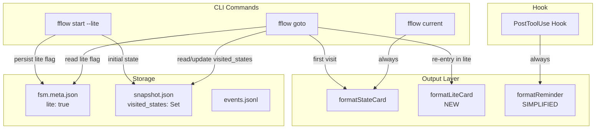
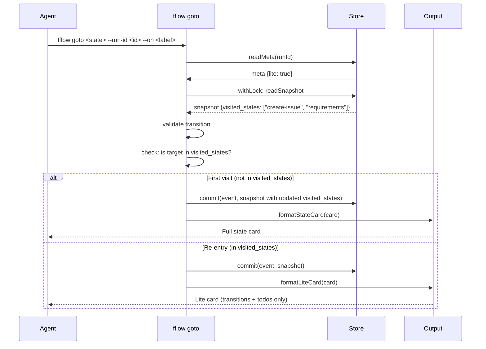

## Overview

Add a `--lite` mode to `fflow start` that reduces token cost when workflow states are re-entered during a conversation. In lite mode, `fflow goto` detects previously-visited states and outputs only transitions and todos (omitting the full prompt), directing the agent to call `fflow current` if it needs full instructions. Additionally, simplify the PostToolUse hook reminder to always omit the prompt excerpt, showing only transitions and todos regardless of lite mode.

## Goal & Constraints

### Goal

1. `fflow start --lite` flag that persists in run metadata
2. `fflow goto` in lite mode outputs an abbreviated state card for re-entered states (transitions + todos only, with pointer to `fflow current`)
3. First-visit states always get the full state card, even in lite mode
4. Track visited states (as a set) in the snapshot
5. Simplify `formatReminder()` to omit the 200-char prompt excerpt — show only transitions, todos, and state name
6. `fflow current` always returns the full state card (no lite behavior)

### Constraints

- MUST NOT change the workflow YAML schema
- MUST NOT alter `fflow current` output behavior
- MUST NOT break existing non-lite runs (backwards-compatible snapshot format)
- MUST NOT affect JSON output mode (`-j`) — lite only applies to human-readable output
- MUST NOT track visit counts — only a boolean visited/not-visited set

## Architecture Overview



### Data Flow for `fflow goto` in Lite Mode



## Components & Interfaces

### 1. `output.ts` — New `formatLiteCard()` Function

**Responsibility:** Format an abbreviated state card for re-entered states.

```typescript
export function formatLiteCard(card: StateCard): string
```

Output format:
```
Re-entering **{state}** state. Instructions unchanged from previous visit.
Run `fflow current --run-id {run_id}` to review full instructions.

{todos section, if any}

Transitions:
  {label} → {target}
  ...

Keep driving the workflow — do NOT stop until you reach a terminal state.
```

Note: The `run_id` is not available in `StateCard`. The caller (`goto.ts`) will need to pass it, or `formatLiteCard` will use a generic message. Since the agent already knows the run ID from its conversation context, a generic "Run `fflow current`" suffices.

### 2. `output.ts` — Simplified `formatReminder()`

**Responsibility:** Simplify the existing reminder to omit the prompt excerpt.

Current behavior: includes first 200 chars of prompt + transitions + todos.
New behavior: state name + transitions + todos only. No prompt content.

```typescript
export function formatReminder(card: StateCard, fsmGuide?: string): string
```

The signature stays the same, but the body removes the prompt truncation logic.

### 3. `store.ts` — Extended `Snapshot` Type

**Responsibility:** Track visited states in the snapshot.

```typescript
export interface Snapshot {
  run_id: string;
  run_status: RunStatus;
  state: string;
  last_seq: number;
  updated_at: string;
  visited_states?: string[];  // NEW — optional for backwards compatibility
}
```

`visited_states` is a string array (serialized set). Optional so that existing snapshots without it still parse correctly — treated as empty set.

### 4. `store.ts` — Extended `RunMeta` Type

**Responsibility:** Persist the `lite` flag.

```typescript
export interface RunMeta {
  run_id: string;
  fsm_path: string;
  created_at: string;
  version: number;
  session_id?: string;
  lite?: boolean;  // NEW — optional for backwards compatibility
}
```

### 5. `commands/start.ts` — Accept `--lite` Flag

**Responsibility:** Parse `--lite`, persist in metadata, seed `visited_states` with the initial state.

Changes:
- Add `lite?: boolean` to `StartArgs`
- Pass `lite: true` to `store.initRun()` or call `store.updateMeta()` after init
- When writing the initial snapshot via `commit()`, include `visited_states: [fsm.initial]`

### 6. `commands/goto.ts` — Lite-Aware Output

**Responsibility:** Check the lite flag and visited states, choose between full and lite output.

Changes:
- After reading meta, check `meta.lite`
- After reading snapshot (inside `withLock`), check if `args.target` is in `snapshot.visited_states`
- Add `args.target` to `visited_states` in the new snapshot (if not already present)
- If `meta.lite && alreadyVisited`: call `formatLiteCard(card)` instead of `formatStateCard(card)`
- If `!meta.lite || !alreadyVisited`: call `formatStateCard(card)` as before

### 7. `cli.ts` — Parse `--lite` Flag

**Responsibility:** Parse the `--lite` CLI flag for the `start` command and pass it through.

### 8. `hooks/post-tool-use.ts` — No Changes Needed

The hook already calls `formatReminder()`. The simplification happens inside `formatReminder()` itself.

## Data Models

### Updated `fsm.meta.json`

```json
{
  "run_id": "spec-gen-20260322",
  "fsm_path": "/path/to/workflow.yaml",
  "created_at": "2026-03-22T13:00:00.000Z",
  "version": 1,
  "lite": true
}
```

### Updated `snapshot.json`

```json
{
  "run_id": "spec-gen-20260322",
  "run_status": "active",
  "state": "requirements",
  "last_seq": 3,
  "updated_at": "2026-03-22T13:05:00.000Z",
  "visited_states": ["create-issue", "requirements", "research"]
}
```

### Backwards Compatibility

- `lite` in meta: optional, defaults to `false`/`undefined` (non-lite behavior)
- `visited_states` in snapshot: optional, defaults to `[]` (no states visited)
- Existing runs without these fields continue to work identically

## Integration Testing

### Test 1: Lite flag persistence in metadata

- **Given**: A store with no existing runs
- **When**: `start` is called with `lite: true` and a valid FSM path
- **Then**: The `fsm.meta.json` contains `"lite": true` and the initial snapshot contains `visited_states` with the initial state

### Test 2: Visited states tracking on goto

- **Given**: An active lite run with `visited_states: ["A"]` in state "A"
- **When**: `goto` transitions to state "B"
- **Then**: The snapshot's `visited_states` is `["A", "B"]` and the full state card is output (first visit)

### Test 3: Lite card on re-entry

- **Given**: An active lite run with `visited_states: ["A", "B"]` in state "B"
- **When**: `goto` transitions back to state "A"
- **Then**: The lite card is output (no prompt, just transitions + todos + "fflow current" pointer)

### Test 4: Non-lite run ignores visited states

- **Given**: An active run without `lite` flag, state "A" previously visited
- **When**: `goto` transitions back to state "A"
- **Then**: The full state card is output (same as current behavior)

### Test 5: formatLiteCard output structure

- **Given**: A `StateCard` with state "requirements", prompt "...", todos ["ask questions"], and transitions `{"done": "design"}`
- **When**: `formatLiteCard(card)` is called
- **Then**: Output contains "Re-entering **requirements**", the todo, the transition, and a `fflow current` hint. Output does NOT contain the prompt.

### Test 6: Simplified formatReminder

- **Given**: A `StateCard` with a long prompt
- **When**: `formatReminder(card)` is called
- **Then**: Output contains state name, transitions, and todos. Output does NOT contain any part of the prompt.

### Test 7: Backwards-compatible snapshot parsing

- **Given**: A snapshot JSON without `visited_states` field
- **When**: `readSnapshot()` is called
- **Then**: Returns a valid `Snapshot` with `visited_states` as `undefined`

### Test 8: fflow current always returns full card

- **Given**: An active lite run with "A" in `visited_states`, currently in state "A"
- **When**: `fflow current` is called
- **Then**: The full state card is output (prompt + transitions + todos), not the lite card

## E2E Testing

No e2e testing for this feature per requirements. Unit and integration tests provide sufficient coverage for the CLI output formatting and state tracking logic.

## Error Handling

### Edge Cases

1. **Missing `visited_states` in snapshot** — treat as empty set. This happens when a run was started before this feature existed. The goto command should handle `undefined` gracefully by defaulting to `[]`.

2. **Non-lite run with `visited_states`** — if `meta.lite` is falsy, ignore `visited_states` entirely and always output the full state card. The visited_states field may still be populated (for potential future use) but has no effect on output.

3. **JSON output mode (`-j`)** — lite mode does NOT affect JSON output. The `goto` command in JSON mode always includes the full prompt in the response payload. Lite only applies to human-readable (non-JSON) output, since JSON consumers may need the full data.

4. **`fflow start --lite` on existing run** — returns `RUN_EXISTS` error as usual. The lite flag is only settable at run creation time.
