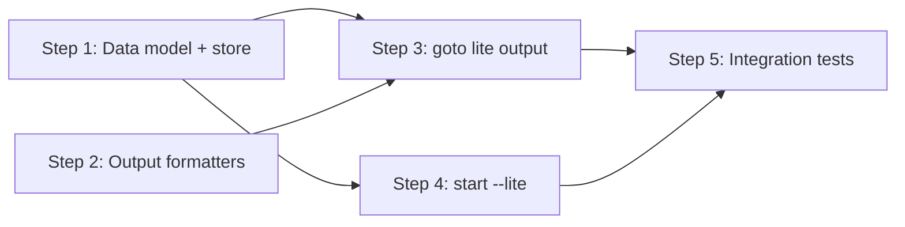

# Implementation Plan: Lite Mode for fflow

## Dependency Graph



## Checklist
- [x] Step 1: Extend data models and store (Snapshot.visited_states, RunMeta.lite)
- [x] Step 2: Add formatLiteCard and simplify formatReminder
- [ ] Step 3: Lite-aware goto command
- [ ] Step 4: start --lite flag and CLI parsing
- [ ] Step 5: Integration tests

---

## Step 1: Extend Data Models and Store

**Depends on**: none

**Objective**: Add `visited_states` to `Snapshot` and `lite` to `RunMeta` so the store can track which states have been visited and whether lite mode is enabled.

**Related Files**:
- `packages/freeflow/src/store.ts` — `Snapshot` and `RunMeta` interfaces, `commit()` method
- `packages/freeflow/tests/store.test.ts` — existing store tests

**Test Requirements**:
- Design Test 7: Backwards-compatible snapshot parsing — reading a snapshot without `visited_states` returns `undefined` (not an error)
- Unit test: `commit()` with `visited_states` in snapshot input correctly persists the array
- Unit test: `readMeta()` on a meta file without `lite` returns `undefined` for that field

**Implementation Guidance**:
- Add `visited_states?: string[]` to `Snapshot` interface
- Add `lite?: boolean` to `RunMeta` interface
- Add `visited_states?: string[]` to `SnapshotInput` interface
- In `commit()`, propagate `visited_states` from `SnapshotInput` to the written snapshot. If not provided, carry forward from the current snapshot (read before write).
- No changes to event types — visited states are snapshot-only state

---

## Step 2: Add formatLiteCard and Simplify formatReminder

**Depends on**: none

**Objective**: Create the lite card formatter and simplify the hook reminder to omit prompt content.

**Related Files**:
- `packages/freeflow/src/output.ts` — `formatStateCard()`, `formatReminder()`, `StateCard`
- `packages/freeflow/tests/output.test.ts` — existing output tests

**Test Requirements**:
- Design Test 5: `formatLiteCard` output structure — contains "Re-entering", todo, transition, `fflow current` hint; does NOT contain prompt
- Design Test 6: Simplified `formatReminder` — contains state name, transitions, todos; does NOT contain any prompt text
- Unit test: `formatLiteCard` with no todos omits the todo section
- Unit test: `formatLiteCard` with empty transitions shows terminal state message
- Unit test: `formatReminder` with guide — guide is still included (guides are structural, not prompt content)

**Implementation Guidance**:
- Add `formatLiteCard(card: StateCard): string` to `output.ts`:
  ```
  Re-entering **{state}** state. Instructions unchanged from previous visit.
  Run `fflow current` to review full instructions.

  {TODO_HEADER + todos, if any}

  Transitions:
    {label} → {target}
  ...

  Keep driving the workflow — do NOT stop until you reach a terminal state.
  ```
- Modify `formatReminder()`:
  - Remove the `REMINDER_PROMPT_MAX` constant and the prompt truncation block (lines ~89-93 in current code)
  - Keep the state name header, guide, todos, and transitions
  - The function signature stays the same for backwards compatibility

---

## Step 3: Lite-Aware goto Command

**Depends on**: Step 1, Step 2

**Objective**: Make `fflow goto` detect lite mode and previously-visited states, outputting the lite card on re-entry.

**Related Files**:
- `packages/freeflow/src/commands/goto.ts` — `goto()` function
- `packages/freeflow/src/store.ts` — `readMeta()`, `Snapshot`
- `packages/freeflow/src/output.ts` — `formatLiteCard()`, `formatStateCard()`
- `packages/freeflow/tests/goto.test.ts` — existing goto tests

**Test Requirements**:
- Design Test 3: Lite card on re-entry — lite run, visited state, lite card output
- Design Test 4: Non-lite run ignores visited states — full card always
- Design Test 8: `fflow current` always returns full card (verify current.ts is unchanged)
- Unit test: goto in lite mode to a first-visit state outputs full card and adds state to visited_states
- Unit test: goto in lite mode to a re-visited state outputs lite card
- Unit test: JSON mode (`-j`) always includes full prompt regardless of lite

**Implementation Guidance**:
- After reading meta, extract `isLite = meta.lite === true`
- Inside `withLock`, after reading snapshot:
  - Compute `visitedSet = new Set(snapshot.visited_states ?? [])`
  - `alreadyVisited = visitedSet.has(args.target)`
  - Add `args.target` to `visitedSet`
  - Pass `visited_states: [...visitedSet]` in the snapshot input to `commit()`
- After `withLock`, when choosing output:
  - If `!args.json && isLite && alreadyVisited`: use `formatLiteCard(card)`
  - Otherwise: use `formatStateCard(card)` as before
- JSON output always includes full data (no lite in JSON mode)

---

## Step 4: start --lite Flag and CLI Parsing

**Depends on**: Step 1

**Objective**: Accept `--lite` on `fflow start`, persist it in metadata, and seed `visited_states` in the initial snapshot.

**Related Files**:
- `packages/freeflow/src/cli.ts` — CLI argument parsing
- `packages/freeflow/src/commands/start.ts` — `start()`, `StartArgs`
- `packages/freeflow/tests/start.test.ts` — existing start tests

**Test Requirements**:
- Design Test 1: Lite flag persistence — start with `lite: true` → meta has `"lite": true`, initial snapshot has `visited_states` with initial state
- Unit test: start without `--lite` → meta has no `lite` field, snapshot has no `visited_states`
- Unit test: `--lite` flag is correctly parsed from CLI args

**Implementation Guidance**:
- Add `lite?: boolean` to `StartArgs`
- In `start()`, after `store.initRun()`:
  - If `args.lite`, call `store.updateMeta(runId, { lite: true })`
- In the `commit()` call for the initial event, include `visited_states: [fsm.initial]` in the snapshot input (only when lite mode)
- In `cli.ts`, add `--lite` flag parsing for the `start` subcommand

---

## Step 5: Integration Tests

**Depends on**: Step 3, Step 4

**Objective**: Verify that the components work together end-to-end through the CLI commands.

**Related Files**:
- `packages/freeflow/tests/goto.test.ts`
- `packages/freeflow/tests/start.test.ts`
- `packages/freeflow/tests/post-tool-use.test.ts` — hook reminder tests

**Test Requirements**:
- Design Test 2: Visited states tracking on goto — start lite → goto B → snapshot has `["A", "B"]` and full card output
- Full round-trip: start lite → goto B (full card) → goto A (lite card) → verify output differences
- Hook reminder: verify `formatReminder` no longer includes prompt text in PostToolUse output
- Non-lite round-trip: start (no --lite) → goto B → goto A → all full cards
