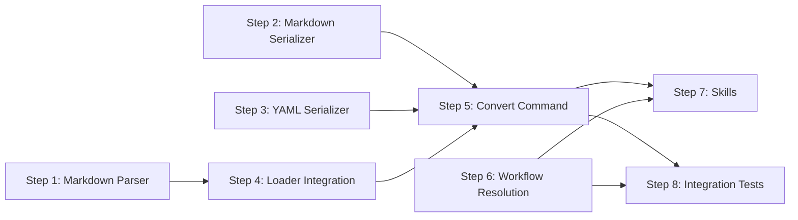

# Implementation Plan: Markdown Workflow Format

## Dependency Graph

## Checklist

- [x] Step 1: Markdown Parser
- [x] Step 2: Markdown Serializer
- [x] Step 3: YAML Serializer
- [x] Step 4: Loader Integration
- [x] Step 5: Convert Command
- [x] Step 6: Workflow Resolution
- [x] Step 7: Skills (fix + convert)
- [x] Step 8: Integration Tests

---

## Step 1: Markdown Parser

**Depends on**: none

**Objective**: Parse `.workflow.md` content into the raw document shape (`Record<string, unknown>`)
that the existing validation pipeline expects. This is the core new component.

**Related Files**:
- `packages/freeflow/src/markdown-parser.ts` (new)
- `packages/freeflow/src/fsm.ts` — `Fsm`, `FsmState` types; raw doc shape reference
- `packages/freeflow/package.json` — add `unified`, `remark-parse`, `remark-frontmatter`, `yaml` deps
- `packages/freeflow/src/__tests__/markdown-parser.test.ts` (new)

**Test Requirements**:
- Parse a minimal valid markdown (frontmatter + one state + done) → correct raw doc
- Parse frontmatter fields: `version`, `initial`, `allowed_tools`, `extends_guide`
- Parse `## Guide` section → `doc.guide`
- Parse `## State: <name>` → `doc.states[name]` with `prompt`, `todos`, `transitions`
- Parse `### Transitions` with both `→` and `->` separators
- Parse `(none)` / empty transitions section → empty `transitions: {}`
- Parse `<freeflow from="base#state">` → `state.from`, tag stripped from prompt
- Parse `<freeflow workflow="./child">` → `state.workflow`, no prompt field
- Parse `<freeflow append-todos>` block → `state.append_todos`
- Skip `## State Machine` mermaid block — does not affect parsed output
- Error on missing frontmatter
- Error on missing `### Instructions` in a non-workflow state
- Error on malformed transition lines

**Implementation Guidance**:
- Use `unified` + `remark-parse` + `remark-frontmatter` to build an AST
- Walk the AST to extract sections by heading level and text
- `<freeflow>` tags appear as `html` nodes in the remark AST — parse attributes with regex
- Assemble the raw doc matching the shape `yamlLoad()` produces
- See design.md §Components §1 for the full interface

---

## Step 2: Markdown Serializer

**Depends on**: none

**Objective**: Convert an `Fsm` object to the `.workflow.md` string format, including
frontmatter, mermaid diagram, and state sections.

**Related Files**:
- `packages/freeflow/src/markdown-serializer.ts` (new)
- `packages/freeflow/src/fsm.ts` — `Fsm`, `FsmState` types
- `packages/freeflow/src/output.ts` — `fsmToMermaid()` for diagram generation
- `packages/freeflow/src/__tests__/markdown-serializer.test.ts` (new)

**Test Requirements**:
- Serialize a minimal `Fsm` → valid markdown with frontmatter, mermaid, states
- Frontmatter includes `version`, `initial`; includes `allowed_tools` only if present
- `## State Machine` contains correct mermaid from `fsmToMermaid()`
- `## Guide` present only when `fsm.guide` is set
- State prompts appear under `### Instructions`
- Todos appear as list items under `### Todos`
- Transitions appear as `- label → target` under `### Transitions`
- Terminal state (done) has `(none)` in transitions section
- State-level guide (from YAML) is prepended to Instructions with separator

**Implementation Guidance**:
- Build the markdown string with template concatenation (no AST needed for output)
- Reuse `fsmToMermaid()` from `output.ts` for the state machine diagram
- Use `js-yaml`'s `dump()` for the frontmatter block
- See design.md §Components §2 for the full interface

---

## Step 3: YAML Serializer

**Depends on**: none

**Objective**: Convert an `Fsm` object back to YAML format for the MD→YAML conversion direction.

**Related Files**:
- `packages/freeflow/src/yaml-serializer.ts` (new)
- `packages/freeflow/src/fsm.ts` — `Fsm`, `FsmState` types
- `packages/freeflow/src/__tests__/yaml-serializer.test.ts` (new)

**Test Requirements**:
- Serialize a minimal `Fsm` → valid YAML that `loadFsm()` can parse back
- Prompts use YAML block scalar style (`|`) for multi-line content
- `guide` and `allowed_tools` included only when present
- `transitions: {}` for terminal states

**Implementation Guidance**:
- Use `js-yaml`'s `dump()` with `lineWidth: -1` and block style for strings
- Reconstruct the YAML structure from `Fsm` fields
- See design.md §Components §3

---

## Step 4: Loader Integration

**Depends on**: Step 1

**Objective**: Wire the markdown parser into `loadFsm()` so `.workflow.md` files are loaded
transparently alongside YAML files.

**Related Files**:
- `packages/freeflow/src/fsm.ts` — modify `loadFsmInternal()`
- `packages/freeflow/src/markdown-parser.ts` — import
- `packages/freeflow/src/__tests__/fsm.test.ts` — add markdown loading tests
- `packages/freeflow/src/__tests__/fixtures/` — add `.workflow.md` test fixtures

**Test Requirements**:
- `loadFsm("path/to/workflow.md")` returns a valid `Fsm` matching equivalent YAML
- Markdown workflows go through the same resolution pipeline (resolveRefs, resolveWorkflowStates, resolveExtendsGuide)
- `from:` references from a markdown workflow to a YAML workflow resolve correctly
- `from:` references from a YAML workflow to a markdown workflow resolve correctly

**Implementation Guidance**:
- In `loadFsmInternal()`, detect `.md` extension and branch to `parseMarkdownWorkflow()`
  vs `yamlLoad()`. See design.md §Components §4 for the exact change.
- The rest of the function (resolution + validation) remains unchanged.
- Add markdown test fixtures alongside existing YAML fixtures.

---

## Step 5: Convert Command

**Depends on**: Step 2, Step 3, Step 4

**Objective**: Add `fflow markdown convert <file>` CLI command for bidirectional conversion.

**Related Files**:
- `packages/freeflow/src/commands/markdown/convert.ts` (new)
- `packages/freeflow/src/cli.ts` — register the new command
- `packages/freeflow/src/markdown-serializer.ts` — import
- `packages/freeflow/src/yaml-serializer.ts` — import
- `packages/freeflow/src/__tests__/commands/markdown-convert.test.ts` (new)

**Test Requirements**:
- From design.md Convert Command Tests:
  - YAML input → outputs valid `.workflow.md`
  - Markdown input → outputs valid `.workflow.yaml`
- Unsupported extension → `ARGS_INVALID` error
- `-o` flag writes to specified path
- Default output path: same basename, swapped extension

**Implementation Guidance**:
- Create `src/commands/markdown/` directory for the subcommand
- Auto-detect direction from input extension
- Load with `loadFsm()`, serialize with the appropriate serializer
- Register as `fflow markdown convert` in `cli.ts`
- See design.md §Components §6

---

## Step 6: Workflow Resolution

**Depends on**: none

**Objective**: Update workflow name resolution to discover `.workflow.md` files and detect
ambiguity when both formats exist.

**Related Files**:
- `packages/freeflow/src/resolve-workflow.ts` — modify `probeDir()`, `hasWorkflowExtension()`
- `packages/freeflow/src/errors.ts` — no change needed (`CliError` already supports custom codes)
- `packages/freeflow/src/__tests__/resolve-workflow.test.ts` — add ambiguity + md-only tests

**Test Requirements**:
- From design.md Resolution Tests:
  - Directory with both `workflow.yaml` and `workflow.md` → `WORKFLOW_AMBIGUOUS`
  - Directory with only `workflow.md` → returns md path
  - `from:` referencing a `.workflow.md` file → resolves correctly
- `hasWorkflowExtension()` recognises `.workflow.md`
- Explicit `.workflow.md` path → resolved directly

**Implementation Guidance**:
- `probeDir()`: check for both `workflow.yaml` and `workflow.md`; if both exist, throw
  `CliError("WORKFLOW_AMBIGUOUS", ...)`. Return whichever one exists.
- Add `.workflow.md` to `hasWorkflowExtension()`.
- See design.md §Components §5

---

## Step 7: Skills (fix + convert)

**Depends on**: Step 5, Step 6

**Objective**: Create the `/fflow markdown fix` and `/fflow markdown convert` agent skills.

**Related Files**:
- `packages/freeflow/skills/markdown-fix/SKILL.md` (new)
- `packages/freeflow/skills/markdown-convert/SKILL.md` (new)

**Test Requirements**: None (skills are agent-driven, not programmatically testable).

**Implementation Guidance**:
- `/fflow markdown fix` skill doc should contain:
  - The canonical markdown workflow format spec (heading hierarchy, frontmatter fields,
    transition format, `<freeflow>` tag syntax)
  - Validation checklist for the agent to follow
  - Instructions to regenerate the mermaid block using transition data
  - Instructions to add missing sections, normalize heading levels
- `/fflow markdown convert` skill doc should contain:
  - Instructions to run `fflow markdown convert <file>`
  - Guidance on verifying conversion output
  - How to handle edge cases (state-level guide, `<freeflow>` tags)

---

## Step 8: Integration Tests

**Depends on**: Step 5, Step 6

**Objective**: Round-trip and cross-format integration tests that verify the full pipeline.

**Related Files**:
- `packages/freeflow/src/__tests__/markdown-roundtrip.test.ts` (new)
- `packages/freeflow/src/__tests__/fixtures/` — test fixture workflows in both formats

**Test Requirements** (leftover from design.md not covered by earlier steps):
- **Round-trip YAML → MD → YAML**: Load a YAML workflow, serialize to MD, parse back,
  compare resulting `Fsm` — must be semantically equal
- **Round-trip MD → YAML → MD**: Load a MD workflow, serialize to YAML, parse back,
  compare resulting `Fsm` — must be semantically equal
- **Cross-format `from:` references**: A markdown workflow inheriting from a YAML workflow
  (and vice versa) produces the correct merged result
- **Convert command round-trip**: Run `fflow markdown convert` in both directions on a
  complex workflow (with guide, todos, composition) and verify equivalence
