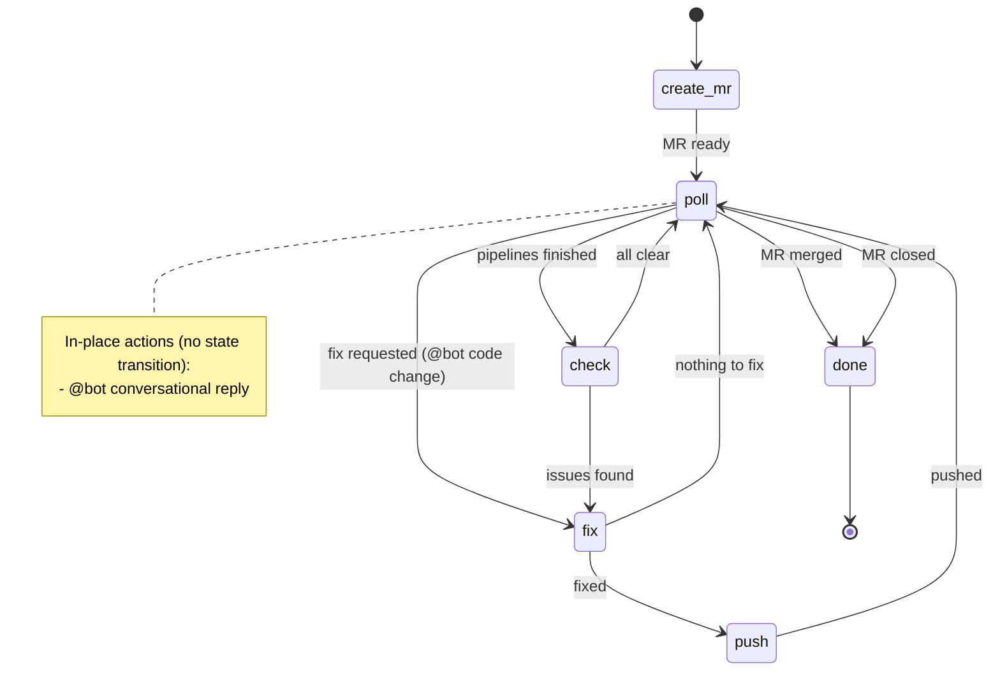

# Design — mr-lifecycle v2

## 1. Overview

The mr-lifecycle workflow is an FSM-based automation that monitors a MR/PR from creation to merge, acting as the author's assistant. This v2 redesign addresses several pain points: replacing the `!fix` mechanism with a unified `@bot` interaction model, separating review-thread resolve responsibility (giving it to the code-review pipeline instead of mr-lifecycle), simplifying state structure by merging two polling states into one, and adding guardrails (bot review severity filtering, max auto-fix rounds). The result is a cleaner state machine with clearer separation of concerns between the author's agent (mr-lifecycle) and the reviewer agent (code-review pipeline).

## 2. Detailed Requirements

### 2.1 `@bot` Unified Interaction (replaces `!fix`)

The `!fix` mechanism is removed entirely. All user-initiated interaction goes through `@bot` mentions in inline review threads or issue-level (PR-level) comments.

- **Dual mode**: `@bot` can trigger either a conversational reply (answer questions, explain code) or a code modification (fix a bug, apply a suggestion), determined by Claude's intent analysis.
- **Reply format**: All mr-lifecycle replies MUST be prefixed with `[from bot]` to distinguish agent-generated comments from human-authored ones.
- **Deduplication**:
  - Inline threads: Check whether every user note in the thread is eventually followed by a `[from bot]` note (timestamp-based). If a user note has no subsequent `[from bot]` note, it needs a response.
  - Issue comments: The same, should check for `[from bot]` replies.
  - Should react to @bot with reaction.
- **User priority**: When a `@bot` instruction conflicts with a bot review finding, the user's instruction takes precedence. The code-review pipeline will re-evaluate in its next run.

### 2.2 Code-Review Trigger Model

- **Automatic review**: Code-review pipeline only runs automatically on initial PR creation (first push that opens the PR).
- **Subsequent reviews**: Must be triggered manually via `/bot-review` command. This avoids noisy re-reviews on every push.
- mr-lifecycle's `push` state should NOT automatically trigger a code-review. The user decides when to re-review.

### 2.3 Bot Review Severity Filtering

- **Blocker**: Auto-fix (subject to round limits).
- **Major**: Do not auto-fix. Leave for the user to address manually or via `@bot`.

### 2.4 Auto-Fix Round Limit

- Maximum **3 rounds** of automatic fixing (the fix → push → poll → check cycle).
- Counter only increments for **bot review blocker and CI failure** auto-fixes. `@bot`-requested fixes do not count.
- When the limit is reached, the workflow enters poll idle — continues monitoring for `@bot` mentions, merge, and close events, but stops auto-fixing.

### 2.5 Simplified State Structure

- **Merge `wait-for-pipeline` and `wait-for-input`** into a single `poll` state that monitors all events simultaneously.
- **Extract rebase** from the polling script. Polling only detects that the target branch has been updated; the actual rebase happens through the normal check → fix → push flow.

### 2.6 Resolve Responsibility Separation

- **mr-lifecycle** MUST NOT resolve review threads. It may comment on threads (e.g., explaining what was fixed) but never resolve them.
- **Code-review pipeline** (CI-side, runs as bot identity) is responsible for resolving threads:
  - Auto-resolve threads where the issue has been verified as fixed in the code.
  - Respond to user rebuttals: if the user's argument is valid, confirm and resolve; if not, explain why the issue still needs fixing.
  - Detect pending replies: for each unresolved bot-authored thread, check if every user note is eventually followed by a bot note. Unresolved user notes require a response.

### 2.7 Identity Model

- **mr-lifecycle** operates under the **user's identity** (user's API token). Its comments appear as authored by the user.
- **code-review pipeline** operates under a **bot identity** (CI bot token). Its comments appear as bot-authored.
- Consequence: code-review treats mr-lifecycle's comments as "user messages" (since author is not a bot). The `[from bot]` prefix serves dual purposes: it is visible to human readers for transparency, and it is parsed programmatically by the polling script for dedup purposes (see §5.3).

## 3. Architecture Overview

### 3.1 New State Flow



### 3.2 Comparison with v1

| Aspect | v1 | v2 |
|--------|----|----|
| Polling states | `wait-for-pipeline` + `wait-for-input` | Single `poll` |
| User interaction | `!fix` comments | `@bot` mentions |
| Rebase | Inside polling script | Via check → fix → push |
| Thread resolve | mr-lifecycle in `push` state | Code-review pipeline only |
| Bot review handling | All severities auto-fixed | Only blocker auto-fixed |
| Fix limits | None | 3 rounds (auto-fix only) |

## 4. Components & Interfaces

### 4.1 `create-mr` State

**Responsibility**: Platform detection, authentication, lint/format, commit, MR/PR creation or reuse.

No changes from v1 except: remove any `!fix`-related mentions from the description template.

**Transitions**: `MR ready` → `poll`

### 4.2 `poll` State

**Responsibility**: Background monitoring of all MR/PR events via a single Python polling script.

**Monitored events**:
| Event | Detection Method | Action |
|-------|-----------------|--------|
| CI completed | GitHub: `gh pr checks`; GitLab: pipeline API | Exit → `check` |
| Target branch updated | `git rev-list --count HEAD..origin/<target>` | Exit → `check` (with rebase flag) |
| `@bot` mention (conversation) | Scan threads + issue comments for unhandled `@bot` | Reply in-place, add ✅ to issue comments, continue polling |
| `@bot` mention (code change) | Same detection, intent analysis determines code change needed | Exit → `fix` |
| MR merged | API check | Exit → `done` |
| MR closed | API check | Exit → `done` |

**`@bot` dedup logic** (see §5.3 `@bot` Mention Detection):
- Inline threads: iterate notes in timestamp order. For each user note containing `@bot`, check if a subsequent note with `[from bot]` prefix exists. If not → needs reply.
- Issue comments: check if a ✅ reaction from the bot exists on each `@bot` comment. If not → needs reply.

**`@bot` reply format**: All replies prefixed with `[from bot]`.

**Transitions**:
- `pipelines finished` → `check`
- `fix requested` → `fix`
- `MR merged` → `done`
- `MR closed` → `done`

### 4.3 `check` State

**Responsibility**: Collect all actionable issues after CI completes.

**Check items**:
| Item | Condition | Actionable? |
|------|-----------|-------------|
| CI failure | Any failed jobs | Yes |
| Bot review blocker | Unresolved + blocker severity + bot-authored | Yes (if auto-fix rounds < 3) |
| Bot review major | Unresolved + major severity + bot-authored | **No** (skip) |
| Rebase needed | Target branch ahead | Yes |

**Auto-fix round tracking**: Read current `auto_fix_rounds` counter. If ≥ 3, skip bot review blockers (treat as "all clear" for auto-fix purposes).

**Transitions**:
- `issues found` → `fix`
- `all clear` → `poll`

### 4.4 `fix` State

**Responsibility**: Apply fixes for issues identified by `check` or requested via `@bot`.

**Fix sources and priority**:
1. CI failures (highest — pipeline won't pass without these)
2. `@bot` code change requests (user-initiated, respect user priority)
3. Bot review blockers (lowest — automated suggestions)

**User priority rule**: If a `@bot` instruction contradicts a bot review blocker, follow the user's instruction and skip that blocker.

**Rebase**: If target branch is ahead, fetch and rebase. Resolve conflicts autonomously.

**Post-fix**: Run lint/format/unit tests to verify.

**Counter**: Increment `auto_fix_rounds` only when fixing bot review blockers or CI failures (not for `@bot` requests).

**Transitions**:
- `fixed` → `push`
- `nothing to fix` → `poll`

### 4.5 `push` State

**Responsibility**: Commit, push, and comment on addressed issues.

**Actions**:
- Commit all changes.
- Push to remote (force push if rebased).
- Comment on addressed review threads explaining what was fixed (prefixed with `[from bot]`). **Do NOT resolve threads.**
- React to processed `@bot` comments as a visual indicator.
- Update MR/PR description if implementation approach changed.

**Transitions**:
- `pushed` → `poll`

### 4.6 `done` State (terminal)

**Responsibility**: Output summary.

- MR/PR URL
- Total auto-fix rounds used
- Total `@bot` interactions handled
- Brief overview of fixes applied

### 4.7 Code-Review Pipeline (external, not part of mr-lifecycle FSM)

**Responsibility**: CI-side reviewer that runs as bot identity.

**Actions each run**:
1. **Review code** — identify issues (blocker, major, etc.)
2. **Auto-resolve fixed threads** — for each unresolved bot-authored thread, check if the issue is fixed in current code. If yes, resolve.
3. **Respond to user rebuttals** — for each unresolved bot-authored thread with unanswered user notes, evaluate the user's argument. If valid, confirm + resolve. If not, explain + keep open.
4. **Pending reply detection** — for each unresolved bot-authored thread, check if every user note is eventually followed by a bot note. User notes without a subsequent bot note need a response.

## 5. Data Models

### 5.1 Poll Script Exit Codes

```
RESULT: pipelines finished    → check
RESULT: fix requested         → fix (with @bot context)
RESULT: MR merged             → done
RESULT: MR closed             → done
```

For `@bot` conversational replies, the script handles them inline and does not exit.

### 5.2 Auto-Fix Round Counter

Tracked as workflow state (passed between states via the FSM prompt or stored in a conventions known to all states):

```
auto_fix_rounds: 0  # incremented in fix state for CI/blocker fixes only
max_auto_fix_rounds: 3
```

### 5.3 `@bot` Mention Detection

**Inline thread (GitHub GraphQL / GitLab discussions API)**:
```
Thread {
  notes: [
    { author: { login, __typename }, body, created_at }
  ]
  isResolved: boolean
}
```

Logic: Iterate notes in order. For each user note containing `@bot`, check if a subsequent note with `[from bot]` prefix exists. If not → needs reply.

**Issue comment (GitHub issues API / GitLab notes API)**:
```
Comment {
  id: number
  author: { login, __typename }
  body: string
  reactions: [{ content: string, user: { login } }]
}
```

Logic: Filter comments containing `@bot` where no ✅ reaction from the bot user exists on the original comment → needs reply. After replying (with `[from bot]` prefix), add a ✅ reaction to the original `@bot` comment as the primary dedup signal.

### 5.4 Bot Review Severity

Detection depends on the code-review pipeline's comment format. Typically severity is indicated in the comment body (e.g., `[BLOCKER]`, `[MAJOR]`, or structured markers like `<!-- severity: blocker -->`).

The `check` state must parse severity from bot review comments and only act on blockers.

## 6. Error Handling

| Failure Mode | Recovery |
|-------------|----------|
| Polling script crashes | Detect non-zero exit code. Retry once, then transition to `check` for manual inspection. |
| API rate limiting | Polling script uses exponential backoff. If persistent, increase poll interval. |
| Rebase conflict unresolvable | Commit conflict markers, push, comment on MR explaining the conflict needs manual resolution. Transition to `poll`. |
| `@bot` reply fails (API error) | Log error, skip this mention, continue polling. Will be retried on next poll cycle. |
| Auth token expired | Detect 401/403. Prompt user to re-authenticate. Pause workflow. |
| Auto-fix introduces new failures | Next `check` cycle will catch them. Counts toward the 3-round limit. |
| 3-round limit reached with unresolved blockers | Enter poll idle. Comment on MR summarizing remaining issues. Continue monitoring for `@bot`/merge/close only. |

## 7. Acceptance Criteria

### AC1: `@bot` Conversational Reply
- **Given** a user posts `@bot why is this function slow?` in an inline thread
- **When** the poll state detects this mention
- **Then** mr-lifecycle replies in the same thread with `[from bot]` prefix, without leaving the poll state

### AC2: `@bot` Code Change Request
- **Given** a user posts `@bot please add null check here` in an inline thread
- **When** the poll state detects this mention and determines code change is needed
- **Then** the workflow transitions to `fix`, applies the change, and proceeds through push → poll

### AC3: `@bot` Dedup (Inline Thread)
- **Given** mr-lifecycle has already replied (with `[from bot]` prefix) to a `@bot` mention in an inline thread
- **When** the poll state scans the thread again
- **Then** the mention is skipped (a `[from bot]` note exists after the user's `@bot` note)

### AC4: `@bot` Dedup (Issue Comment)
- **Given** mr-lifecycle has replied (with `[from bot]` prefix) to an issue comment containing `@bot`
- **When** the poll state scans issue comments again
- **Then** the comment is skipped (`[from bot]` reply found)

### AC5: Bot Review Blocker Auto-Fix
- **Given** a bot review has posted an unresolved blocker comment
- **When** the check state runs and auto_fix_rounds < 3
- **Then** the issue is included in the fix list

### AC6: Bot Review Major Ignored
- **Given** a bot review has posted an unresolved major comment
- **When** the check state runs
- **Then** the major comment is NOT included in the fix list

### AC7: Auto-Fix Round Limit
- **Given** auto_fix_rounds = 3
- **When** the check state finds bot review blockers
- **Then** blockers are NOT auto-fixed, workflow enters poll idle, and a summary comment is posted on the MR

### AC8: No Auto-Resolve by mr-lifecycle
- **Given** mr-lifecycle has fixed an issue raised in a bot review thread
- **When** the push state commits and pushes
- **Then** mr-lifecycle comments on the thread but does NOT resolve it

### AC9: Rebase via Normal Flow
- **Given** the target branch has new commits
- **When** the poll state detects this
- **Then** it exits to `check`, which identifies rebase needed, transitions to `fix` for rebase, then `push`

### AC10: User Priority Over Bot Review
- **Given** a user says `@bot don't add error handling here` contradicting a bot blocker
- **When** the fix state processes both the `@bot` instruction and the blocker
- **Then** the user's instruction is followed, and the blocker is skipped

### AC11: `[from bot]` Prefix
- **Given** mr-lifecycle needs to reply to any `@bot` mention or comment on a thread
- **When** the reply is posted
- **Then** the reply body starts with `[from bot]`

### AC12: Code-Review Auto-Resolve
- **Given** a bot review thread is open but the issue has been fixed in the code
- **When** the code-review pipeline runs its next cycle
- **Then** the pipeline verifies the fix and resolves the thread

### AC13: Code-Review Respond to Rebuttal
- **Given** a user replied to a bot review thread disagreeing with the finding
- **When** the code-review pipeline runs and detects the unanswered user note
- **Then** it evaluates the user's argument and either confirms+resolves or explains+keeps open

## 8. Testing Strategy

Since mr-lifecycle is an FSM workflow YAML (not application code), testing is primarily **behavioral/integration testing** of the workflow execution.

### 8.1 Workflow YAML Validation
- Parse the YAML and verify all states, transitions, and prompt fields are well-formed.
- Verify the state graph matches the designed architecture (no orphan states, all transitions reference valid targets).

### 8.2 Scenario-Based Manual Testing
Each acceptance criterion (AC1–AC13) maps to a manual test scenario:
- Create a test MR/PR on a test repo.
- Trigger the workflow and simulate each scenario (post `@bot` comments, trigger CI failures, post bot review comments).
- Verify behavior matches acceptance criteria.

### 8.3 Polling Script Unit Tests
The Python polling script (generated at runtime) should be tested for:
- Correct `@bot` dedup logic (`[from bot]` prefix detection in both inline threads and issue comments).
- Correct event detection (CI complete, target branch update, merge/close).
- Correct exit code / RESULT line for each event type.

### 8.4 Edge Cases
- Multiple simultaneous `@bot` mentions → all should be handled in one poll cycle.
- `@bot` during active CI → conversation replies handled immediately, code changes wait for appropriate transition.
- Auto-fix round 3 → verify no more auto-fixes, verify `@bot` still works.
- Conflicting `@bot` and blocker → verify user priority.

## 9. Appendices

### A. Research Findings: taq-runner Claude Review Pipeline

The taq-runner project implements a CI-based code review pipeline with these relevant patterns:
- **Read-only review**: The pipeline only posts review comments and responds to user replies. It does NOT modify code.
- **Respond-and-resolve**: Each CI run checks if previously flagged issues have been fixed in the code and auto-resolves them. It also responds to user rebuttals.
- **Discussion dedup**: Uses `<!-- ci:review -->` HTML markers and author bot detection (`author.__typename == "Bot"`).
- **Pending reply detection**: Checks if every user note in a thread has a subsequent bot note (timestamp ordering).
- **No `!fix` mechanism**: Users simply reply in threads; the pipeline infers intent.

These patterns directly influenced decisions #5 (resolve responsibility), #7 (`@bot` interaction model), and the code-review pipeline's respond-and-resolve design.

### B. Technology Choices

| Choice | Rationale |
|--------|-----------|
| `[from bot]` prefix for dedup | Unified mechanism for both inline threads and issue comments. Since mr-lifecycle posts as user identity, `[from bot]` is the only reliable signal. Reaction added as visual indicator. |
| `[from bot]` prefix (not HTML comment) | Visible to human readers for transparency. HTML comments would be hidden. |
| Single `poll` state (merged) | Reduces state explosion. Both polling modes monitor overlapping events; a single script is simpler. |
| 3-round limit on auto-fix only | `@bot` requests are user-initiated and should not be artificially limited. Auto-fix loops are the risk. |

### C. Alternatives Considered

| Alternative | Rejected Because |
|-------------|-----------------|
| `!fix` mechanism | Too narrow — only triggers fixes. `@bot` is more flexible (conversation + code changes). Also had dedup issues that motivated this redesign. |
| Local state file for dedup | Adds local-only state that can desync. Server-side signals (✅ reaction, thread resolved status) are more reliable. |
| mr-lifecycle resolves threads | Author resolving their own review threads is semantically wrong. The reviewer (code-review pipeline) should decide when an issue is resolved. |
| Separate `wait-for-pipeline` and `wait-for-input` states | Redundant — both write similar polling scripts monitoring overlapping events. A single `poll` state is simpler. |
| Auto-fix all bot review severities | Major findings are often subjective. Auto-fixing them risks unnecessary churn. Limiting to blockers keeps auto-fix focused on clear issues. |
| `@bot` as a new FSM state | Conversational replies don't need state transitions (no code changes, no push). Only code-change requests justify a state transition. |
