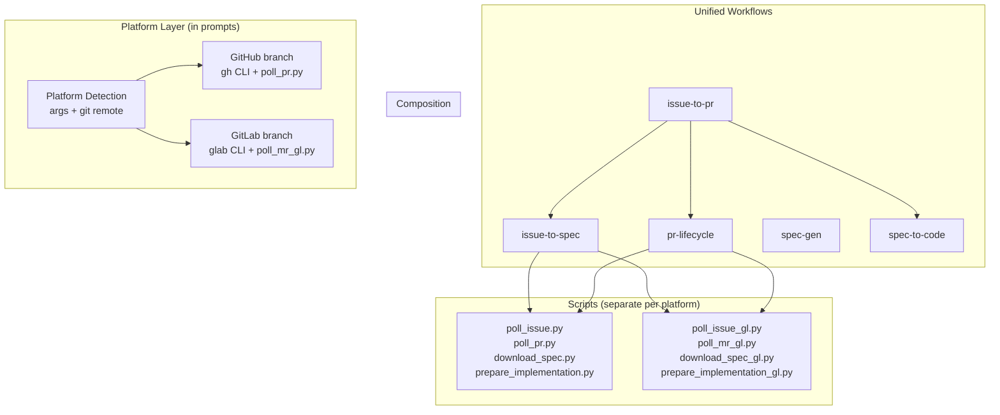

# Design: Platform-Agnostic Workflow Consolidation

## Overview

Consolidate 8 platform-specific workflow variants (GitHub/GitLab) and 3 lite variants into
4 platform-agnostic workflows: `pr-lifecycle`, `issue-to-spec`, `issue-to-pr`, and `spec-gen`
(with `--lite` mode). Platform differences are handled via conditional branches in YAML prompts,
while Python scripts remain separate per platform. This eliminates ~60% of workflow YAML
duplication while preserving all existing functionality.

## Goal & Constraints

### Goal
- Merge `github-pr-lifecycle` + `gitlab-mr-lifecycle` → unified `pr-lifecycle`
- Merge `github-spec-gen` + `gitlab-spec-gen` → unified `issue-to-spec`
- Merge `issue-to-pr` + `issue-to-pr-lite` + `gitlab-issue-to-mr` → unified `issue-to-pr`
- Add `--lite` mode to `spec-gen` and `issue-to-spec` (replacing `spec-gen-lite`, `github-spec-gen-lite`)
- Auto-detect platform (GitHub vs GitLab) from argument format and git remote
- Delete all replaced workflow directories after migration

### Constraints
- MUST NOT merge Python scripts — keep `poll_pr.py`/`poll_mr_gl.py` etc. as separate files
- MUST NOT change `spec-to-code` — it's already platform-agnostic
- MUST NOT break existing functionality — all GitHub and GitLab features must work identically
- MUST NOT change the fflow runtime or CLI — only workflow YAML files and directory structure
- MUST NOT change the reference docs (`github-cli.md`, `gitlab-cli.md`) — they stay separate

## Architecture Overview



### Script Relocation

Since unified workflows replace multiple directories, scripts need a shared home.
All platform-specific Python scripts move to a `scripts/` subdirectory under each
unified workflow:

```
workflows/
  issue-to-spec/
    workflow.yaml
    scripts/
      poll_issue.py          # from github-spec-gen/
      poll_issue_gl.py       # from gitlab-spec-gen/
  pr-lifecycle/
    workflow.yaml
    scripts/
      poll_pr.py             # from github-pr-lifecycle/
      poll_mr_gl.py          # from gitlab-mr-lifecycle/
  spec-to-code/
    workflow.yaml
    download_spec.py         # unchanged
    download_spec_gl.py      # unchanged
    prepare_implementation.py
    prepare_implementation_gl.py
  issue-to-pr/
    workflow.yaml
  spec-gen/
    workflow.yaml
  references/
    github-cli.md
    gitlab-cli.md
```

### Lite Mode Mechanism

Lite mode is a workflow-level flag set at the start and checked in conditional prompts.
The user passes `--lite` as an argument (or the parent workflow propagates it).

In `spec-gen`, the `design` and `plan` states include conditional sections:

```yaml
prompt: |
  **Lite mode**: If lite mode was chosen, use the simplified format:
  - Design: exactly 4 sections (Overview, Goal & Constraints, Architecture & Components, E2E Testing)
  - Plan: exactly 1 step covering all implementation

  **Normal mode**: Use the full format:
  - Design: 8 sections (Overview, Goal & Constraints, Architecture, Components, Data Models, ...)
  - Plan: N steps, one per component/layer
```

In `issue-to-spec`, the same lite mode flag propagates from `create-issue` through
to `design` and `plan` states.

## Components & Interfaces

### Component 1: `pr-lifecycle` (unified)

Merges `github-pr-lifecycle` and `gitlab-mr-lifecycle`.

**States**: `create-pr` → `poll` ↔ `fix`/`rebase`/`address` → `push` → `poll` → `done`

**Platform detection** (in `create-pr`):
```
Check git remote:
  - Contains "github" → platform = "github"
  - Contains "gitlab" → platform = "gitlab"
  - Else → ask user
```

**State-level platform branching pattern** (example for `create-pr`):
```
**GitHub**: Create PR with `gh pr create`. Link source-issue with `Closes owner/repo#N`.
**GitLab**: Create MR with `glab mr create --remove-source-branch --squash-before-merge --push --yes`.
  Link source-issue with `Closes #N`.
```

**Key per-state differences to branch on**:

| State | GitHub | GitLab |
|-------|--------|--------|
| create-pr | `gh pr create` | `glab mr create` with extra flags |
| poll | `poll_pr.py`, `pr_status.json` | `poll_mr_gl.py`, `mr_status.json` |
| fix | Read CI checks from pr_status.json | Read pipeline failures from mr_status.json |
| rebase | Local git rebase only | Try GitLab API rebase first, fallback to local |
| address | GraphQL thread resolution | REST API discussion resolution |
| push | GraphQL `resolveReviewThread` | PUT `.../discussions/{id}` with `resolved=true` |

**Agent memory**:
- Common: `platform`, `target_branch`, `source_branch`
- GitHub: `owner`, `repo`, `pr_number`
- GitLab: `project_path`, `gitlab_url`, `mr_iid`, `hostname`

**Reference docs**: Read `$SCRIPT_DIR/../references/github-cli.md` or `gitlab-cli.md` based on platform.

### Component 2: `issue-to-spec` (unified)

Merges `github-spec-gen` and `gitlab-spec-gen` (and their lite variants via `--lite` flag).

**States**: `create-issue` → `requirements` ↔ `research` → `design` → `plan` → `e2e-gen` → `done`

**Platform detection** (in `create-issue`):
```
Check argument format:
  - `owner/repo` pattern → platform = "github"
  - GitLab URL or `project/path` with gitlab in git remote → platform = "gitlab"
```

**Key per-state differences to branch on**:

| State | GitHub | GitLab |
|-------|--------|--------|
| create-issue | `gh issue create`, comment IDs in `artifact_comment_ids.json` | `glab api` issue create, note IDs in `artifact_note_ids.json` |
| requirements | `poll_issue.py`, react 👀 | `poll_issue_gl.py`, react 👀, `--hostname` |
| done | Add `spec-ready` label via `gh`, artifact links with `#issuecomment-{id}` | Add `spec-ready` label via `glab api`, artifact links with `#note_{id}` |

**Artifact management** (shared pattern, platform-specific API):
- Local cache: `$HOME/.freeflow/runs/{run_id}/artifacts/`
- ID tracking: `artifact_comment_ids.json` (GitHub) or `artifact_note_ids.json` (GitLab)
- Create: write local → post to issue → capture ID → save
- Update: edit local → look up ID → patch in-place
- Read: always from local cache

**Lite mode conditionals** (in `design` and `plan` states):
- Design lite: 4 sections, skip design approaches step
- Plan lite: 1 step, all implementation in single step with sub-items

### Component 3: `issue-to-pr` (unified)

Merges `issue-to-pr`, `issue-to-pr-lite`, and `gitlab-issue-to-mr`.

**States**: `start` → `spec` → `decide` → `confirm-implement` → `implement` → `confirm-pr` → `submit-pr` → `done`

**Platform detection** (in `start`):
```
Check argument format:
  - `owner/repo#N` or `owner/repo` → platform = "github"
  - GitLab URL or `project/path#N` with gitlab in git remote → platform = "gitlab"
```

**Sub-workflow references** (platform-agnostic):
- `spec`: `../issue-to-spec/workflow.yaml`
- `implement`: `../spec-to-code/workflow.yaml`
- `submit-pr`: `../pr-lifecycle/workflow.yaml`

**Lite mode**: Propagated to `issue-to-spec` sub-workflow. Detected from args or parent workflow.

**Gate states** (`confirm-implement`, `confirm-pr`):
- GitHub: poll issue comments for user approval
- GitLab: poll issue notes for user approval
- Full-auto mode: skip gates entirely (both platforms)

### Component 4: `spec-gen` (with `--lite` mode)

Existing `spec-gen` with lite mode conditionals added to `design` and `plan` states.

**States**: unchanged — `create-structure` → `requirements` ↔ `research` → `design` → `plan` → `e2e-gen` → `done`

**Changes**:
- `design` state: add "Lite mode" conditional section at top of prompt
- `plan` state: add "Lite mode" conditional section at top of prompt
- Guide: mention lite mode availability

No platform detection needed — spec-gen is local-only.

## Data Models

### Agent Memory (conversation-scoped)

```
Common:
  platform: "github" | "gitlab"
  slug: string
  mode: "normal" | "fast-forward" | "full-auto"
  lite: boolean

GitHub-specific:
  owner: string
  repo: string
  issue_number: number
  pr_number: number

GitLab-specific:
  project_path: string
  gitlab_url: string
  issue_iid: number
  mr_iid: number
  hostname: string (optional, for self-hosted)
```

### Persisted Files (per-run)

| File | Used By | Purpose |
|------|---------|---------|
| `artifact_comment_ids.json` | issue-to-spec (GitHub) | Maps artifact filename → comment ID |
| `artifact_note_ids.json` | issue-to-spec (GitLab) | Maps artifact filename → note ID |
| `pr_status.json` | pr-lifecycle (GitHub) | PR state, CI, reviews, mentions |
| `mr_status.json` | pr-lifecycle (GitLab) | MR state, pipeline, discussions, mentions |
| `comment_count` | issue-to-spec | Polling cursor for issue comments/notes |

## Integration Testing

### Test 1: Platform detection from git remote

- **Given**: A git repository with `origin` pointing to `github.com/freematters/testbed`
- **When**: `pr-lifecycle` workflow starts without explicit platform argument
- **Then**: Platform is detected as "github", `gh` commands are used

### Test 2: Platform detection for GitLab

- **Given**: A git repository with `origin` pointing to `gitlab.corp.metabit-trading.com/ran.xian/testproj`
- **When**: `pr-lifecycle` workflow starts without explicit platform argument
- **Then**: Platform is detected as "gitlab", `glab` commands are used

### Test 3: Lite mode propagation in issue-to-pr

- **Given**: `issue-to-pr` started with `--lite` flag
- **When**: Spec phase enters `design` state
- **Then**: Design uses 4-section lite format, plan uses single-step format

### Test 4: Script path resolution after relocation

- **Given**: `pr-lifecycle` workflow running on GitHub
- **When**: `poll` state resolves `$SCRIPT_DIR/scripts/poll_pr.py`
- **Then**: Script is found and executes successfully

### Test 5: Deleted workflows no longer resolve

- **Given**: Old workflow names (`github-pr-lifecycle`, `gitlab-mr-lifecycle`, etc.)
- **When**: `fflow start github-pr-lifecycle` is attempted
- **Then**: CLI returns `WORKFLOW_NOT_FOUND` error

## E2E Testing

**Scenario: GitHub issue-to-pr full cycle**
1. User runs `/fflow issue-to-pr` with `freematters/testbed` and a new idea
2. System detects GitHub platform, creates issue with status checklist
3. User answers requirements questions via issue comments
4. System generates design and plan artifacts as issue comments
5. User confirms implementation
6. System implements via spec-to-code, creates PR
7. **Verify:** PR exists on `freematters/testbed`, linked to source issue
8. System monitors PR until CI passes
9. **Verify:** PR description contains implementation summary
10. Close PR and issue (cleanup)

**Scenario: GitLab issue-to-mr full cycle**
1. User runs `/fflow issue-to-pr` with `ran.xian/testproj` and a new idea
2. System detects GitLab platform, creates issue with status checklist
3. User answers requirements questions via issue notes
4. System generates design and plan artifacts as issue notes
5. User confirms implementation
6. System implements via spec-to-code, creates MR
7. **Verify:** MR exists on `ran.xian/testproj`, linked to source issue
8. System monitors MR until pipeline passes
9. **Verify:** MR description contains implementation summary
10. Close MR and issue (cleanup)

**Scenario: spec-gen lite mode**
1. User runs `/fflow spec-gen --lite` with a feature idea
2. System goes through requirements clarification
3. System generates design with exactly 4 sections
4. **Verify:** design.md has only Overview, Goal & Constraints, Architecture & Components, E2E Testing
5. System generates plan with exactly 1 step
6. **Verify:** plan.md has single "Step 1: Implement the feature" with sub-items

## Error Handling

- **Ambiguous platform**: If git remote doesn't contain "github" or "gitlab", prompt the user
  to specify. Do NOT guess.
- **Missing CLI tool**: If `gh` (GitHub) or `glab` (GitLab) is not installed or authenticated,
  show a clear error with setup instructions before proceeding.
- **Script not found**: If platform-specific script is missing at the expected path, error with
  the expected path and suggest checking the workflow installation.
- **Cross-platform confusion**: If user passes `owner/repo#N` (GitHub format) but git remote
  points to GitLab, warn and ask for confirmation before proceeding.
