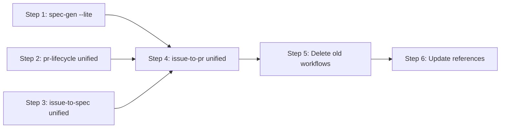

# Implementation Plan: Platform-Agnostic Workflow Consolidation

## Dependency Graph

## Checklist
- [x] Step 1: Add --lite mode to spec-gen
- [x] Step 2: Unify pr-lifecycle
- [x] Step 3: Unify issue-to-spec
- [x] Step 4: Unify issue-to-pr
- [ ] Step 5: Delete old workflows
- [ ] Step 6: Update references and commands

---

## Step 1: Add --lite mode to spec-gen

**Depends on**: none

**Objective**: Add lite mode conditionals to the existing `spec-gen/workflow.yaml` so that
`spec-gen-lite` can be deleted. This is the simplest change and establishes the pattern
for lite mode in other workflows.

**Related Files**:
- `packages/freeflow/workflows/spec-gen/workflow.yaml` (modify)
- `packages/freeflow/workflows/spec-gen-lite/workflow.yaml` (read for lite differences)

**Test Requirements**:
- No automated tests — verify manually that `fflow render spec-gen` produces correct
  output with and without lite mode context.

**Implementation Guidance**:
1. Read `spec-gen-lite/workflow.yaml` to identify the exact differences in `design` and `plan` states.
2. In `spec-gen/workflow.yaml`:
   - Add a note in the `guide` section: "Supports `--lite` mode: simplified design (4 sections) and plan (1 step)."
   - In the `design` state prompt, add a **Lite mode** conditional block at the top (before Step 1)
     that replaces the full design format with the 4-section lite format.
   - In the `plan` state prompt, add a **Lite mode** conditional block that replaces the
     multi-step format with a single-step format.
3. The lite conditional should read: "**Lite mode**: If the user started with `--lite`, use the
   simplified format below instead of the normal format."

---

## Step 2: Unify pr-lifecycle

**Depends on**: none

**Objective**: Merge `github-pr-lifecycle` and `gitlab-mr-lifecycle` into a single
`pr-lifecycle/workflow.yaml` with platform conditional branches in each state.

**Related Files**:
- `packages/freeflow/workflows/github-pr-lifecycle/workflow.yaml` (read)
- `packages/freeflow/workflows/gitlab-mr-lifecycle/workflow.yaml` (read)
- `packages/freeflow/workflows/github-pr-lifecycle/poll_pr.py` (move)
- `packages/freeflow/workflows/gitlab-mr-lifecycle/poll_mr_gl.py` (move)
- `packages/freeflow/workflows/references/github-cli.md` (referenced)
- `packages/freeflow/workflows/references/gitlab-cli.md` (referenced)

**Test Requirements**:
- Integration Test 1: Platform detection from git remote (GitHub)
- Integration Test 2: Platform detection for GitLab
- Integration Test 4: Script path resolution after relocation

**Implementation Guidance**:
1. Create `packages/freeflow/workflows/pr-lifecycle/` directory with `scripts/` subdirectory.
2. Move `poll_pr.py` and `poll_mr_gl.py` into `pr-lifecycle/scripts/`.
3. Write `pr-lifecycle/workflow.yaml`:
   - Same state machine structure (states are identical between platforms):
     `create-pr` → `poll` ↔ `fix`/`rebase`/`address` → `push` → `done`
   - `guide` section: includes platform detection rules, reference doc selection,
     and shared conventions (`[from bot]` prefix, dedup rules).
   - Each state prompt: shared logic first, then `**GitHub**: ...` / `**GitLab**: ...`
     blocks for platform-specific API calls, script invocations, and terminology.
   - `create-pr`: platform detection via `git remote get-url origin`.
     Remember `platform` and platform-specific identifiers.
     Read appropriate reference doc.
   - `poll`: call `scripts/poll_pr.py` or `scripts/poll_mr_gl.py` based on platform.
     Status file: `pr_status.json` or `mr_status.json`.
   - `rebase`: shared logic + GitLab API rebase attempt before local fallback.
   - `address`: shared @bot handling + platform-specific thread resolution.
   - `push`: shared commit/push + platform-specific thread resolution and reactions.
4. Keep transition labels platform-neutral: "PR ready" → "ready", "PR merged" → "merged", etc.

---

## Step 3: Unify issue-to-spec

**Depends on**: none

**Objective**: Merge `github-spec-gen` and `gitlab-spec-gen` (and their lite variants) into
a single `issue-to-spec/workflow.yaml` with platform conditionals and `--lite` mode support.

**Related Files**:
- `packages/freeflow/workflows/github-spec-gen/workflow.yaml` (read)
- `packages/freeflow/workflows/gitlab-spec-gen/workflow.yaml` (read)
- `packages/freeflow/workflows/github-spec-gen-lite/workflow.yaml` (read for lite diffs)
- `packages/freeflow/workflows/github-spec-gen/poll_issue.py` (move)
- `packages/freeflow/workflows/gitlab-spec-gen/poll_issue_gl.py` (move)

**Test Requirements**:
- Integration Test 4: Script path resolution after relocation

**Implementation Guidance**:
1. Create `packages/freeflow/workflows/issue-to-spec/` directory with `scripts/` subdirectory.
2. Move `poll_issue.py` and `poll_issue_gl.py` into `issue-to-spec/scripts/`.
3. Write `issue-to-spec/workflow.yaml`:
   - Same state machine: `create-issue` → `requirements` ↔ `research` → `design` → `plan` → `e2e-gen` → `done`
   - `guide`: platform detection rules, artifact management pattern (shared between platforms),
     lite mode description.
   - `create-issue`: detect platform from argument format. Create issue via `gh` or `glab api`.
     Set up artifact tracking (`artifact_comment_ids.json` or `artifact_note_ids.json`).
   - `requirements`: poll via `scripts/poll_issue.py` or `scripts/poll_issue_gl.py`.
   - `design`: include lite mode conditional (4 sections vs full). Skip design approaches in lite mode.
   - `plan`: include lite mode conditional (1 step vs N steps).
   - `done`: add `spec-ready` label, compile artifact links with platform-specific URL format.
4. Artifact management: describe the shared create/update/read pattern once in the guide,
   with platform-specific API details in each state.

---

## Step 4: Unify issue-to-pr

**Depends on**: Step 1, Step 2, Step 3

**Objective**: Merge `issue-to-pr`, `issue-to-pr-lite`, and `gitlab-issue-to-mr` into
a single `issue-to-pr/workflow.yaml` that references the unified sub-workflows and
supports `--lite` mode.

**Related Files**:
- `packages/freeflow/workflows/issue-to-pr/workflow.yaml` (modify — rewrite in place)
- `packages/freeflow/workflows/issue-to-pr-lite/workflow.yaml` (read)
- `packages/freeflow/workflows/gitlab-issue-to-mr/workflow.yaml` (read)

**Test Requirements**:
- Integration Test 3: Lite mode propagation in issue-to-pr

**Implementation Guidance**:
1. Rewrite `issue-to-pr/workflow.yaml`:
   - `guide`: document platform detection, execution modes (full-auto, fast-forward, stop),
     lite mode propagation.
   - `start`: detect platform from argument format + git remote. Remember platform, identifiers,
     mode, and lite flag.
   - `spec`: reference `../issue-to-spec/workflow.yaml` (unified).
   - `implement`: reference `../spec-to-code/workflow.yaml` (unchanged).
   - `submit-pr`: reference `../pr-lifecycle/workflow.yaml` (unified).
   - `confirm-implement` and `confirm-pr`: platform conditional for polling
     (GitHub: poll issue comments, GitLab: poll issue notes). Full-auto skips gates.
   - `done`: platform-neutral summary.
2. Lite mode: detected from args, propagated to `issue-to-spec` sub-workflow.

---

## Step 5: Delete old workflows

**Depends on**: Step 4

**Objective**: Remove all replaced workflow directories.

**Related Files**:
- `packages/freeflow/workflows/github-spec-gen/` (delete)
- `packages/freeflow/workflows/github-spec-gen-lite/` (delete)
- `packages/freeflow/workflows/gitlab-spec-gen/` (delete)
- `packages/freeflow/workflows/github-pr-lifecycle/` (delete)
- `packages/freeflow/workflows/gitlab-mr-lifecycle/` (delete)
- `packages/freeflow/workflows/gitlab-issue-to-mr/` (delete)
- `packages/freeflow/workflows/issue-to-pr-lite/` (delete)
- `packages/freeflow/workflows/spec-gen-lite/` (delete)

**Test Requirements**:
- Integration Test 5: Deleted workflows no longer resolve

**Implementation Guidance**:
1. `rm -rf` each directory listed above.
2. Verify `fflow render` for the old names returns errors.

---

## Step 6: Update references and commands

**Depends on**: Step 5

**Objective**: Update all references to the old workflow names throughout the codebase.

**Related Files**:
- `.claude/commands/spec-gen.md` (check for references)
- `packages/freeflow/CLAUDE.md` (check for references)
- `CLAUDE.md` (check for references)
- `packages/freeflow/workflows/spec-to-code/workflow.yaml` (check for references to old names)
- `packages/freeflow/skills/` (check skill files for references)

**Test Requirements**:
- No automated tests — grep for old workflow names to verify no dangling references.

**Implementation Guidance**:
1. Grep the entire repo for old workflow names: `github-spec-gen`, `gitlab-spec-gen`,
   `github-pr-lifecycle`, `gitlab-mr-lifecycle`, `gitlab-issue-to-mr`, `issue-to-pr-lite`,
   `spec-gen-lite`.
2. Update any references to point to the new unified names.
3. Update the `spec-to-code` workflow if it references `github-pr-lifecycle` or
   `gitlab-mr-lifecycle` in any prompts.
4. Update skill files and command files as needed.

---

## Integration Test Step

**Depends on**: Step 6

Leftover integration tests not covered by individual steps:

- Integration Test 1: Platform detection from GitHub git remote (verify in pr-lifecycle)
- Integration Test 2: Platform detection from GitLab git remote (verify in pr-lifecycle)
- Integration Test 3: Lite mode propagation end-to-end (verify in issue-to-pr)

These require a real git repo context and are best verified during E2E testing.
