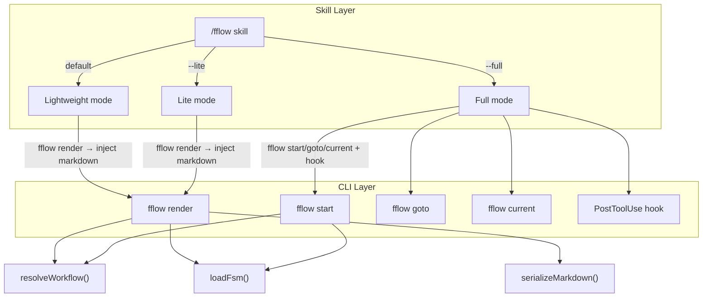

# Design: Simplify FreeFlow Workflow Run

## Overview

Simplify how freeflow workflows are invoked and executed. The current model requires the
full CLI (`fflow start`/`goto`/`current`), event sourcing, and a PostToolUse hook for every
workflow run. This redesign makes the lightweight, prompt-only mode the default (`/fflow`),
with the full CLI+hook mode available via `/fflow --full`. It also introduces `fflow render`
to resolve and flatten YAML workflows into standalone markdown, replaces `fflow markdown convert`,
and simplifies state card output by removing repeated guide/reminders from `goto`.

## Goal & Constraints

### Goal
- `/fflow <workflow>` runs workflows without CLI state tracking or hooks — agent reads
  rendered markdown and self-manages state transitions
- `/fflow --full <workflow>` preserves current behavior (CLI + event sourcing + hook)
- `/fflow --lite <workflow>` same as `/fflow` but passes `--lite` to `fflow start`
- New `fflow render <workflow>` CLI command: resolves YAML → markdown, supports
  workflow path resolution, composition resolution (`from:`, `workflow:`, `extends_guide:`)
- `fflow render` outputs to stdout by default, `-o <path>` for file, `--save` writes
  `.md` alongside `.yaml` (same basename, keeps original YAML)
- `fflow render` accepts YAML input only (errors on markdown)
- Remove `fflow markdown convert` entirely
- Simplify state cards: guide and fflow reminders only in `fflow start`, not in `goto`
- `goto` shows lite card on revisited states by default (no `--lite` flag needed)
- Hook reminders unchanged

### Constraints
- MUST NOT break `/fflow --full` behavior (existing CLI+hook model)
- MUST NOT break existing YAML workflow schemas
- MUST NOT remove or change event sourcing in `--full` mode
- MUST resolve all composition directives (`from:`, `workflow:`, `extends_guide:`) in `fflow render`
- `fflow render` MUST error on non-YAML input
- MUST NOT delete original YAML when `--save` is used

## Architecture Overview



## Components & Interfaces

### 1. `fflow render` command (`src/commands/render.ts`)

New CLI command that resolves a YAML workflow and outputs a standalone markdown document.

**Interface:**
```typescript
interface RenderArgs {
  fsmPath: string;    // workflow name or path
  output?: string;    // -o <path>
  save?: boolean;     // --save flag
  json: boolean;      // -j flag
  root: string;       // storage root (for workflow resolution)
}

function render(args: RenderArgs): void
```

**Behavior:**
1. `resolveWorkflow(fsmPath)` → resolve to absolute YAML path
2. Validate input is YAML (`.yaml`/`.yml` extension) — error if `.md`
3. `loadFsm(resolvedPath)` → fully resolved FSM (composition directives applied)
4. `serializeMarkdown(fsm)` → markdown string
5. Output routing:
   - Default: write to stdout
   - `--save`: write to `<dir>/<basename>.workflow.md` alongside the YAML
   - `-o <path>`: write to specified path

### 2. Updated `/fflow` skill (`skills/fflow/SKILL.md`)

Single skill with three modes:

**Default mode (no flags):**
1. Run `fflow render <workflow>` to get the full resolved markdown
2. Inject the entire markdown as the conversation prompt
3. Agent reads all states, self-manages transitions — no CLI calls after this point
4. No hook registration

**`--lite` mode:**
1. Same as default but also passes `--lite` to `fflow start` if the agent needs it
   (effectively same as default — render + inject)

**`--full` mode:**
1. Current behavior: `fflow start`, `fflow goto`, `fflow current`
2. PostToolUse hook active
3. State tracking, event sourcing, all current features

### 3. Simplified `formatStateCard` (`src/output.ts`)

**Changes to `formatStateCard()`:**
- Add `options` parameter: `{ includeGuide?: boolean; includeReminders?: boolean }`
- Default both to `true` for backward compatibility
- `fflow start` calls with both `true`
- `fflow goto` calls with both `false`

**Changes to `goto` command:**
- First visit to a state: `formatStateCard(card, fsmGuide, { includeGuide: false, includeReminders: false })`
  — full prompt but no guide/reminders
- Revisited state: `formatLiteCard(card)` with added hint "Run `fflow current` to review
  full instructions if you forget."
- Always track `visited_states` (not just in `--lite` mode)

### 4. Remove `fflow markdown convert`

- Delete `src/commands/markdown/convert.ts`
- Remove `markdown convert` subcommand registration from `src/cli.ts`
- Remove `/freeflow:markdown-convert` skill
- Keep `src/markdown-parser.ts` and `src/markdown-serializer.ts` (used by `render`)

## Data Models

### RenderArgs (new)
```typescript
interface RenderArgs {
  fsmPath: string;
  output?: string;
  save?: boolean;
  json: boolean;
  root: string;
}
```

### StateCardOptions (new)
```typescript
interface StateCardOptions {
  includeGuide?: boolean;     // default true
  includeReminders?: boolean; // default true
}
```

### Snapshot (modified)
```typescript
interface Snapshot {
  run_id: string;
  run_status: RunStatus;
  state: string;
  last_seq: number;
  updated_at: string;
  visited_states: string[];  // Always tracked, not just --lite
}
```

## Integration Testing

### `fflow render` command

**Given:** A YAML workflow `spec-gen/workflow.yaml` with `from:` and `extends_guide:` composition
**When:** `fflow render spec-gen`
**Then:** Outputs fully resolved markdown to stdout with all states, guide, transitions inlined

**Given:** A YAML workflow path
**When:** `fflow render spec-gen --save`
**Then:** Writes `workflow.md` alongside `workflow.yaml` in the same directory; YAML not deleted

**Given:** A markdown workflow file
**When:** `fflow render my-workflow.md`
**Then:** Exits with error code 2 and message indicating only YAML input is accepted

**Given:** A YAML workflow path and `-o /tmp/out.md`
**When:** `fflow render spec-gen -o /tmp/out.md`
**Then:** Writes rendered markdown to `/tmp/out.md`

### Simplified state cards

**Given:** An active run at state `requirements`
**When:** `fflow goto design --on "proceed to design"` (first visit to design)
**Then:** Output includes full prompt, todos, transitions but NO guide and NO fflow reminders

**Given:** An active run, state `requirements` already visited
**When:** `fflow goto requirements --on "revise requirements"` (revisit)
**Then:** Output is lite card: state name, todos, transitions, hint to run `fflow current`

**Given:** `fflow start spec-gen --run-id test`
**When:** Start command executes
**Then:** Output includes guide, full prompt, todos, transitions, AND fflow reminders

### `goto` always tracks visited_states

**Given:** A run started without `--lite` flag
**When:** Agent transitions through states
**Then:** `snapshot.json` contains `visited_states` array tracking all visited states

## E2E Testing

**Scenario: fflow render resolves and outputs markdown**
1. Create a test YAML workflow with `from:` composition
2. Run `fflow render <path>`
3. **Verify:** stdout contains all resolved states as markdown sections
4. **Verify:** `from:` references are fully inlined (no `from:` directives in output)

**Scenario: fflow render --save writes alongside YAML**
1. Run `fflow render <workflow> --save`
2. **Verify:** `.workflow.md` file exists next to the `.yaml` file
3. **Verify:** Original `.yaml` file still exists unchanged
4. **Verify:** Markdown content matches stdout output

**Scenario: /fflow lightweight mode runs a workflow end-to-end**
1. User invokes `/fflow spec-gen` (default mode)
2. **Verify:** Skill calls `fflow render spec-gen` and injects markdown as prompt
3. **Verify:** No `fflow start`/`goto`/`current` calls made
4. **Verify:** Agent self-manages state transitions from the prompt
5. **Verify:** No PostToolUse hook reminders appear

**Scenario: /fflow --full preserves current behavior**
1. User invokes `/fflow --full spec-gen`
2. **Verify:** Skill calls `fflow start spec-gen --run-id <id>`
3. **Verify:** Agent uses `fflow goto` for transitions
4. **Verify:** PostToolUse hook fires reminders

**Scenario: Simplified state cards in --full mode**
1. Start a workflow with `fflow start` → output includes guide + reminders
2. Transition to a new state with `fflow goto` → output has full prompt but NO guide/reminders
3. Transition back to a visited state → output is lite card with "run `fflow current`" hint
4. **Verify:** `fflow current` still returns the full card with guide

## Error Handling

| Error | Cause | Behavior |
|-------|-------|----------|
| Non-YAML input to `render` | User passes `.md` file | Exit 2, message: "fflow render only accepts YAML input" |
| Workflow not found | Invalid name/path | Exit 2, `WORKFLOW_NOT_FOUND` (existing behavior) |
| Composition cycle | Circular `from:`/`workflow:` | Exit 2, `SCHEMA_INVALID` (existing behavior) |
| `--save` write failure | Permission/disk error | Exit 2, IO error message |
| `-o` and `--save` both specified | Conflicting flags | Exit 2, "Cannot use both -o and --save" |
