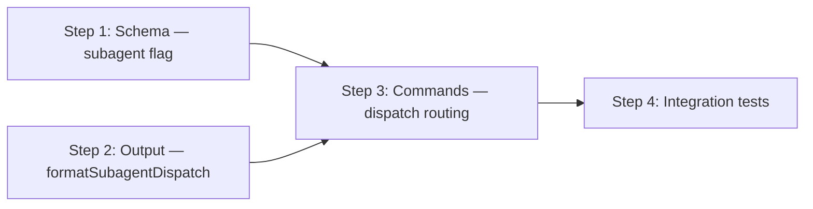

# Implementation Plan: Subagent State Execution

## Dependency Graph

## Checklist
- [x] Step 1: Schema — add `subagent` flag to FsmState
- [x] Step 2: Output — add `formatSubagentDispatch` function
- [ ] Step 3: Commands — route to dispatch format in start/goto
- [ ] Step 4: Integration tests — cross-module verification

---

## Step 1: Schema — add `subagent` flag to FsmState

**Depends on**: none

**Objective**: Extend the workflow YAML schema to accept an optional `subagent: true` boolean on individual states. This is the foundation that all other steps build on.

**Related Files**:
- `packages/freeflow/src/fsm.ts` — `FsmState` interface and `loadFsmInternal` validation
- `packages/freeflow/src/__tests__/fsm.test.ts` — existing schema validation tests

**Test Requirements**:
- Design.md Test 1: Schema accepts `subagent: true`
- Design.md Test 2: Schema accepts `subagent: false`
- Design.md Test 3: Schema rejects non-boolean `subagent` (e.g., `"yes"`, `42`)
- Design.md Test 4: Schema accepts missing `subagent` (backward compat)

**Implementation Guidance**:
1. Add `subagent?: boolean` to the `FsmState` interface
2. In `loadFsmInternal`, after validating `guide`, add validation for `subagent`:
   - If present and not a boolean, fail with `state "<name>": "subagent" must be a boolean`
   - If present and boolean, store it on the parsed state
3. Ensure `subagent` is preserved through `from:` ref resolution (inherited from base if not overridden locally)

---

## Step 2: Output — add `formatSubagentDispatch` function

**Depends on**: none (can be built in parallel with Step 1)

**Objective**: Create the dispatch instruction formatter that produces the parent agent's state card for subagent states. Also add the `subagent` field to `StateCard`.

**Related Files**:
- `packages/freeflow/src/output.ts` — `StateCard` interface, `stateCardFromFsm`, `formatStateCard`
- `packages/freeflow/src/__tests__/output.test.ts` — existing output tests

**Test Requirements**:
- Design.md Test 5: `formatSubagentDispatch` renders dispatch instructions (contains "subagent execution", `fflow current --run-id`, "Execution Summary", "Proposed Transition", transitions list)
- Design.md Test 6: `formatStateCard` unchanged for subagent states (flag is ignored)
- Design.md Test 7: `stateCardFromFsm` preserves `subagent` flag

**Implementation Guidance**:
1. Add `subagent?: boolean` to the `StateCard` interface
2. In `stateCardFromFsm`, propagate `fsmState.subagent` to the card if truthy
3. Add new function `formatSubagentDispatch(card: StateCard, runId: string, fsmGuide?: string): string` that renders the dispatch instructions template per design.md
4. `formatStateCard` remains unchanged — it does not branch on `subagent`

---

## Step 3: Commands — route to dispatch format in start/goto

**Depends on**: Step 1, Step 2

**Objective**: Wire the schema flag and dispatch formatter into the `start` and `goto` commands so that subagent states render dispatch instructions instead of the normal state card.

**Related Files**:
- `packages/freeflow/src/commands/start.ts` — `start()` function
- `packages/freeflow/src/commands/goto.ts` — `goto()` function
- `packages/freeflow/src/commands/current.ts` — verify no changes needed
- `packages/freeflow/src/__tests__/` — command-level tests if they exist

**Test Requirements**:
- Design.md Test 8: `start` uses dispatch format for subagent initial state
- Design.md Test 9: `goto` uses dispatch format for subagent target state
- Design.md Test 10: `current` always uses normal format (verify no change)
- Design.md Test 11: Mixed workflow transitions work

**Implementation Guidance**:
1. In `start.ts`: after building the card, check `card.subagent`. If true, call `formatSubagentDispatch(card, runId, fsm.guide)` instead of `formatStateCard(card)` for human-readable output. For JSON output, include `subagent: true` in the data payload.
2. In `goto.ts`: same pattern — check `card.subagent`, route to dispatch formatter. Pass `args.runId`.
3. In `current.ts`: verify it calls `formatStateCard` unconditionally — no changes needed.
4. For mixed workflow test: create a test workflow YAML with normal → subagent → done states, run through the full lifecycle, assert each state renders the correct format.

---

## Step 4: Integration tests — cross-module verification

**Depends on**: Step 3

**Objective**: Verify end-to-end behavior across schema loading, output formatting, and command execution for subagent workflows.

**Related Files**:
- `packages/freeflow/src/__tests__/` — test directory
- All files from Steps 1-3

**Test Requirements** (leftover tests not covered in earlier steps):
- Full lifecycle test: `loadFsm` a mixed workflow → `start` → verify dispatch output → `goto` to normal state → verify normal output → `goto` to done
- JSON envelope includes `subagent: true` for subagent states in both `start` and `goto`
- `from:` inheritance: a state that inherits from a base state with `subagent: true` should inherit the flag
- `from:` override: a state that inherits from a base with `subagent: true` but sets `subagent: false` locally should override

**Implementation Guidance**:
1. Create integration test file that exercises the full path: YAML → loadFsm → store → start/goto → output
2. Use temp directories for run storage
3. Test both human-readable and JSON output modes
4. Test `from:` inheritance and override of `subagent` flag
