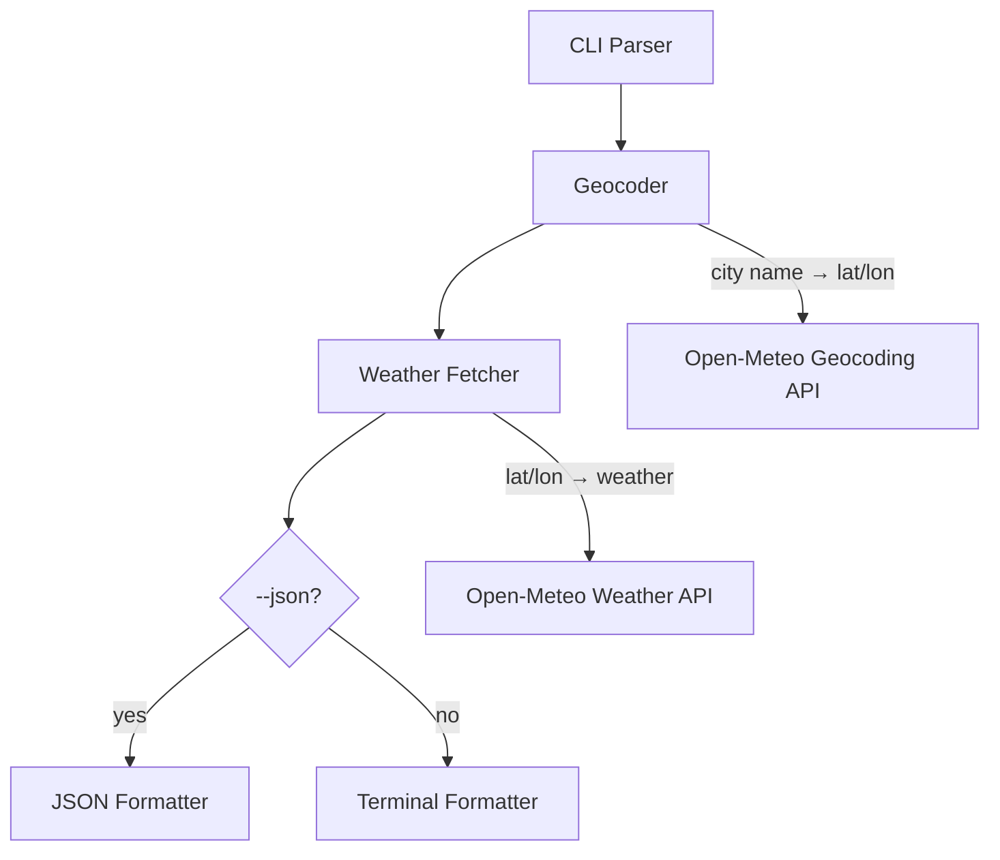

# Weather CLI — Design Document

## Overview

A command-line weather tool written in Rust that fetches weather data from the Open-Meteo API and displays it in a friendly, colorful terminal format. The tool takes a city name as input, resolves it to coordinates via Open-Meteo's geocoding API, and displays current conditions, daily forecast, and hourly forecast with emoji weather icons and colored output. It also supports `--json` for machine-readable output.

## Goal & Constraints

### Goals
- Display current weather conditions (temperature, humidity, wind, sunrise/sunset)
- Display daily forecast (configurable number of days, default 7)
- Display hourly forecast for the current day
- Friendly output with emoji weather icons and terminal colors
- Support `--json` flag for machine-readable JSON output
- Support `--days N` flag to control forecast length
- City name geocoding via Open-Meteo geocoding API
- Single binary with no runtime dependencies

### Constraints
- MUST use Open-Meteo API only (no API keys)
- MUST NOT require any configuration or setup from the user
- MUST be a standalone Rust binary (not part of the monorepo's npm packages)
- MUST handle network errors and invalid city names gracefully
- MUST work on Linux, macOS, and Windows terminals

## Architecture Overview



The application follows a simple pipeline:
1. **CLI Parser** — parses arguments and flags
2. **Geocoder** — resolves city name to coordinates
3. **Weather Fetcher** — fetches weather data for coordinates
4. **Formatter** — renders output as colored terminal text or JSON

## Components & Interfaces

### 1. CLI Parser (`cli.rs`)
- **Responsibility**: Parse command-line arguments using `clap`
- **Interface**:
  ```
  weather <CITY> [--days N] [--json] [--units metric|imperial]
  ```
- **Output**: `Args { city: String, days: u8, json: bool, units: Units }`

### 2. Geocoder (`geocoder.rs`)
- **Responsibility**: Resolve city name to geographic coordinates
- **API**: `https://geocoding-api.open-meteo.com/v1/search?name={city}&count=1`
- **Interface**: `async fn geocode(city: &str) -> Result<Location>`
- **Output**: `Location { name: String, country: String, latitude: f64, longitude: f64 }`
- **Behavior**: Returns the top result; errors if no results found

### 3. Weather Fetcher (`weather.rs`)
- **Responsibility**: Fetch current + forecast weather data
- **API**: `https://api.open-meteo.com/v1/forecast?latitude={lat}&longitude={lon}&current=...&daily=...&hourly=...`
- **Interface**: `async fn fetch_weather(loc: &Location, days: u8, units: &Units) -> Result<WeatherData>`
- **Output**: `WeatherData { current: Current, daily: Vec<DayForecast>, hourly: Vec<HourForecast> }`

### 4. Terminal Formatter (`display.rs`)
- **Responsibility**: Render weather data as colorful terminal output
- **Interface**: `fn display_weather(data: &WeatherData, loc: &Location)`
- **Sections**:
  - Header: city name, country, coordinates
  - Current: temperature, feels-like, humidity, wind, weather description with emoji
  - Daily forecast: table with date, high/low, weather icon, precipitation chance
  - Hourly forecast: table with time, temp, weather icon, wind

### 5. JSON Formatter (`json.rs`)
- **Responsibility**: Serialize weather data as JSON to stdout
- **Interface**: `fn display_json(data: &WeatherData, loc: &Location)`

## Data Models

```rust
struct Location {
    name: String,
    country: String,
    latitude: f64,
    longitude: f64,
}

struct Current {
    temperature: f64,
    feels_like: f64,
    humidity: f64,
    wind_speed: f64,
    wind_direction: f64,
    weather_code: u8,
    is_day: bool,
    time: String,
}

struct DayForecast {
    date: String,
    temp_max: f64,
    temp_min: f64,
    weather_code: u8,
    precipitation_probability: f64,
    sunrise: String,
    sunset: String,
}

struct HourForecast {
    time: String,
    temperature: f64,
    weather_code: u8,
    wind_speed: f64,
    precipitation_probability: f64,
}

struct WeatherData {
    current: Current,
    daily: Vec<DayForecast>,
    hourly: Vec<HourForecast>,
}
```

### Weather Code → Emoji Mapping

| Code | Description | Emoji |
|------|------------|-------|
| 0 | Clear sky | ☀️ |
| 1-3 | Partly cloudy | ⛅ |
| 45, 48 | Fog | 🌫️ |
| 51-55 | Drizzle | 🌦️ |
| 61-65 | Rain | 🌧️ |
| 71-77 | Snow | 🌨️ |
| 80-82 | Rain showers | 🌧️ |
| 85-86 | Snow showers | 🌨️ |
| 95-99 | Thunderstorm | ⛈️ |

## Integration Testing

### Test 1: Geocoder resolves known city
- **Given**: A valid city name "London"
- **When**: `geocode("London")` is called
- **Then**: Returns a `Location` with latitude ≈ 51.5, longitude ≈ -0.1, country contains "United Kingdom"

### Test 2: Geocoder handles unknown city
- **Given**: A nonsensical city name "xyznotacity"
- **When**: `geocode("xyznotacity")` is called
- **Then**: Returns an error with a user-friendly message

### Test 3: Weather fetch returns expected structure
- **Given**: A valid `Location` for London
- **When**: `fetch_weather(&loc, 3, &Units::Metric)` is called
- **Then**: Returns `WeatherData` with non-empty `current`, 3 entries in `daily`, and 24+ entries in `hourly`

### Test 4: JSON output is valid JSON
- **Given**: A `WeatherData` struct with sample data
- **When**: JSON formatter serializes it
- **Then**: Output parses as valid JSON with expected keys

## E2E Testing

**Scenario: Basic weather lookup**
1. User runs `weather London`
2. System displays current weather with emoji icon and temperature
3. System displays 7-day forecast table
4. System displays hourly forecast for today
5. **Verify:** Output contains "London" and temperature values

**Scenario: JSON output mode**
1. User runs `weather London --json`
2. System outputs JSON to stdout
3. **Verify:** Output is valid JSON with `current`, `daily`, `hourly` keys

**Scenario: Invalid city**
1. User runs `weather xyznotacity`
2. **Verify:** System shows a friendly error message and exits with non-zero code

## Error Handling

| Failure Mode | Behavior |
|-------------|----------|
| Network unreachable | Print "Could not connect. Check your internet connection." and exit 1 |
| City not found | Print "City '<name>' not found. Try a different spelling." and exit 1 |
| API returns unexpected format | Print "Unexpected response from weather service." and exit 1 |
| Invalid `--days` value | Clap handles validation; print usage and exit 2 |
| Terminal doesn't support colors | `colored` crate auto-detects; falls back to plain text |
