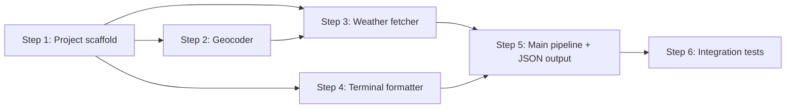

# Implementation Plan: Weather CLI

## Dependency Graph

## Checklist
- [x] Step 1: Project scaffold & CLI parser
- [x] Step 2: Geocoder module
- [x] Step 3: Weather fetcher module
- [ ] Step 4: Terminal formatter
- [ ] Step 5: Main pipeline & JSON output
- [ ] Step 6: Integration tests

---

## Step 1: Project Scaffold & CLI Parser

**Depends on**: none

**Objective**: Initialize the Rust project with `cargo init`, set up dependencies, and implement the CLI argument parser.

**Related Files**:
- `weather-cli/Cargo.toml` (create)
- `weather-cli/src/main.rs` (create)
- `weather-cli/src/cli.rs` (create)
- `specs/weather-app/design.md` — CLI Parser section

**Implementation Guidance**:
- Run `cargo init weather-cli` in the repo root
- Add dependencies: `clap` (derive), `reqwest` (json, rustls-tls), `serde`/`serde_json`, `tokio` (rt, macros), `colored`, `anyhow`
- Implement `Args` struct with clap derive: `city` (positional), `--days` (default 7, range 1-16), `--json` (flag), `--units` (metric/imperial, default metric)
- Wire up `main.rs` with `#[tokio::main]` and basic arg parsing

**Test Requirements**:
- Unit test: verify default values (days=7, json=false, units=metric)
- Unit test: verify `--days 3` parses correctly
- Unit test: verify invalid `--days 0` or `--days 20` is rejected

---

## Step 2: Geocoder Module

**Depends on**: Step 1

**Objective**: Implement city name → coordinates resolution using Open-Meteo geocoding API.

**Related Files**:
- `weather-cli/src/geocoder.rs` (create)
- `weather-cli/src/main.rs` (modify — add module)
- `specs/weather-app/design.md` — Geocoder section

**Implementation Guidance**:
- Define `Location` struct (name, country, latitude, longitude) with Deserialize
- Implement `pub async fn geocode(city: &str) -> Result<Location>` using reqwest
- API endpoint: `https://geocoding-api.open-meteo.com/v1/search?name={city}&count=1&language=en`
- Parse the `results` array from response; error if empty
- Friendly error message for unknown cities

**Test Requirements**:
- Design test 1: Geocoder resolves known city ("London" → lat ≈ 51.5)
- Design test 2: Geocoder handles unknown city ("xyznotacity" → error)

---

## Step 3: Weather Fetcher Module

**Depends on**: Step 1, Step 2

**Objective**: Fetch current conditions, daily forecast, and hourly forecast from Open-Meteo.

**Related Files**:
- `weather-cli/src/weather.rs` (create)
- `weather-cli/src/main.rs` (modify — add module)
- `specs/weather-app/design.md` — Weather Fetcher section, Data Models section

**Implementation Guidance**:
- Define `Current`, `DayForecast`, `HourForecast`, `WeatherData` structs per design.md
- Implement `pub async fn fetch_weather(loc: &Location, days: u8, units: &Units) -> Result<WeatherData>`
- Build API URL with required parameters: current (temperature_2m, relative_humidity_2m, apparent_temperature, weather_code, wind_speed_10m, wind_direction_10m, is_day), daily (weather_code, temperature_2m_max, temperature_2m_min, sunrise, sunset, precipitation_probability_max), hourly (temperature_2m, weather_code, wind_speed_10m, precipitation_probability)
- Handle unit conversion via `temperature_unit` and `wind_speed_unit` API params
- Parse the nested JSON response into the data structs

**Test Requirements**:
- Design test 3: Weather fetch returns expected structure (non-empty current, correct daily count, 24+ hourly entries)

---

## Step 4: Terminal Formatter

**Depends on**: Step 1

**Objective**: Implement colorful, emoji-rich terminal output for weather data.

**Related Files**:
- `weather-cli/src/display.rs` (create)
- `weather-cli/src/main.rs` (modify — add module)
- `specs/weather-app/design.md` — Terminal Formatter section, Weather Code → Emoji Mapping

**Implementation Guidance**:
- Implement weather code → emoji/description mapping per design.md table
- `display_weather(data: &WeatherData, loc: &Location)`:
  - Header: "Weather for {name}, {country}" in bold
  - Current section: emoji + description, temperature (colored by range), feels-like, humidity, wind
  - Daily forecast: formatted table with date, high/low (colored), emoji, precipitation %
  - Hourly forecast: table with time, temp, emoji, wind, precipitation %
- Use `colored` crate for terminal colors; it auto-detects color support

**Test Requirements**:
- Unit test: weather code mapping returns correct emoji for each code range
- Unit test: temperature color coding (blue for cold, yellow for warm, red for hot)

---

## Step 5: Main Pipeline & JSON Output

**Depends on**: Step 2, Step 3, Step 4

**Objective**: Wire everything together in main.rs and implement JSON output mode.

**Related Files**:
- `weather-cli/src/main.rs` (modify)
- `weather-cli/src/json.rs` (create)
- `specs/weather-app/design.md` — JSON Formatter section

**Implementation Guidance**:
- Main pipeline: parse args → geocode → fetch weather → format output
- JSON mode: serialize `WeatherData` + `Location` as JSON to stdout via serde_json
- Add Serialize derives to all data structs
- Implement proper error handling: catch each error type and print friendly messages per design.md Error Handling table
- Exit codes: 0 for success, 1 for runtime errors

**Test Requirements**:
- Design test 4: JSON output is valid JSON with expected keys

---

## Step 6: Integration Tests

**Depends on**: Step 5

**Objective**: End-to-end integration tests that verify the full pipeline works correctly.

**Related Files**:
- `weather-cli/tests/integration.rs` (create)

**Implementation Guidance**:
- Use `assert_cmd` crate for CLI testing
- Tests call the actual binary and verify output

**Test Requirements**:
- Remaining design tests not covered by earlier steps:
  - Test: Run `weather-cli London` and verify output contains "London" and temperature-like numbers
  - Test: Run `weather-cli London --json` and verify output is valid JSON with `current`, `daily`, `hourly` keys
  - Test: Run `weather-cli xyznotacity` and verify non-zero exit code with friendly error message
